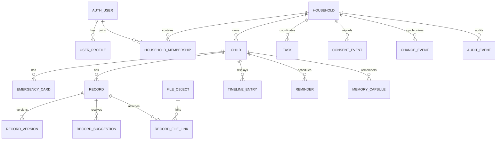
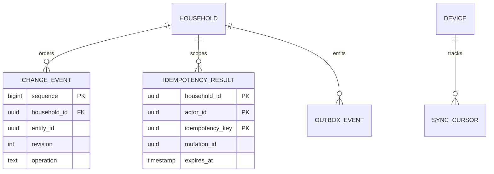
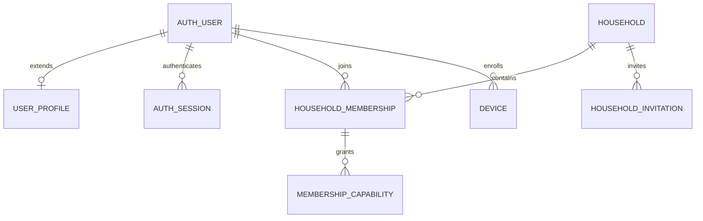
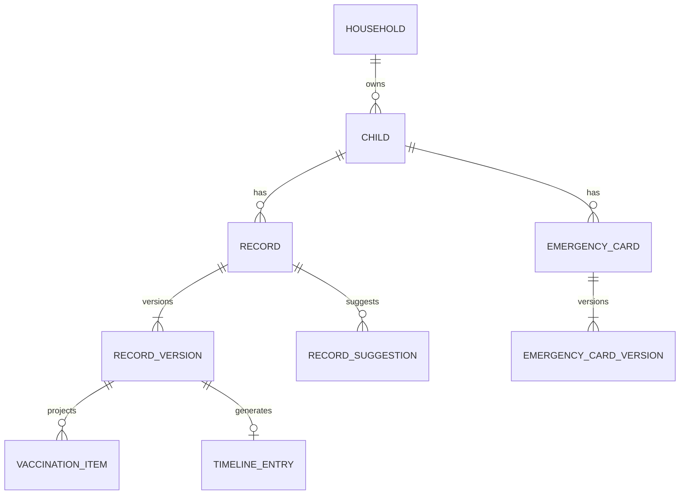
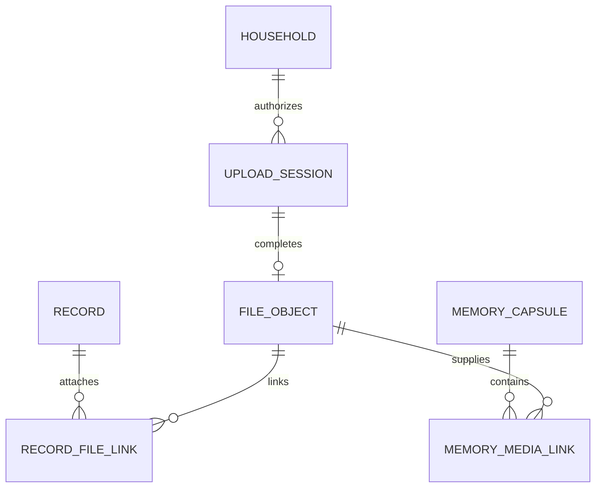
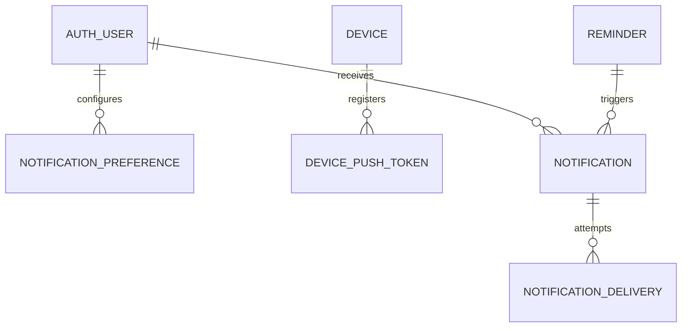
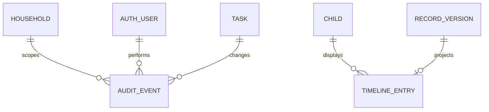
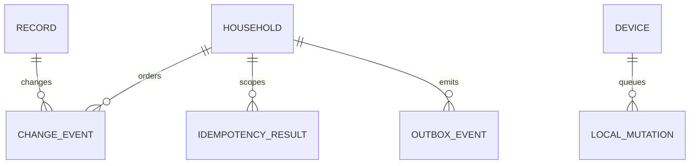
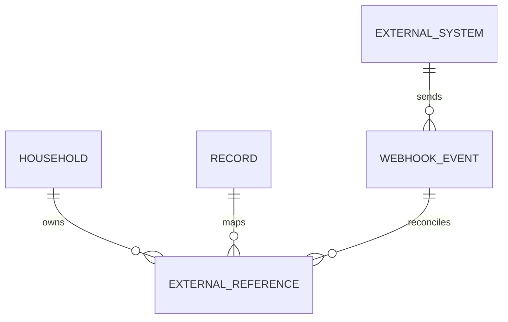
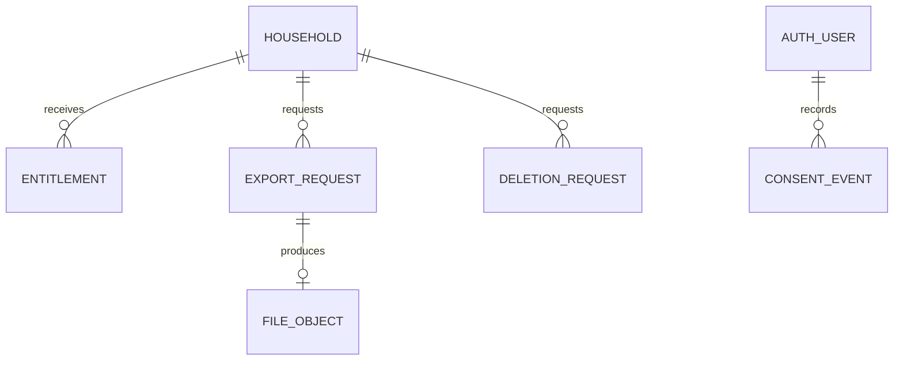

# LittleArc Backend Data Model and Database Schema

> **Status:** Active core data-model baseline
> **Last updated:** 2026-07-19
> **Owner:** Engineering
> **Applies to:** Server-side PostgreSQL schema from M1 foundation through M5 trust operations
> **Current delivery boundary:** FND-05 and Gate 1 are complete; M2 work-package planning is ready
> **Authority boundary:** Implemented structures follow executable schema; planned structures require their owning work-package acceptance

---

## 1. Executive Summary

LittleArc uses a modular Fastify backend, PostgreSQL 18 as the system of record,
Drizzle for typed schema/query mapping, reviewed forward SQL migrations, and
`pg-boss` for durable background jobs. The household is the tenant and data
ownership boundary. Every tenant-owned row is protected by application policy
and PostgreSQL row-level security (RLS).

This document separates three levels of certainty:

- **Implemented:** the seven FND-05 tables and migration in
  `packages/database`.
- **Planned:** an implementation-ready target for approved M2-M5 product scope,
  subject to the named work-package plan and acceptance gate.
- **Future:** post-MVP integration, billing, and richer sharing structures that
  must not be built prematurely.

The target model uses UUIDv7 identifiers, UTC `timestamptz`, integer optimistic
revisions, append-only audit/change/outbox streams, immutable record versions,
encrypted content envelopes, private object storage for document bytes, and
explicit tombstones for offline deletion propagation. It does not introduce
microservices, Redis, Elasticsearch, event sourcing, CQRS, or a second server
database.

This core document does not authorize M2 work and does not change delivery
status, roadmap order, architecture, or any accepted ADR.

## 2. Source Documents Reviewed

| Source | Authority used here |
| --- | --- |
| [Implementation status](../IMPLEMENTATION_STATUS.md) | Current package state, gates, and synthetic-only boundary |
| [Product plan](./littlearc-complete-product-plan.md) | Product behavior, roles, records, flows, privacy, and lifecycle |
| [Mobile application flow](./mobile-application-flow.md) | Screen operations, entity lifecycles, offline behavior, API mapping, and flow coverage |
| [Architecture and stack](./littlearc-architecture-and-tech-stack.md) | Persistence, encryption, sync, API, worker, and infrastructure constraints |
| [Implementation roadmap](../impl-plan/roadmap.md) | M2-M5 ownership, sequence, and acceptance gates |
| [FND-05 plan](../impl-plan/m1-foundation/fnd-05-database-and-migration-foundation-plan.md) | Foundation scope and residual obligations |
| [FND-05 evidence](../impl-plan/m1-foundation/fnd-05-implementation-evidence.md) | Implemented schema and validation boundary |
| [ADR-0004](../adr/0004-fastify-drizzle-modular-monolith.md) | Fastify/Drizzle modular-monolith decision |
| [ADR-0005](../adr/0005-postgresql-rls-migrations-and-pg-boss.md) | PostgreSQL, RLS, migration, role, and job decisions |
| [ADR-0007](../adr/0007-privacy-safe-observability-boundary.md) | Telemetry and restricted-data boundary |
| [Data classification](../reference/engineering/data-classification.md) | Repository, telemetry, and restricted-data handling |
| [Database migrations](../reference/engineering/database-migrations.md) | Authoritative schema sources and release procedure |
| [`packages/database`](../../packages/database/src/schema/index.ts) | Current executable Drizzle schema |
| [Foundation migration](../../packages/database/migrations/0001_fnd_05_database_foundation.sql) | Current reviewed SQL, roles, grants, and RLS policies |
| [Gate 1 RLS evidence](../impl-plan/m1-foundation/gate-1-aiven-rls-evidence.md) | Real PostgreSQL cross-household isolation result and evidence boundaries |

## 3. Assumptions and Open Decisions

### 3.1 Material assumptions

| ID | Classification | Position |
| --- | --- | --- |
| A-01 | Assumption | One PostgreSQL database and shared `littlearc` schema remain sufficient through the invited pilot. |
| A-02 | Assumption | One household contains one child in the initial UI, while the schema preserves one-to-many portability. |
| A-03 | Assumption | The server may decrypt authorized content; LittleArc is envelope-encrypted, not zero-knowledge. |
| A-04 | Assumption | Server search narrows candidates with metadata and decrypts bounded rows; local SQLCipher FTS provides content search. |
| A-05 | Recommendation | Use composite tenant foreign keys for every proposed child table even though the FND-05 baseline currently uses single-column FKs. |
| A-06 | Recommendation | Store fixed status values as `text` plus named checks, not PostgreSQL enums, to keep zero-downtime evolution straightforward. |
| A-07 | Recommendation | Keep notification templates in version-controlled code; persist only `template_key` and `template_version`. |
| A-08 | Recommendation | Treat file objects as immutable. A replacement creates a new row and relationship rather than overwriting an object. |

### 3.2 Open decisions that block final migration design

| ID | Decision required | Owner / work package |
| --- | --- | --- |
| O-01 | Generate and review the exact Better Auth 1.6.23 Drizzle schema, table names, plugins, and isolation strategy. | `OFF-01` |
| O-02 | Reconcile product role language (`owner`, `co-parent`, `caregiver`) with the current domain roles (`owner`, `caregiver`, `staff`). The conservative target models co-parent as a caregiver capability bundle until changed through contracts/ADR. | `OFF-02` |
| O-03 | Replace or justify the implemented `households.default_country_code = 'US'` default for an India-first product. Do not silently change it. | `OFF-02` |
| O-04 | Approve adult/parent verification provider, evidence fields, and retention; no verification-document schema is proposed before that decision. | Pre-real-data gate / `OFF-02` |
| O-05 | Approve retention durations for audit, consent, tombstones, processor payloads, exports, backups, and support data. | Privacy/legal review before real data |
| O-06 | Decide whether emergency-card versions share the generic record/version aggregate or remain a dedicated aggregate optimized for offline access. This draft recommends dedicated versions. | `OFF-05` |
| O-07 | Define the exact encrypted-envelope JSON schema and key-table layout before adding real restricted data. | `OFF-02`, `VLT-01` |
| O-08 | Define cursor lifetime and reset threshold using observed device inactivity and storage growth. | `OFF-04` |
| O-09 | Confirm whether email reminders are promoted into M4. Email remains account/essential-operation only by default. | `UTL-02` |
| O-10 | Approve external processor raw-payload retention. Default is not to retain raw health/document payloads. | Integration-specific plan |

## 4. Architecture and Persistence Context

| Concern | Approved position |
| --- | --- |
| Application | Mobile-first pediatric history platform with mobile, API, worker, and staff surfaces |
| Backend | TypeScript Fastify modular monolith plus separately deployed worker |
| API | REST `/v1`, OpenAPI 3.1 from Zod contracts, Problem Details errors |
| Database | PostgreSQL 18, initially Railway Singapore |
| ORM | Drizzle 0.45.2; one table per file; reviewed SQL migrations |
| Authentication | Better Auth 1.6.23; Apple, Google, and passwordless email OTP; no passwords in MVP |
| Authorization | Household membership/capability policy plus transaction-local RLS |
| Object storage | Private Railway bucket containing ciphertext only |
| Jobs | `pg-boss` 12.26.1 in PostgreSQL; transactional outbox before enqueue |
| Cache | No Redis; bounded process/cache usage only; never system of record |
| Search | Local SQLCipher FTS; household-scoped bounded server search; no hosted search service |
| Offline | Server-authoritative change feed; device SQLCipher read model and mutation outbox |
| Analytics | Privacy-safe allowlisted events without account, child, record, health, or free-text data |
| Multi-tenancy | Shared database/shared schema; household is primary tenant |
| Data residency | Initial production data plane in Singapore; environments fully separated |
| Scale target | At least 500 records, 2,000 timeline entries, 1,000 local search terms, 100 pending mutations, and 20 pending uploads per test household |

Transaction boundary: a successful business mutation writes its aggregate,
append-only audit row, change-feed row, and outbox row in one database
transaction after setting household/actor context with transaction-local
`set_config` calls.

## 5. Business Domains and Bounded Contexts

| Domain | Responsibility and owned data | Security / transaction boundary |
| --- | --- | --- |
| Identity | Provider users, accounts, sessions, verifications, user profiles, devices | Global identity rows; household content is not stored here |
| Household access | Households, membership, invitations, capabilities | Household owner controls membership; RLS on tenant rows |
| Consent | Versioned notice grants/withdrawals and processing purpose | Append-only events; consent checked at processing time |
| Child and emergency | Child encrypted profile, emergency card and versions | Household/child scoped; critical conflicts require review |
| Records and provenance | Records, immutable versions, suggestions, category projections | One aggregate write plus audit/change/outbox |
| Files | Upload sessions, immutable file objects, record/media links | Private ciphertext; short-lived authorized sessions |
| Timeline | User-visible projections, notes, milestones | Generated entry follows source lifecycle; manual entry is its own aggregate |
| Reminders and tasks | Confirmed schedules, assignments, completion/reopen | Only confirmed source dates may drive reminders |
| Memories | Monthly capsule text and explicitly uploaded media | Child scoped; media local until explicit upload |
| Notifications | Preferences, persisted in-app item, delivery attempts, push tokens | Generic payloads; authenticated deep links only |
| Sync | Change sequence, idempotency results, tombstones | Household-ordered server authority |
| Operations | Audit, outbox, export, deletion, entitlement, staff workflow | Least privilege; staff sees workflow metadata, not child content |
| Integrations | External references and signed webhook receipts | Future, consented, minimized, reconciled |

Modules expose application commands/queries and repository interfaces. Route
handlers must not query another module's tables directly.

## 6. Entity Inventory

Status values: `IMPLEMENTED`, `PLANNED`, `PROVIDER`, or `FUTURE`.

| Entity / table | Kind | Owner | Phase | Class / retention summary |
| --- | --- | --- | --- | --- |
| `households` | Aggregate root | Household | IMPLEMENTED | Sensitive metadata; active until deletion workflow |
| `children` | Aggregate root | Child | IMPLEMENTED | Restricted child profile; until child/account deletion |
| `audit_events` | Append-only event | Audit | IMPLEMENTED | Sensitive security metadata; legal duration open |
| `idempotency_results` | Operational record | Sync | IMPLEMENTED | Bounded replay window |
| `change_events` | Append-only event/tombstone | Sync | IMPLEMENTED | Cursor window plus reset safety margin |
| `outbox_events` | Durable event | Operations | IMPLEMENTED | Until dispatch plus operations retention |
| `schema_migrations` | Bookkeeping | Database | IMPLEMENTED | Database lifetime |
| Better Auth user/account/session/verification | Provider tables | Identity | PROVIDER / M2 | Provider contract; session/verification expiry |
| `user_profiles` | Aggregate child | Identity | M2 | Encrypted adult profile; account lifetime |
| `household_memberships` | Aggregate child | Household | M2 | Access relationship; retain audit after revocation |
| `membership_capabilities` | Junction | Household | M2/M4 | Active grant rows plus audit history |
| `household_invitations` | Workflow | Household | M4 | Expire; minimize rejected/expired invites |
| `devices` | Aggregate child | Identity | M2 | Enrollment/session support; purge on account deletion |
| `consent_events` | Append-only event | Consent | M2 | Regulatory evidence; duration open |
| `household_keys` | Key metadata | Crypto | M2 | While encrypted household data or recovery copy exists |
| `emergency_cards` | Aggregate root | Emergency | M2 | Restricted current pointer and access mode |
| `emergency_card_versions` | Immutable version | Emergency | M2 | Restricted; correction/deletion policy |
| `records` | Aggregate root | Records | M3 | Restricted metadata; tombstone then purge |
| `record_versions` | Immutable version | Records | M3 | Restricted encrypted confirmed/draft payload |
| `record_suggestions` | Review item | Records/AI | M3/M4 | Restricted; short purpose-bound retention after review |
| `vaccination_items` | Category projection | Records | M3 | Health-related; source-linked lifecycle |
| `upload_sessions` | Workflow | Files | M3 | Short expiry; no plaintext content |
| `file_objects` | Aggregate root | Files | M3 | Restricted ciphertext metadata; object purge workflow |
| `record_file_links` | Junction | Files | M3 | Follows record/file lifecycle |
| `timeline_entries` | Projection/aggregate | Timeline | M3/M4 | Restricted; source-linked or manual |
| `reminders` | Aggregate root | Reminders | M4 | Health-related schedule metadata |
| `tasks` | Aggregate root | Tasks | M4 | Restricted notes/source link |
| `memory_capsules` | Aggregate root | Memories | M4 | Restricted text; owner deletion |
| `memory_media_links` | Junction | Memories | M4 | Explicitly uploaded media only |
| `notification_preferences` | Aggregate child | Notifications | M4 | Account preferences |
| `device_push_tokens` | Secret-like identifier | Notifications | M4 | Until rotation/invalidation/device removal |
| `notifications` | Aggregate root | Notifications | M4 | Generic in-app metadata; bounded retention |
| `notification_deliveries` | Attempt history | Notifications | M4 | Operational delivery metadata |
| `ai_extraction_requests` | Workflow | AI | Optional M4 | Restricted consent reference and safe provider metadata |
| `export_requests` | Workflow | Trust operations | M5 | Short-lived encrypted artifact |
| `deletion_requests` | Workflow | Trust operations | M5 | Completion proof without deleted content |
| `entitlements` | Aggregate root | Entitlements | M1/M5 | Non-health plan/source metadata |
| `staff_profiles` | Aggregate child | Staff identity | M5 | Allowlisted staff only |
| `external_references` | Mapping | Integrations | FUTURE | Source ID/provenance, consent-bound |
| `webhook_events` | Inbound idempotency | Integrations | FUTURE | Signed/minimized payload; no secrets |

No general-purpose business comments or chat tables are included. Manual
Timeline notes, task notes, and caregiver memory notes meet approved scope.

## 7. Conceptual Data Model



The `records.current_version_id` pointer is denormalized deliberately for the
dominant detail/list query. Each immutable version retains the original source
and confirmation context. Timeline rows are projections, not independent
copies of authoritative record payloads.

## 8. Relationship Catalogue

| Parent | Child | Cardinality | Required | Delete behavior | Ownership |
| --- | --- | --- | --- | --- | --- |
| Auth user | User profile | 1:0..1 | No until onboarding | Restrict; deletion workflow | User |
| Auth user | Household membership | 1:many | Yes for access | Revoke/soft delete | Household |
| Household | Membership | 1:many | Yes | Restrict while owner exists | Household |
| Household | Child | 1:many | Yes | Restrict; orchestrated child purge | Household |
| Household | Consent event | 1:many | Yes | Never cascade ordinary deletion | Household/user |
| Household | Household key | 1:many versions | Yes with encrypted content | Restrict until rewrap/purge | Crypto |
| Child | Emergency card | 1:0..1 active | No | Tombstone then purge | Child |
| Emergency card | Card version | 1:many | Yes | Cascade only in terminal purge | Emergency |
| Child | Record | 1:many | Yes | Tombstone then purge | Child |
| Record | Record version | 1:many | Yes | Cascade only in terminal purge | Record |
| Record | Suggestion | 1:many | No | Purge with record/retention | Record/AI |
| Record version | Vaccination item | 1:0..many | No | Cascade with version purge | Record |
| Record | Record-file link | 1:many | No | Cascade link only | Record |
| File object | Record-file link | 1:many | No | Restrict until unlinked/purge | Files |
| Child | Timeline entry | 1:many | Yes | Tombstone; generated entries follow source | Timeline |
| Record version | Timeline entry | 1:0..1 generated | No | Deactivate projection | Timeline |
| Child | Reminder | 1:many | Yes | Cancel then purge | Reminder |
| Household | Task | 1:many | Yes | Tombstone then purge | Task |
| Child | Memory capsule | 1:many | Yes | Tombstone then purge | Memory |
| Device | Push token | 1:many rotations | Yes | Cascade token | Notification |
| Notification | Delivery | 1:many | Yes | Cascade after retention | Notification |
| Household | Change/audit/outbox event | 1:many | Yes | Controlled retention, not ordinary cascade | Operations |

Every proposed child-specific FK must include `household_id` in the referenced
key, for example `(household_id, child_id) -> children(household_id, id)`. This
prevents a valid tenant row from referencing an object belonging to a different
tenant.

Polymorphic identifiers are deliberately limited to infrastructure records
(`audit_events`, `change_events`, `outbox_events`, notification deep links, and
future integration mappings). They are not aggregate ownership links, do not
cascade, and require application validation of type, tenant, and target.

## 9. Database Conventions

In compact column catalogues, unmarked columns are required unless their
lifecycle explicitly makes them optional; a `?` suffix means nullable. IDs use
`uuid`, status/category/source values use checked `text`, time suffixes use
`timestamptz`, counters use `integer`, and encrypted envelopes use validated
`jsonb`, unless a table states otherwise.

### 9.1 Identifiers and time

- Public and internal resource IDs are the same UUIDv7 in MVP. Do not expose
  sequential change-event IDs as resource IDs.
- `change_events.sequence` remains `bigserial` because it is an ordered cursor
  source, not a public identifier.
- Timestamps are `timestamptz`, written in UTC and returned as normalized ISO
  8601 strings.
- Client clock values may be recorded as observations but never decide conflict
  winners or audit time.

### 9.2 Mutable-resource columns

Tenant-owned mutable tables normally include:

| Column | Type | Rule |
| --- | --- | --- |
| `id` | `uuid` | UUIDv7 PK |
| `household_id` | `uuid` | Required tenant FK |
| `child_id` | `uuid` | Required only for child-specific data |
| `created_by`, `updated_by` | `uuid` | Auth user/actor ID; no cascading FK from audit evidence |
| `revision` | `integer` | Starts at 1; increments atomically; check `> 0` |
| `created_at`, `updated_at` | `timestamptz` | UTC; server generated |
| `deleted_at` | `timestamptz null` | Sync-visible tombstone marker |

`is_deleted` is not stored because it duplicates `deleted_at`. `public_id` is
not added until an external sharing or identifier-rotation requirement exists.

### 9.3 Encryption envelope

Restricted profile, record, health, note, OCR, provider, and filename content
uses a versioned JSONB envelope rather than arbitrary JSON:

```text
EncryptedEnvelopeV1
  formatVersion: 1
  algorithm: AES-256-GCM
  keyVersion: positive integer
  wrappedDek: base64url bytes
  wrapNonce: base64url 96-bit nonce
  contentNonce: base64url 96-bit nonce
  authTag: base64url bytes
  ciphertext: base64url bytes
  aadSchemaVersion: positive integer
```

The application validates the exact shape with Zod; SQL checks at least object
type, format version, and required keys. JSONB content is not searched or
partially updated. A future normalized bytea representation requires an ADR and
compatible migration.

### 9.4 Soft deletion and cascades

- User-visible deletes set `deleted_at`, increment revision, emit audit and
  change tombstone rows, and enqueue purge work.
- Cascades are limited to operational rows or final purge transactions.
- Consent and audit evidence use `restrict` or minimized retained identities.
- Restores are disallowed unless the owning domain defines a reviewed restore
  transition; stale clients cannot resurrect a tombstone.

## 10. Identity and Authorization Schema

### 10.1 Provider-owned authentication tables

Better Auth owns user, account, session, and verification storage. Expected
logical fields are shown for review, but migration SQL must be generated from
the pinned adapter during `OFF-01`; these are not hand-authored contracts.

| Logical table | Required fields | Key constraints / indexes | Sensitive handling |
| --- | --- | --- | --- |
| Auth user | `id`, normalized email, email verified state, name/display fields, timestamps | Unique normalized email | Email is PII; no household health content |
| Auth account | `id`, `user_id`, provider/account ID, scoped tokens if required, timestamps | Unique provider + account ID; user index | Do not store provider refresh tokens unless required |
| Auth session | `id`, `user_id`, token hash/value per adapter, expiry, IP/device metadata if approved | Unique token; user + expiry index | Hash/token rules follow provider; short-lived and revocable |
| Auth verification | identifier, value/hash, expiry, attempts | Identifier + expiry indexes | OTP short-lived, one-time, rate-limited; never log value |

### 10.2 LittleArc identity/access tables

| Table | Columns | Constraints and indexes |
| --- | --- | --- |
| `user_profiles` | `user_id uuid PK`, `encrypted_profile jsonb NN`, `country_code text`, `time_zone text NN`, `created_at`, `updated_at`, `deleted_at` | Valid IANA timezone at service boundary; country ISO check; encrypted envelope check |
| `household_memberships` | `id uuid PK`, `household_id uuid NN`, `user_id uuid NN`, `role text NN`, `status text NN`, `invited_by uuid`, `accepted_at`, `revoked_at`, base audit columns | Unique active `(household_id,user_id)`; one active owner minimum enforced transactionally; indexes by user/status and household/status |
| `membership_capabilities` | `membership_id uuid`, `capability text`, `granted_by uuid`, `granted_at`, `revoked_at` | PK `(membership_id,capability,granted_at)`; capability check; only caregiver-grantable values accepted |
| `household_invitations` | `id`, `household_id`, `normalized_email_hash`, `role_template`, `token_hash`, `status`, `expires_at`, `accepted_by`, audit columns | Unique token hash; pending household/email partial unique; no raw invite token |
| `devices` | `id`, `user_id`, `household_id`, `platform`, `app_version`, `enrollment_status`, `last_seen_at`, `revoked_at`, timestamps | User/status and household/status indexes; device ID is not authority by itself |
| `staff_profiles` | `user_id PK`, `status`, `role`, `allowlisted_by`, `last_reauthenticated_at`, timestamps | Separate staff auth context; no household membership implication |

Authorization matrix:

| Resource / action | Owner | Caregiver capability | Staff |
| --- | --- | --- | --- |
| Emergency card / view | Allowed | `viewEmergencyCard` | Denied by default |
| Selected records / view | Allowed | `viewSelectedHealthRecords` | Denied by default |
| Identity records / view | Allowed | `viewIdentityDocuments` | Denied |
| Records / add | Allowed | `addRecords` | Denied |
| Confirmed records / correct | Allowed | `editConfirmedRecords` | Denied |
| Tasks / manage | Allowed | `manageTasks` | Denied |
| Members / invite or revoke | Allowed | None | Denied |
| Export or delete household | Allowed after recent reauth | None | Workflow status only |
| Entitlement / override | Manage own plan | None | Purpose code + recent reauth + audit |

## 11. Core Business Schema

### 11.1 Implemented household and child tables

`households` and `children` remain exactly as FND-05 until an owning migration
changes them. `children.encrypted_profile` is restricted child data;
`access_policy` is a schema-validated authorization envelope.

### 11.2 Planned child/emergency/record tables

| Table | Core columns | Invariants / access patterns |
| --- | --- | --- |
| `household_keys` | `id`, `household_id`, `key_version`, `wrapped_key bytea`, `wrap_nonce bytea`, `wrapping_key_version`, `status`, `created_at`, `retired_at` | Unique `(household_id,key_version)`; one active key; worker-only rewrap fields |
| `emergency_cards` | base columns, `child_id`, `current_version_id`, `access_mode`, `status` | Unique active child card; access mode `standard` or `quick_access`; current version same aggregate |
| `emergency_card_versions` | `id`, `household_id`, `emergency_card_id`, `version_number`, `encrypted_payload`, `confirmed_by`, `confirmed_at`, `source_revision`, `created_at` | Immutable; unique card/version; no unconfirmed value in quick access |
| `records` | base columns, `child_id`, `category`, `source_type`, `confirmation_state`, `event_at`, `current_version_id`, `access_policy`, `ai_assisted` | Category/source/state checks; current version same record; partial indexes exclude deleted rows |
| `record_versions` | `id`, `household_id`, `record_id`, `version_number`, `payload_schema_version`, `encrypted_payload`, `confirmation_state`, `provenance_type`, `source_issuer_id`, `confirmed_by`, `confirmed_at`, `supersedes_version_id`, `created_by`, `created_at` | Immutable; unique record/version; confirmation actor/time paired; self-FK same record |
| `record_suggestions` | `id`, `household_id`, `record_id`, `record_version_id`, `field_path`, `encrypted_suggestion`, `encrypted_source_span`, `confidence_bucket`, `extractor_type`, `model_id`, `prompt_version`, `consent_event_id`, `review_state`, `reviewed_by`, `reviewed_at`, `created_at`, `expires_at` | Suggestions never authoritative; review state check; consent required for cloud AI |
| `vaccination_items` | `id`, `household_id`, `child_id`, `record_version_id`, `status`, `due_at`, `scheduled_at`, `given_at`, `date_authority`, `encrypted_details`, `revision`, timestamps, `deleted_at` | Date/status compatibility checks; reminder uses only confirmed date; source version required |

Planned record categories remain the current contract values: `emergency`,
`identity`, `vaccination`, `doctor_visit`, `prescription`, `document`, and
`memory`. Growth, milestone, and note are Timeline entry types until contracts
explicitly promote them to record categories.

### 11.3 Record and vaccination lifecycles

| Current | Action | Next | Actor | Preconditions / side effects |
| --- | --- | --- | --- | --- |
| `draft` | Save suggestion | `suggested` | Owner/granted caregiver | No Timeline/reminder/search authority |
| `draft` or `suggested` | Confirm | `confirmed` | Owner/granted caregiver | New immutable version; audit/change/Timeline/outbox |
| `confirmed` | Correct | `confirmed` | Owner/granted caregiver | New version; stale critical revision rejected |
| `confirmed` | Archive | `archived` | Owner | Timeline deactivates; audit/change |
| Any active | Delete | tombstoned | Owner/authorized actor | Immediate sync delete; purge queued |

| Vaccination current | Action | Next | Preconditions |
| --- | --- | --- | --- |
| `due` | Schedule | `scheduled` | Parent-confirmed date |
| `due` or `scheduled` | Record administration | `given` | Confirmed given date and provenance |
| `due` or `scheduled` | Skip | `skipped` | Reason note recommended |
| `due` or `scheduled` | Mark not applicable | `not_applicable` | Explicit confirmation |
| `given`, `skipped`, `not_applicable` | Correct | any valid state | New record version and audit; never silent overwrite |

## 12. Supporting Module Schemas

| Table | Core columns | Principal constraints / query |
| --- | --- | --- |
| `timeline_entries` | base columns, `child_id`, `entry_type`, `event_at`, `source_record_id`, `source_version_id`, `encrypted_payload`, `visibility`, `projection_state` | One active generated entry per source version; child/event/id cursor index; manual entries have no source |
| `reminders` | base columns, `child_id`, `source_record_id`, `category`, `status`, `fire_at_utc`, `time_zone`, `recurrence_rule`, `confirmed_by`, `confirmed_at`, `completed_at`, `cancelled_at` | Confirmed actor/time before active; pending fire index; deterministic scheduling key |
| `tasks` | base columns, `child_id`, `assigned_membership_id`, `source_record_id`, `status`, `due_at`, `encrypted_note`, `completed_at`, `reopened_at` | Assignee active in same household; status/time checks; assignee/status/due index |
| `memory_capsules` | base columns, `child_id`, `period_start`, `period_end`, `status`, `encrypted_payload`, `future_unlock_at`, `confirmed_at` | Unique active child/month; maximum five linked media enforced transactionally |
| `memory_media_links` | `capsule_id`, `file_object_id`, `display_order`, `upload_state`, `created_at`, `removed_at` | Unique capsule/order and capsule/file; state reflects local/uploaded lifecycle |
| `ai_extraction_requests` | `id`, `household_id`, `record_id`, `file_object_id`, `consent_event_id`, `input_type`, `status`, `provider_class`, `provider_request_hash`, `model_id`, `prompt_version`, `attempts`, timestamps, `safe_error_code` | Consent grant active at creation; no raw provider payload; record/status index |
| `entitlements` | `id`, `household_id`, `source`, `plan_key`, `effective_at`, `expires_at`, `grace_until`, `limits jsonb`, `status`, audit columns | No health data; precedence resolved in domain; lapse never deletes content |
| `export_requests` | `id`, `household_id`, `requested_by`, `status`, `format_set`, `artifact_file_id`, `expires_at`, progress timestamps, `safe_error_code` | Owner + recent reauth; one idempotent active request key; artifact short-lived |
| `deletion_requests` | `id`, `household_id`, `scope_type`, `scope_id`, `requested_by`, `status`, `grace_until`, progress timestamps, `processor_state`, `completion_proof`, `safe_error_code` | Owner + recent reauth; restartable step machine; proof excludes deleted content |

Task status is `open`, `completed`, `cancelled`; `completed -> open` is the only
reopen transition and creates audit/change events. Reminder status is `draft`,
`active`, `completed`, `cancelled`, or `expired`.

## 13. Files and Media Schema

Binary bytes never enter PostgreSQL.

| Table | Core columns | Invariants / indexes |
| --- | --- | --- |
| `upload_sessions` | `id`, `household_id`, `created_by`, `intended_owner_type`, `intended_owner_id`, `status`, `expected_size`, `expected_mime`, `part_state`, `expires_at`, timestamps, `safe_error_code` | 25 MB and page limits enforced by config; expiry/status index; object key opaque |
| `file_objects` | `id`, `household_id`, `origin_upload_session_id?`, `storage_key`, `ciphertext_size`, `detected_mime`, `ciphertext_sha256`, `encrypted_metadata`, `wrapped_file_key`, `wrap_nonce`, `content_nonce`, `auth_tag`, `key_version`, `aad_version`, `validation_status`, `malware_status`, `processing_status`, timestamps, `deleted_at?`, `purged_at?` | Unique storage key and ciphertext hash per household policy; no original filename in plaintext; status indexes |
| `record_file_links` | `record_id`, `record_version_id`, `file_object_id`, `relationship_type`, `display_order`, `created_by`, `created_at`, `deleted_at` | Composite PK or unique active triplet; all three rows same household |

File state transitions:

`created -> uploading -> uploaded -> validating -> ready`, with terminal
`rejected`, `failed`, `cancelled`, and lifecycle `tombstoned -> purged` states.
Retries may resume only nonterminal uploads. A terminal failure never deletes
the device-local source automatically.

Signed URLs are short-lived grants generated by the API after household policy
checks; they are not persisted as reusable URLs.

## 14. Notifications Schema

| Table | Core columns | Invariants / indexes |
| --- | --- | --- |
| `notification_preferences` | `user_id`, `household_id`, `category`, `push_enabled`, `local_enabled`, `email_enabled`, `time_zone`, `updated_at`, `revision` | PK user/household/category; email false unless promoted |
| `device_push_tokens` | `id`, `device_id`, `user_id`, `environment`, `platform`, `token_ciphertext`, `token_hash`, `status`, `last_seen_at`, `invalidated_at`, timestamps | Unique environment/token hash; token never logged |
| `notifications` | `id`, `household_id`, `recipient_user_id`, `source_type?`, `source_id?`, `category`, `template_key`, `template_version`, `deep_link_type`, `deep_link_id`, `status`, `available_at`, `expires_at?`, `read_at?`, `created_at` | Generic content only; unread recipient/time index |
| `notification_deliveries` | `id`, `notification_id`, `channel`, `attempt_number`, `status`, `provider_message_hash`, `attempted_at`, `next_attempt_at`, `delivered_at`, `safe_error_code` | Unique notification/channel/attempt; pending retry index |

No child name, medicine/vaccine name, condition, document title, provider name,
or decrypted content is stored in a delivery payload. The authenticated client
resolves the deep-linked resource after authorization.

## 15. Audit and Activity Schema

Three concepts remain separate:

- **Timeline:** user-visible child history and manual notes.
- **Business workflow history:** immutable record versions and status timestamps.
- **Security audit:** append-only `audit_events`, never displayed as child content.

The implemented `audit_events` fields are `id`, `household_id`, `actor_id`,
`actor_role`, `action`, nullable `purpose_code`, JSONB `metadata`, and
`occurred_at`. `OFF-02` should migrate toward the contract-required safe fields:
`target_type`, `target_id`, `request_id`, `result`, and optional stable
`failure_code`. Before/after values must be minimized field-name/revision
snapshots, never decrypted payloads, credentials, tokens, filenames, OCR text,
or provider responses.

Audit rows are append-only to application and worker roles. Any correction is a
new audit row. Staff actions require purpose code and recent reauthentication.

## 16. Offline Synchronization Schema

The implemented sync primitives remain:

- `change_events`: household-ordered `bigserial` sequence, entity identity,
  upsert/delete operation, revision, actor/mutation, optional safe payload.
- `idempotency_results`: household + actor + key replay boundary, request
  fingerprint, mutation ID, bounded response, expiry.
- `outbox_events`: aggregate event and opaque payload awaiting worker dispatch.

Per-entity conflict policy:

| Entity/field | Policy | Reason |
| --- | --- | --- |
| Child identity, allergy, emergency, vaccination, medication, growth, clinical dates | Explicit conflict review | Safety-critical or identity-critical |
| Confirmed record version | Append new version after review | Preserve provenance and correction history |
| Task description/status | Server-ordered LWW with audit, except incompatible terminal transition | Coordination utility |
| Draft memory text / display preference | Server-ordered LWW with audit | Noncritical and reversible |
| File object | Immutable / duplicate warning | Bytes are never merged |
| Tombstone | Server wins | Prevent stale resurrection |

Initial sync uses paginated resource snapshots followed by a captured change
cursor. Incremental pull orders by `(sequence)`. Push mutations carry UUIDv7
`mutationId`, entity ID, operation, base revision, and dependency IDs. A cursor
older than retained changes receives a typed reset response and rebuilds the
local read model.



`SYNC_CURSOR` is a mobile-local concept, not a required server table.

## 17. Integration Schema

Institutional integrations are not required for MVP. When authorized:

| Table | Columns | Rules |
| --- | --- | --- |
| `external_references` | `id`, `household_id`, `internal_type`, `internal_id`, `system_key`, `external_id_ciphertext`, `direction`, `last_synced_at`, `sync_status`, `provenance_type`, timestamps | Unique system/internal mapping; no cross-household lookup; consent/source retained |
| `webhook_events` | `id`, `system_key`, `provider_event_id`, `signature_verified`, `event_type`, `payload_hash`, `minimized_payload`, `received_at`, `processed_at`, `status`, `safe_error_code` | Unique provider event ID; secrets absent; raw restricted payload disabled by default |

Reconciliation is asynchronous and idempotent. External source authority does
not transfer household ownership. Third-party credentials remain in the secret
system, never these tables.

## 18. Detailed Implemented Table Definitions

These definitions describe migration `0001_fnd_05_database_foundation` and are
the current source of truth.

| Table | Columns and types | PK / FK / checks | Indexes / RLS |
| --- | --- | --- | --- |
| `households` | `id uuid`, `status text`, `default_country_code text`, `access_policy text`, `created_by uuid`, `updated_by uuid`, `revision int`, `created_at/updated_at timestamptz`, `deleted_at timestamptz?` | PK id; revision > 0 | RLS `id = current_household_id()` |
| `children` | `id uuid`, `household_id uuid`, `encrypted_profile jsonb`, `access_policy jsonb`, actor/revision/timestamps | PK id; FK household restrict; revision > 0 | household; household+updated indexes; tenant RLS |
| `audit_events` | `id uuid`, `household_id uuid`, `actor_id uuid`, `actor_role text`, `action text`, `purpose_code text?`, `metadata jsonb`, `occurred_at timestamptz` | PK id; FK household restrict | household+time; actor; tenant RLS |
| `idempotency_results` | `household_id uuid`, `actor_id uuid`, `idempotency_key uuid`, `mutation_id uuid`, `request_fingerprint text`, `response_status int`, `response_body jsonb`, `expires_at/created_at timestamptz` | Composite PK; response 200..599; FK household cascade | expiry; household+mutation; tenant RLS |
| `change_events` | `sequence bigserial`, `household_id uuid`, `entity_type text`, `entity_id uuid`, `operation text`, `revision int`, `actor_id uuid?`, `mutation_id uuid?`, `payload jsonb?`, `changed_at timestamptz` | PK sequence; operation upsert/delete; revision > 0; FK household cascade | household+sequence; household+entity; tenant RLS |
| `outbox_events` | `id uuid`, `household_id uuid`, event/aggregate fields, `payload jsonb`, `available_at`, `dispatched_at?`, `attempts`, `last_error?`, `created_at` | PK id; attempts >= 0; FK household cascade | dispatch+available; household+created; tenant RLS |
| `schema_migrations` | `version text`, `checksum_sha256 text`, `applied_at timestamptz` | PK version | No tenant RLS |

Known planned deltas, not current behavior:

1. Add tenant-composite unique keys/FKs.
2. Add status and access-policy checks.
3. Expand safe audit target/request/result fields.
4. Make outbox terminal failure/dead-letter state explicit or derive it from an
   accepted maximum-attempt policy.
5. Review cascade behavior for retained audit/change evidence during deletion.
6. Resolve country default and encrypted-envelope checks.

## 19. Constraints and Business Invariants

Database-enforced:

- Positive revision/version/attempt counters.
- Same-household composite FKs for proposed tenant relationships.
- Unique active membership, active invitation, child emergency card, record
  version number, and monthly capsule period.
- Paired state fields: confirmation actor/time, completion status/time,
  revocation status/time, and purge status/time.
- Range checks for upload size, media order `0..4`, response status, and
  confidence bucket.
- Check-constrained status/source/category/capability values.
- Partial uniqueness excludes tombstoned rows where recreation is valid.
- Immutable version/event rows: application and worker roles receive no UPDATE
  or DELETE grant.

Service/domain-enforced in the same transaction:

- Household retains at least one active owner.
- Actor membership/capability and recent reauthentication.
- Current version belongs to the same aggregate.
- Cloud extraction has an active, matching, feature-specific consent event.
- Suggestions cannot populate authoritative search, emergency, reminder, or
  Timeline data until confirmed.
- Maximum five memory media links and one invited Free member.
- File and encryption AAD context matches household/object/type/version.
- Lifecycle transition legality and record-category payload schema.

## 20. Index Strategy

| Index | Table / columns | Type | Purpose |
| --- | --- | --- | --- |
| `children_household_updated_idx` | children `(household_id, updated_at)` | B-tree | Existing sync/list support |
| `memberships_user_status_idx` | memberships `(user_id, status)` | B-tree | Resolve active household access |
| `records_child_event_idx` | records `(household_id, child_id, event_at DESC, id DESC)` where active | B-tree | Vault/Timeline candidate listing |
| `records_category_event_idx` | records `(household_id, child_id, category, event_at DESC, id DESC)` where active | B-tree | Category/date filters |
| `record_versions_record_version_uk` | versions `(household_id, record_id, version_number)` | Unique B-tree | Immutable ordering |
| `suggestions_pending_idx` | suggestions `(household_id, record_id, created_at)` where pending | Partial B-tree | Pending review |
| `timeline_child_event_idx` | timeline `(household_id, child_id, event_at DESC, id DESC)` where active | B-tree | Stable cursor feed |
| `reminders_due_idx` | reminders `(fire_at_utc, id)` where status active | Partial B-tree | Worker due scan |
| `tasks_assignee_due_idx` | tasks `(household_id, assigned_membership_id, status, due_at)` where active | B-tree | Today/handover |
| `uploads_expiry_idx` | uploads `(expires_at)` where nonterminal | Partial B-tree | Cleanup |
| `files_validation_idx` | files `(validation_status, created_at)` where pending | Partial B-tree | Worker validation |
| `notifications_unread_idx` | notifications `(recipient_user_id, created_at DESC)` where `read_at is null` | Partial B-tree | Unread list/badge |
| `deliveries_retry_idx` | deliveries `(next_attempt_at, id)` where retryable | Partial B-tree | Delivery retry |
| `change_events_household_sequence_idx` | change events `(household_id, sequence)` | B-tree | Existing incremental pull |
| `outbox_events_pending_idx` | outbox `(dispatched_at, available_at)` | B-tree; later partial | Existing dispatcher scan |

Do not add plaintext full-text indexes over encrypted child data. Avoid JSONB GIN
indexes on encrypted envelopes. Query plans must be measured before adding
covering indexes or partitioning.

## 21. Entity Lifecycles

| Entity | Initial | Active progression | Terminal / reversal |
| --- | --- | --- | --- |
| Membership | invited/pending | active | revoked; new invitation required |
| Consent | granted event | later grant versions | withdrawn event; never edit history |
| Record | draft | suggested -> confirmed -> corrected versions | archived or tombstoned; restore not MVP |
| File | created | uploading -> validating -> ready | rejected/failed/cancelled or tombstoned -> purged |
| Reminder | draft | active -> completed | cancelled/expired; no implicit reopen |
| Task | open | completed | cancelled; completed may reopen with audit |
| Notification | queued | sent/delivered/read | failed/expired; delivery retries bounded |
| AI extraction | requested | queued -> processing -> awaiting_review | accepted/rejected/failed/expired |
| Export | requested | queued -> building -> ready | failed/expired/purged |
| Deletion | requested | grace -> executing -> processor_pending | completed/failed; cancellation only in approved grace |

## 22. API Data Contracts

Database rows never become API responses directly.

| Layer | Rule |
| --- | --- |
| Database model | Includes RLS keys, encrypted envelopes, internal states, provider IDs, audit and purge metadata |
| Domain model | Decrypted only inside authorized application use case; expresses invariants and capabilities |
| Create request | Client UUID/mutation ID, user-entered fields, no actor/tenant authority fields |
| Update request | `baseRevision`, mutation/idempotency IDs, explicit patch or replacement fields |
| Summary response | Minimal decrypted display fields plus source/confirmation/revision; no key/provider internals |
| Detail response | Authorized confirmed/draft content and provenance; suggestions separately labeled |
| Internal event | Opaque IDs, event type, revisions, operation parameters; no decrypted payload unless narrowly required |

Never expose wrapped keys, nonces/tags, storage keys, session/OTP/token material,
request fingerprints, raw audit metadata, provider request/response payloads,
malware details, staff-only fields, purge internals, or database role/context
settings.

## 23. Security and Privacy Classification

| Class | Examples | Storage / access |
| --- | --- | --- |
| Public | App/environment labels, public legal versions | Plaintext if intentionally public |
| Internal | Status codes, migration version, generic category | Queryable; bounded telemetry |
| Sensitive | Operational resource IDs, upload state, bucket metadata | Queryable only as required; staff masked |
| PII | Adult name, email, relationship, timezone | Email in auth boundary; profile encrypted |
| Restricted child/health | Child identity, DOB, allergies, medicine/vaccine names, notes, documents, OCR/AI text | Application envelope encryption; private ciphertext object; no telemetry |
| Authentication secret | OTP, session token, invitation token, push token | Hash or encrypt; never log; shortest practical retention |
| Cryptographic secret | KEK, plaintext DEK | KEK secret system only; plaintext DEKs ephemeral |
| Regulatory evidence | Consent, access and deletion audit | Minimized, append-only, tightly authorized |

Queryable plaintext health-adjacent metadata is limited to what scheduling and
filtering require: category, state, event/due times, tenant relations, revision,
and provenance class. Names, values, notes, provider names, vaccine/medicine
names, OCR text, titles, filenames, and identifiers remain encrypted.

## 24. Retention and Deletion

Durations below are recommendations for planning, not approved policy. Legal
and privacy review must replace every `TBD` before real data.

| Entity | Active retention | Soft delete | Hard delete/archive | Legal hold / anonymization |
| --- | --- | --- | --- | --- |
| Household/child/record | Until owner deletes/account terminates | Immediate tombstone | Purge within published TBD window | Legal hold exceptional and isolated |
| Document/file | While linked/owned | Immediate tombstone | Bucket + DB purge in TBD window; backups age out | No anonymization of ciphertext |
| Record suggestion/AI request | Through review + short TBD window | Status/expiry | Purge content; retain coarse quality bucket only if approved | No raw provider payload |
| Consent event | Regulatory TBD | No | Minimize/retain as legally required | Pseudonymize deleted actor where permitted |
| Audit event | Security/legal TBD | No | Archive/minimize under policy | Legal hold supported |
| Change tombstone | Cursor window + safety margin | N/A | Purge after no supported cursor needs it | Reset path required first |
| Idempotency result | Recommended 24 hours; route may justify longer | N/A | Scheduled delete | Bound/scrub response body |
| Upload session/temp file | Recommended 24 hours after expiry/terminal | N/A | Purge | None |
| Notification/delivery | Recommended 90/30 days | Read/expired state | Purge | None normally |
| Session/verification | Provider expiry | Revoke | Provider cleanup | Minimal security evidence only |
| Export artifact | Recommended 24-72 hours after ready | Expired state | Object and key purge | None |
| Deletion request proof | Policy TBD | No | Retain minimized completion proof | Legal hold if required |
| Backup | Minimum architecture target includes 14-day PITR if supported | N/A | Backup lifecycle | Deletion completes as backups age out |

Deactivation blocks use; soft deletion propagates state; hard deletion removes
active data; anonymization removes identity while preserving approved aggregate
evidence; archival moves immutable evidence to restricted lower-cost storage.

## 25. Performance and Scalability

| High-volume table | Expected pattern | Initial strategy | Scale trigger |
| --- | --- | --- | --- |
| Records/versions | Hundreds per household; write-light, read-heavy | Tenant/child/date cursor indexes; batch current-version load | Measured p95 or storage growth |
| Timeline | 2,000+ per test child | Stable `(event_at,id)` cursor; no offset pagination | Consider partitioning only at multi-million global rows with plan evidence |
| Change events | Append per mutation; inactive-device reads | Household/sequence index; bounded retention/reset | Partition by time only after vacuum/index metrics justify |
| Audit events | Append-only, operational reads | Household/time index; restricted archive | Time partition after retention/volume evidence |
| Outbox/pg-boss | Short hot working set | Partial pending indexes; bounded batches/locks | Separate queue database only if SLO contention is measured |
| Notifications | Burst around reminder times | Due/retry indexes; deterministic keys | Batch/partition after delivery load evidence |

Avoid N+1 reads by loading list summaries/current versions in bounded batches.
Use cursor pagination, limited decryption candidate sets, short transactions, and
`FOR UPDATE SKIP LOCKED` only in accepted worker/dispatcher patterns. Read
replicas, sharding, and partitioning are not justified for MVP.

## 26. Data Migration Strategy

1. Change Drizzle source under `packages/database/src/schema/`, one table per
   file, with related policy/tests.
2. Generate an ordered candidate migration; never edit an applied migration.
3. Review drops, locks, defaults, backfills, RLS, grants, checks, indexes,
   transaction behavior, and old/new application compatibility.
4. Test forward on fresh PostgreSQL and an upgraded representative database.
5. Apply to staging as an explicit release step before dependent code.
6. Record version/checksum/commit/environment/result without connection data.

Use expand/migrate/contract for breaking changes: add nullable column/table,
dual-read/write if required, backfill in bounded idempotent batches, validate a
`NOT VALID` constraint, switch reads, then remove old shape in a later release.
Create large indexes concurrently outside an all-enclosing transaction when
required. Rollback is application rollback or forward repair plus PITR/restore;
automatic destructive down migrations are not promised.

## 27. SQL DDL

The committed FND-05 migration is authoritative. The following is a
migration-oriented illustration for `VLT-01`, not executable release SQL:

```sql
begin;

alter table littlearc.children
  add constraint children_household_id_id_uk unique (household_id, id);

create table littlearc.records (
  id uuid primary key,
  household_id uuid not null,
  child_id uuid not null,
  category text not null,
  source_type text not null,
  confirmation_state text not null default 'draft',
  event_at timestamptz,
  current_version_id uuid,
  access_policy jsonb not null,
  ai_assisted boolean not null default false,
  created_by uuid not null,
  updated_by uuid not null,
  revision integer not null default 1,
  created_at timestamptz not null default now(),
  updated_at timestamptz not null default now(),
  deleted_at timestamptz,
  constraint records_revision_ck check (revision > 0),
  constraint records_category_ck check (
    category in ('emergency','identity','vaccination','doctor_visit',
                 'prescription','document','memory')
  ),
  constraint records_source_type_ck check (
    source_type in ('manual','imported','ocr_assisted','ai_assisted',
                    'provider_issued','government_imported')
  ),
  constraint records_confirmation_ck check (
    confirmation_state in ('draft','suggested','confirmed','archived')
  ),
  constraint records_household_child_fk
    foreign key (household_id, child_id)
    references littlearc.children (household_id, id) on delete restrict,
  constraint records_household_id_id_uk unique (household_id, id)
);

create table littlearc.record_versions (
  id uuid primary key,
  household_id uuid not null,
  record_id uuid not null,
  version_number integer not null,
  payload_schema_version integer not null,
  encrypted_payload jsonb not null,
  confirmation_state text not null,
  provenance_type text not null,
  source_issuer_id uuid,
  confirmed_by uuid,
  confirmed_at timestamptz,
  supersedes_version_id uuid,
  created_by uuid not null,
  created_at timestamptz not null default now(),
  constraint record_versions_number_ck check (version_number > 0),
  constraint record_versions_payload_schema_ck check (payload_schema_version > 0),
  constraint record_versions_confirmation_pair_ck check (
    (confirmation_state = 'confirmed' and confirmed_by is not null and confirmed_at is not null)
    or (confirmation_state <> 'confirmed')
  ),
  constraint record_versions_record_fk
    foreign key (household_id, record_id)
    references littlearc.records (household_id, id) on delete restrict,
  constraint record_versions_record_number_uk
    unique (household_id, record_id, version_number),
  constraint record_versions_household_id_id_uk unique (household_id, id)
);

alter table littlearc.records
  add constraint records_current_version_fk
  foreign key (household_id, current_version_id)
  references littlearc.record_versions (household_id, id)
  deferrable initially deferred;

create index records_child_event_idx
  on littlearc.records (household_id, child_id, event_at desc, id desc)
  where deleted_at is null;

create index record_versions_record_created_idx
  on littlearc.record_versions (household_id, record_id, created_at desc);

alter table littlearc.records enable row level security;
alter table littlearc.records force row level security;
alter table littlearc.record_versions enable row level security;
alter table littlearc.record_versions force row level security;

create policy records_tenant_isolation on littlearc.records
  using (household_id = littlearc.current_household_id())
  with check (household_id = littlearc.current_household_id());

create policy record_versions_tenant_isolation on littlearc.record_versions
  using (household_id = littlearc.current_household_id())
  with check (household_id = littlearc.current_household_id());

commit;
```

Before adoption, the owning package must resolve the circular current-version
FK, JSON-envelope checks, grants, audit triggers/policy, migration version, and
PostgreSQL integration tests.

## 28. Representative Drizzle Models

```ts
export const records = littlearcSchema.table(
  "records",
  {
    id: uuidV7Column("id").primaryKey(),
    householdId: uuidV7Column("household_id").notNull(),
    childId: uuidV7Column("child_id").notNull(),
    category: text("category").$type<RecordCategory>().notNull(),
    sourceType: text("source_type").$type<RecordSourceType>().notNull(),
    confirmationState: text("confirmation_state")
      .$type<ConfirmationState>()
      .notNull()
      .default("draft"),
    eventAt: timestamp("event_at", { mode: "string", withTimezone: true }),
    currentVersionId: uuidV7Column("current_version_id"),
    accessPolicy: jsonObjectColumn("access_policy").notNull(),
    aiAssisted: boolean("ai_assisted").notNull().default(false),
    createdBy: uuidV7Column("created_by").notNull(),
    updatedBy: uuidV7Column("updated_by").notNull(),
    revision: revisionColumn().default(sql`1`),
    createdAt: createdAtColumn(),
    updatedAt: updatedAtColumn(),
    deletedAt: deletedAtColumn(),
  },
  (table) => [
    check("records_revision_check", sql`${table.revision} > 0`),
    index("records_child_event_idx").on(
      table.householdId,
      table.childId,
      table.eventAt,
      table.id,
    ),
  ],
);
```

The final model must add composite foreign/unique constraints and current-version
relations using the Drizzle API supported by the pinned version. Public exports
continue through `src/schema/index.ts` and `src/index.ts`.

## 29. Mermaid ER Diagrams

### 29.1 Identity and authorization



### 29.2 Main record domain



### 29.3 Files and media



### 29.4 Notifications



### 29.5 Audit and activity



### 29.6 Offline synchronization



`LOCAL_MUTATION` is device-local SQLCipher state.

### 29.7 Integrations



### 29.8 Trust operations



## 30. Mobile Flow-to-Backend Traceability

| Flow / screen | User action | Backend operation | Reads | Writes | Authorization |
| --- | --- | --- | --- | --- | --- |
| Onboarding | Accept notice and create child | Record consent, household owner, profile, child | Notice version | Consent, household, membership, profile, child, audit/change | Auth user; consent before child |
| Emergency setup | Confirm critical fields | Append card version and sync | Child/card | Card/version, audit/change/outbox | Owner or granted caregiver; critical revision |
| Today | View urgent/upcoming/handover | Query ordered actionable summaries | Reminders, tasks, pending suggestions, capsule prompt | None/read state | Active membership and per-resource capability |
| Vault | Filter/retrieve records | Metadata candidate query then authorized decrypt | Records/current versions/files | None | Household RLS + category access |
| Manual record | Save offline then sync | Idempotent create/confirm | Dependencies/current revision | Record/version/Timeline/audit/change/outbox | Add-record capability; consent where applicable |
| Capture/review | Upload ciphertext and confirm suggestions | Upload, validate, append confirmed version | Upload/file/suggestions | File/link/record/version/events | File/record same tenant; explicit review |
| Vaccination loop | Schedule then mark given | Correct vaccination projection/version | Record/source/reminder | Version/item/reminder/Timeline/events | Edit-confirmed capability; confirmed dates |
| Search | Search metadata/confirmed content | Bounded candidate query; local FTS offline | Record summaries/current versions | None | Authorized confirmed rows only |
| Timeline | Filter age feed/add note | Cursor query or manual entry | Timeline/source versions | Manual entry/events | Household/child access |
| Caregiver | Invite/grant/revoke | Invitation and membership transition | Membership/capabilities | Invitation/membership/grants/audit/change | Owner only |
| Task handover | Assign/complete/reopen | Task mutation | Membership/record | Task/audit/change/notification event | Manage-tasks capability; same household assignee |
| Memory | Save text and optional uploads | Capsule mutation and media links | Child/files | Capsule/media/Timeline/events | Owner or approved caregiver grant |
| Notifications | Read/deep-link | Mark read then fetch target | Notification/target | `read_at`/revision | Recipient plus target authorization |
| Export | Request/download | Async export workflow | Authorized household graph | Export/outbox/audit/file | Owner + recent reauth |
| Delete | Delete record/child/account | Tombstone and restartable purge | Scope/dependencies | Deletion request/tombstones/outbox/audit | Owner + recent reauth for broad scope |

Every data-changing mobile operation uses a mutation UUID and idempotency key.
Every list uses a stable cursor. Every displayed status is check-constrained or
derived from persisted fields. Offline writes identify their dependencies.

## 31. Testing Requirements

Minimum persistence tests:

- Drizzle/SQL generated-output agreement and clean forward migration.
- FK, composite tenant FK, unique, check, and immutable-row grants.
- Application policy plus container-backed RLS using two households and every
  application/worker/read-only role.
- Transaction rollback proves aggregate, audit, change, and outbox atomicity.
- Optimistic critical conflict, noncritical LWW audit, idempotent replay, and
  duplicate mutation behavior.
- Cursor pagination stability under concurrent inserts, cursor expiry/reset,
  and tombstone propagation.
- File hash/AAD mismatch, cross-household object link, expired upload, resume,
  rejection, and purge.
- Suggestion isolation: no unconfirmed value in emergency, reminder, Timeline,
  search, export confirmed facts, or notifications.
- Consent withdrawal blocks new AI jobs and does not rewrite audit history.
- Reminder timezone change, deterministic job key, retry, and exactly-once
  user-visible delivery.
- Deletion restartability, processor failure, backup lifecycle statement, and
  absence from local search after tombstone.

Representative Given-When-Then scenarios:

| Given | When | Then |
| --- | --- | --- |
| Tenant context is household A | SQL requests child from B | RLS returns no row and mutation fails |
| Record revision is 4 | Critical update submits base revision 3 | `409` conflict; no version/change/outbox row |
| Mutation result already exists | Same key and fingerprint retries | Stored response returned; no duplicate audit/event |
| Same key has different fingerprint | Request retries | Typed idempotency conflict; no mutation |
| AI consent is withdrawn | Worker starts queued extraction | Job terminates safely; no provider call/suggestion |
| Deleted record tombstone exists | Offline device pushes stale update | Tombstone wins; local copy preserved only as safe conflict artifact |
| Upload object hash differs | Client completes session | File is rejected; plaintext/content absent from logs |
| Owner revokes caregiver offline | Caregiver device next syncs | Future access denied and local unauthorized rows removed |

Validation commands when implementation begins:

```sh
pnpm --filter @littlearc/database test
pnpm --filter @littlearc/database typecheck
pnpm check:generated
pnpm test:contract
pnpm check:docs
pnpm validate
```

PostgreSQL/RLS claims additionally require a real PostgreSQL integration harness;
unit inspection of SQL text is not sufficient. The Gate 1 foundation case is
implemented by `pnpm test:database:rls`; broader M2-M5 scenarios remain owned by
their work packages.

## 32. Risks and Recommendations

| Risk | Recommendation |
| --- | --- |
| Cross-tenant relationship points to another household | Add composite tenant FKs before product tables multiply |
| Current role names conflict with product co-parent language | Resolve in `OFF-02`; avoid a new role framework until needed |
| Current country default is inappropriate | Make onboarding explicit or deployment-configured in reviewed migration |
| Encrypted JSON becomes an ungoverned blob | Version a strict envelope and category payload schemas; never query inside ciphertext |
| Audit JSON leaks restricted content | Positive allowlist metadata and canary tests; append-only grants |
| Change/outbox cascades erase lifecycle evidence | Define deletion retention and anonymization before broad delete implementation |
| Current-version circular FK complicates inserts | Use a deferrable FK or two-step transaction and prove it in integration tests |
| Server search decrypts too many rows | Bound by tenant/child/category/date, cap candidates, measure p95 before new search service |
| `pg-boss` competes with API | Monitor queue age/connections; scale/process-tune before adding Redis |
| Better Auth schema drifts from documentation | Generate from pinned adapter and treat provider migration as reviewed source |
| Retention guesses become policy by accident | Store durations in approved configuration and label this draft's values nonbinding |

## 33. Implementation Readiness Checklist

### Required before promoting planned structures into implementation packages

- [x] Gate 1 mobile-device and accessibility evidence is complete under the
  formally replanned iOS-simulator plus physical-Android matrix.
- [x] Gate 1 seeded cross-household RLS reads and writes are blocked by real
  Aiven PostgreSQL when executed as `littlearc_app`.
- [ ] `OFF-01` and `OFF-02` have standalone accepted plans.
- [ ] Better Auth schema is generated from the pinned version and reviewed.
- [ ] Role/co-parent model and country-default conflict are resolved.
- [ ] Encrypted envelope and child/profile/record payload schemas are versioned.
- [ ] Every proposed FK has verified cardinality and same-tenant enforcement.
- [ ] RLS policies and grants exist for every tenant table and database role.
- [ ] Retention/deletion values have privacy/legal approval before real data.
- [ ] Migration is split into safe forward steps with backfill/rollback strategy.
- [ ] Drizzle, SQL DDL, API contracts, and ER diagrams agree.
- [ ] Container-backed RLS, migration, transaction, idempotency, and sync tests pass.
- [ ] Only synthetic fixtures are used until every pre-real-data gate passes.

### Explicitly deferred

- [ ] Post-MVP multi-child UI, granular arbitrary roles, partner portals, provider/government imports, and school/older-child data.
- [ ] RevenueCat/store billing until retention evidence authorizes M7.
- [ ] Hosted search, Redis, Kafka, microservices, sharding, or database-per-tenant without measured need and ADR review.
- [ ] Any schema that stores passwords, plaintext OTPs/tokens/keys, binary files, raw child content in jobs/logs, or unreviewed processor payloads.
