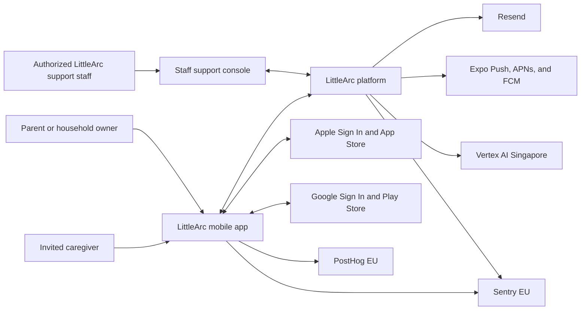
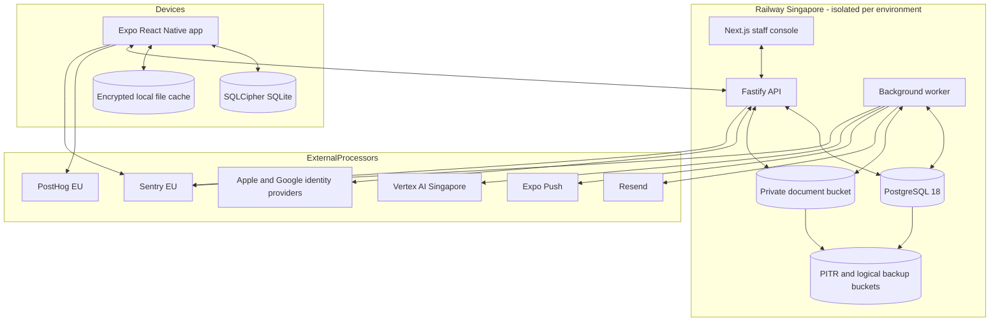
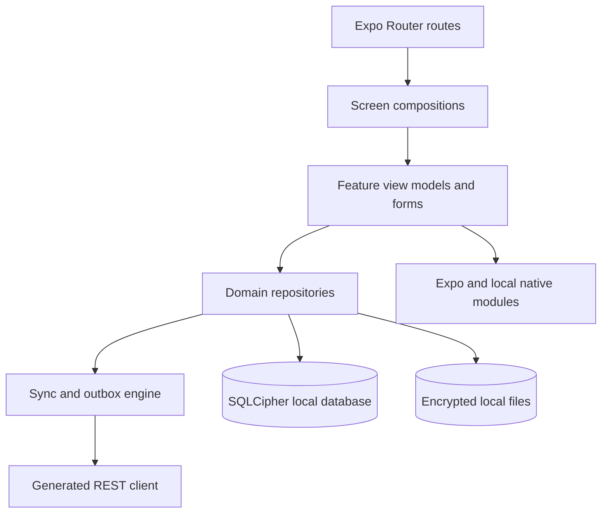
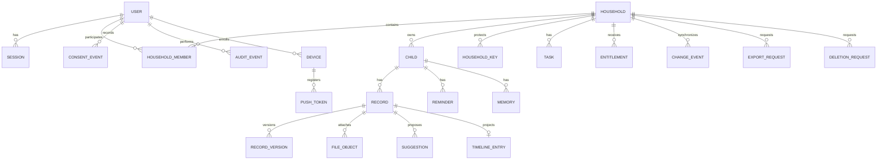
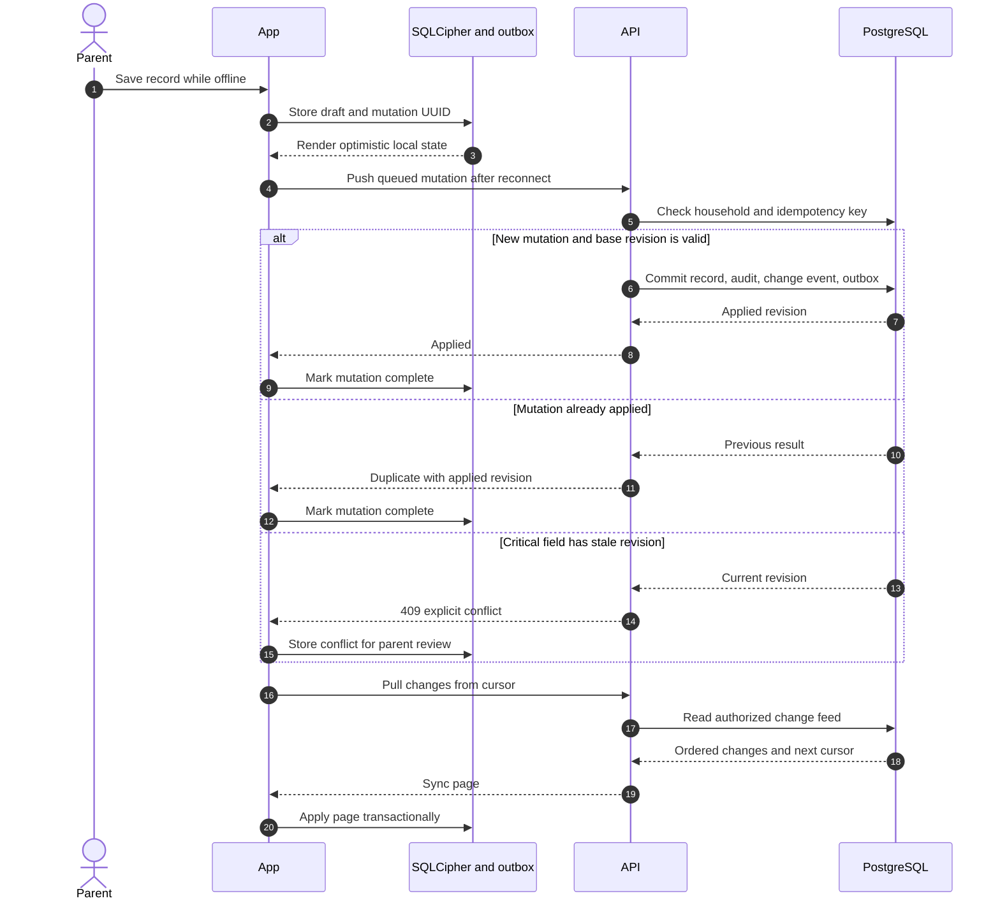
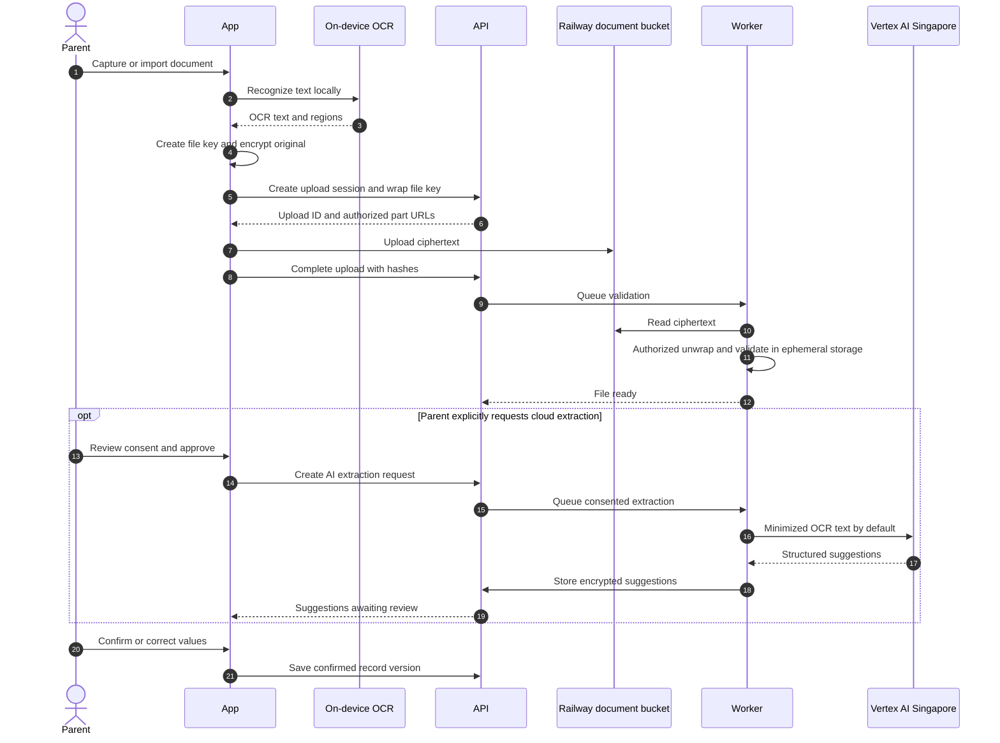
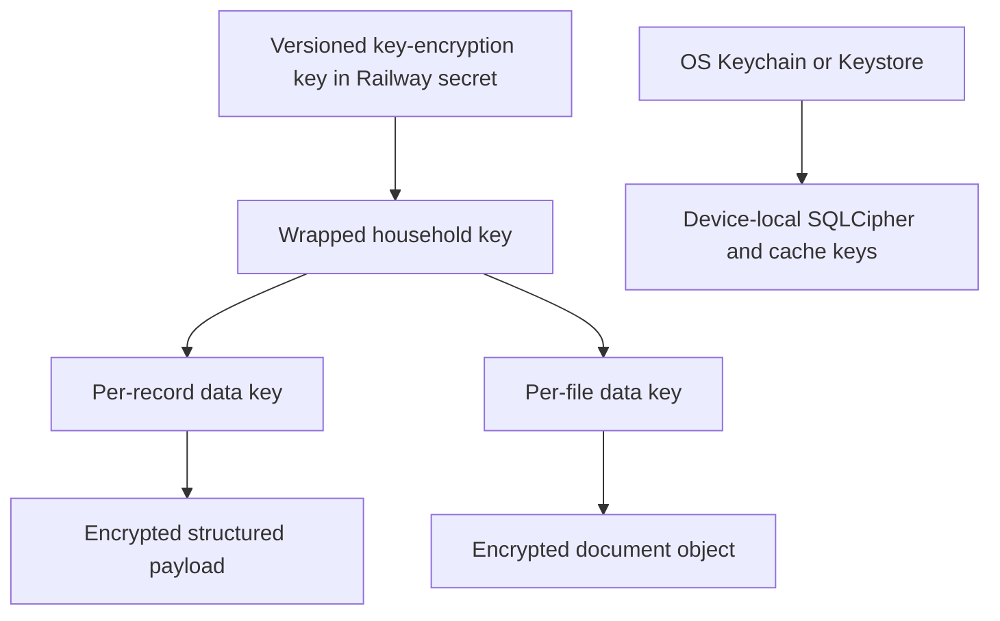

# LittleArc Architecture and Technology Stack

> **Status:** Accepted architecture baseline  
> **Version:** 1.3
> **Last updated:** 18 July 2026
> **Product source:** [LittleArc Complete Product Plan](./littlearc-complete-product-plan.md)  
> **M0 source:** [M0 Readiness and Evidence Dossier](./m0-readiness-and-evidence.md)
> **Audience:** Engineering, product, security, operations, and future implementation agents

---

## 1. Purpose

This document defines the technical architecture for LittleArc's first production release and the path from an early Railway-hosted product to a larger AWS or Azure deployment.

It is the engineering companion to the product plan. The product plan remains authoritative for product behavior, positioning, safety, and rollout sequencing. This document is authoritative for:

- Runtime and framework choices
- Mobile, backend, worker, and staff-console boundaries
- API and synchronization contracts
- Data ownership and storage
- Encryption and authorization boundaries
- Capture, OCR, and consented AI processing
- Deployment, build, update, backup, and recovery workflows
- Observability and privacy controls
- Testing and architecture acceptance gates
- Known risks and migration triggers

The words **must**, **must not**, **should**, and **may** are normative.

---

## 2. Architecture Summary

LittleArc will be implemented as a TypeScript monorepo containing:

- A React Native mobile app built with Expo
- A Fastify modular-monolith API
- A separately deployed background worker using the same domain packages
- A small Next.js staff-support console
- Shared API contracts, validation schemas, domain rules, encryption adapters, and configuration

The production data plane will initially run in Railway's Singapore region. PostgreSQL is the system of record, Railway Buckets store encrypted documents, and `pg-boss` supplies durable PostgreSQL-backed jobs. Redis, Kafka, Kubernetes, and independently deployed domain microservices are intentionally excluded from the MVP.

The mobile app is offline-capable for emergency information, selected records, drafts, uploads, reminders, and tasks. The server remains authoritative. A local SQLCipher database is the mobile read model and outbox, not a second independent source of truth.

Documents and sensitive structured payloads use application-level AES-256-GCM envelope encryption. The initial key-encryption key is stored in Railway secrets by explicit product decision. The implementation must hide that choice behind a replaceable key-provider interface.

OCR runs on-device first. Cloud AI is optional, feature-specific, and explicitly consented. AI output is always a suggestion that requires confirmation.

Native Android and iOS builds run on the development Mac using Android Studio/Gradle and Xcode. LittleArc does not use EAS Build, EAS Submit, or EAS Update during the initial 10–20-person pilot. Pilot releases are native store builds distributed through a Google Play test track and TestFlight. The production update strategy is a post-pilot decision.

---

## 3. Architectural Drivers

### 3.1 Priority order

When architectural concerns conflict, use this order:

1. Child and household privacy
2. Correctness of confirmed health information
3. Offline emergency availability
4. Tenant isolation and authorization
5. Recoverability and auditability
6. Simple operations for a small team
7. Mobile responsiveness and accessibility
8. Cost efficiency
9. Provider portability
10. Feature velocity

Cost efficiency must not bypass the first five priorities.

### 3.2 Hard constraints

- The mobile app must use the latest stable Expo-compatible React Native stack.
- Styling in the mobile app must use Unistyles 3.
- The app must use React Native's New Architecture.
- Expo Go is not a supported development or production environment.
- The API must be REST with an OpenAPI 3.1 contract.
- Better Auth must be self-hosted.
- PostgreSQL must be the primary database and job queue backend.
- Initial production hosting must use Railway Singapore.
- Staging and production must be isolated.
- Billing is deferred until product retention is validated.
- Sensitive analytics payloads are prohibited.
- AI suggestions must never silently become confirmed facts.

### 3.3 Quality targets

| Quality | MVP target |
| --- | --- |
| Emergency availability | Emergency card opens offline from an already enrolled device |
| Emergency interaction | Reach emergency card in no more than two intentional actions |
| API availability | 99.9% monthly target after public launch |
| Data durability | PITR enabled; documented and tested restoration |
| Mobile crash-free sessions | At least 99.5% during beta, 99.8% before broad launch |
| Common interaction responsiveness | No avoidable JS-thread blocking above 50 ms |
| Timeline performance | Smooth interaction with at least 2,000 mixed timeline items on target devices |
| Tenant isolation | Zero tolerated cross-household reads or writes |
| Analytics privacy | Zero user-entered or child-specific values in event payloads |
| AI safety | Zero reminders or confirmed fields created without user confirmation |

These are engineering acceptance targets, not external service-level guarantees.

---

## 4. Decisions at a Glance

| Area | Decision | Rationale |
| --- | --- | --- |
| Repository | pnpm workspace with Turborepo | One TypeScript toolchain with clear app/package boundaries |
| Linting and formatting | Biome for JS, TS, JSON, and CSS | One fast tool and shared configuration across the monorepo |
| Mobile | Expo SDK 57 and React Native 0.86 | Current stable Expo line as of this document |
| Styling | Unistyles 3 | Required styling system; native themes, breakpoints, and variants |
| Navigation | Expo Router | Native file-based routing, linking, and share-intent routing |
| Local storage | SQLCipher through Expo SQLite | Encrypted, queryable offline read model and outbox |
| Mobile state | Repository hooks + TanStack Query + Zustand for UI state | Avoid multiple competing sources of domain truth |
| Backend | Fastify modular monolith | Small operational footprint and explicit domain boundaries |
| API | REST `/v1` + OpenAPI 3.1 | Portable across mobile, staff web, and future partners |
| Authentication | Better Auth, Apple/Google, email OTP | Self-hosted identity without password-reset burden |
| Database | PostgreSQL 18 | Durable relational model, RLS, transactions, search, and queue |
| ORM | Drizzle | Explicit SQL-oriented schema and migrations |
| Jobs | `pg-boss` | PostgreSQL-backed durable jobs without Redis |
| Object storage | Railway Buckets through S3 adapter | Low-cost initial storage with a portable interface |
| Encryption | AES-256-GCM envelope encryption | Protect file and structured payload content |
| Key custody | Railway secrets initially | Accepted cost/operations compromise |
| OCR | On-device ML Kit | Default privacy-preserving extraction |
| Cloud AI | Vertex AI Singapore, opt-in | Regional processing and structured multimodal extraction |
| Analytics/flags | PostHog EU behind an allowlist wrapper | Mature mobile SDK and feature flags |
| Error reporting | Sentry EU with client/server scrubbing | Cross-stack diagnostics with strict data minimization |
| Transactional email | Resend | Low-cost OTP and transactional delivery |
| Push | Expo Push, backed by APNs and FCM | Simple mobile push integration |
| Staff operations | Next.js staff console | Separate, auditable, masked operational surface |
| Billing | Deferred | Validate retention before purchase complexity |
| Mobile builds | Local Mac for Android and iOS | Direct Gradle/Android Studio and Xcode workflows; no EAS during the pilot |
| Pilot distribution | Google Play test track and TestFlight | Controlled releases for the first 10–20 testers |
| OTA updates | Deferred until after the pilot | Avoid operating update infrastructure before release cadence justifies it |
| Initial recovery | Railway PITR and Railway-only copies | Accepted same-provider recovery risk |

---

## 5. Version and Dependency Policy

### 5.1 What "latest" means

LittleArc uses the **latest stable compatible release**, not the newest published artifact regardless of compatibility.

- Preview, beta, release-candidate, and canary packages must not enter production unless an ADR explicitly approves them.
- Expo native packages must be installed with `npx expo install`, which resolves versions compatible with the selected Expo SDK.
- Direct dependencies must be exact-pinned.
- The lockfile must be committed.
- Renovate should open grouped weekly dependency updates.
- Expo SDK, React Native, Unistyles, native modules, database major versions, and authentication major versions require dedicated upgrade pull requests.
- Every native dependency update must pass the physical-device smoke matrix.
- The table below is a dated selection, not permission to update blindly.

### 5.2 Core version snapshot

Versions are current stable releases observed on 17 July 2026.

The M0 compatibility run on 18 July 2026 takes precedence where a newer
registry release falls outside Expo 57's supported matrix. This is why React
19.2.3 and TypeScript 6.0.3 are intentionally pinned instead of their newer
registry versions. The native harness also narrowly overrides Infinite Red ML
Kit core 3.1.0 to corrected core 5.0.0 because text-recognition 5.0.1 retains a
stale dependency; the clean peer and native checks in the M0 dossier govern
that temporary override.

#### Toolchain and repository

| Technology | Version |
| --- | ---: |
| Node.js | 24.18.x LTS |
| pnpm | 11.14.0 |
| Turborepo | 2.10.5 |
| TypeScript | 6.0.3 |
| Biome | 2.5.4 |
| Vitest | 4.1.10 |

#### Mobile

| Package | Version |
| --- | ---: |
| `expo` | 57.0.7 |
| `react-native` | 0.86.0 |
| `react` | 19.2.3 |
| `expo-router` | 57.0.7 |
| `react-native-unistyles` | 3.3.0 |
| `react-native-nitro-modules` | 0.36.1 |
| `react-native-reanimated` | 4.5.2 |
| `react-native-gesture-handler` | 3.1.0 |
| `@shopify/flash-list` | 2.3.2 |
| `@tanstack/react-query` | 5.101.2 |
| `zustand` | 5.0.14 |
| `react-hook-form` | 7.81.0 |
| `zod` | 4.4.3 |
| `@sentry/react-native` | 8.19.0 |
| `posthog-react-native` | 4.57.0 |
| `@react-native-community/netinfo` | 12.0.1 |
| `react-native-keyboard-controller` | 1.22.1 |
| `i18next` | 26.3.6 |
| `react-i18next` | 17.0.10 |

#### Expo native packages

| Package | Expo 57-compatible version |
| --- | ---: |
| `expo-dev-client` | 57.0.7 |
| `expo-sqlite` | 57.0.1 |
| `expo-secure-store` | 57.0.1 |
| `expo-local-authentication` | 57.0.1 |
| `expo-crypto` | 57.0.1 |
| `expo-file-system` | 57.0.1 |
| `expo-sharing` | 57.0.6 |
| `expo-document-picker` | 57.0.1 |
| `expo-image-picker` | 57.0.5 |
| `expo-image-manipulator` | 57.0.5 |
| `expo-camera` | 57.0.3 |
| `expo-image` | 57.0.1 |
| `expo-notifications` | 57.0.6 |
| `expo-localization` | 57.0.1 |

#### Capture modules requiring Phase 0 validation

| Package | Version | Status |
| --- | ---: | --- |
| `react-native-document-scanner-plugin` | 2.0.4 | Validate New Architecture and Expo 57 |
| `@infinitered/react-native-mlkit-text-recognition` | 5.0.1 | Validate Expo 57, real devices, and Indian document samples |

If either package fails its acceptance gate, replace it with a local Expo module:

- iOS scanner: VisionKit `VNDocumentCameraViewController`
- Android scanner: Google ML Kit Document Scanner
- OCR: platform ML Kit/Vision APIs through asynchronous Expo Modules

#### Backend and contracts

| Package | Version |
| --- | ---: |
| `fastify` | 5.10.0 |
| `@fastify/swagger` | 9.8.1 |
| `@fastify/swagger-ui` | 6.1.0 |
| `@fastify/rate-limit` | 11.1.0 |
| `@fastify/helmet` | 13.1.0 |
| `@fastify/cors` | 11.3.0 |
| `@fastify/multipart` | 10.1.0 |
| `better-auth` | 1.6.23 |
| `@better-auth/expo` | 1.6.23 |
| `drizzle-orm` | 0.45.2 |
| `drizzle-kit` | 0.31.10 |
| `pg` | 8.22.0 |
| `pg-boss` | 12.26.1 |
| `openapi-typescript` | 7.13.0 |
| `openapi-fetch` | 0.17.0 |
| `pino` | 10.3.1 |
| `@aws-sdk/client-s3` | 3.1089.0 |
| `@google/genai` | 2.12.0 |
| `resend` | 6.17.2 |

#### Staff console and testing

| Package | Version |
| --- | ---: |
| `next` | 16.2.10 |
| `@playwright/test` | 1.61.1 |
| `jest-expo` | 57.0.2 |
| `@testing-library/react-native` | 14.0.1 |

### 5.3 Deliberate exclusions

Do not add these to the MVP without a new ADR:

- Redis
- GraphQL
- tRPC as the network API
- Kafka, RabbitMQ, or hosted queue services
- Elasticsearch or a hosted search service
- A generic cross-platform UI component library
- AsyncStorage or MMKV for sensitive domain records
- Firebase Auth, Clerk, or Supabase Auth
- Prisma
- Kubernetes
- EAS Build, EAS Submit, and EAS Update during the initial pilot
- Self-hosted OTA update infrastructure before the post-pilot release review
- RevenueCat before billing activation
- Cloud AI by default

### 5.4 Linting and formatting

Biome is the required linter and formatter for JavaScript, TypeScript, JSX, TSX, JSON, JSONC, and CSS.

- Keep one root `biome.jsonc` with explicit `files.includes` and exclusions for dependencies, generated code, build output, and native generated projects.
- Workspace-specific Biome configs may extend the root with `"extends": ["//"]` only when a package needs a justified override.
- Use `pnpm exec biome check .` locally, `pnpm exec biome check --write .` for safe fixes and formatting, and `pnpm exec biome ci .` in CI.
- Configure editors to use Biome for format-on-save and import organization for supported files.
- Do not add ESLint or use Prettier for Biome-supported files. If Markdown or YAML automation is needed, Prettier may be scoped only to those unsupported formats.
- Generated API clients and native build output are checked at their source or generation boundary rather than reformatted after generation.

---

## 6. System Context



The child is a data subject, not the intended application user. The initial app is operated by a parent or authorized adult caregiver.

### 6.1 Trust boundaries

1. **Device boundary:** locally decrypted records and keys exist only inside the app process and protected local stores.
2. **Public network boundary:** all client/server communication uses TLS.
3. **Household boundary:** every domain query and mutation is scoped to one authenticated household membership.
4. **Staff boundary:** staff access uses separate roles, stronger authentication, purpose capture, and audit.
5. **Processor boundary:** AI, analytics, email, push, and error processors receive only explicitly permitted data classes.
6. **Infrastructure boundary:** Railway hosts both ciphertext and the initial wrapping secret; this is a documented residual risk.

---

## 7. Container Architecture



### 7.1 Runtime topology

- `api` and `worker` are separate Railway services built from the same backend image.
- The API never executes long-running OCR, export, deletion, email, or notification work inline.
- The worker receives durable jobs from `pg-boss`.
- The staff console never connects directly to PostgreSQL.
- Buckets are private. Document access uses short-lived, household-authorized upload/download sessions.
- Staging and production use separate databases, buckets, secrets, domains, auth credentials, analytics projects, and AI projects.

---

## 8. Repository and Dependency Boundaries

```text
littlearc/
├── apps/
│   ├── mobile/          Expo Router mobile application
│   ├── api/             Fastify HTTP application
│   ├── worker/          pg-boss consumers and schedulers
│   └── ops-web/         Next.js staff support console
├── packages/
│   ├── contracts/       OpenAPI source schemas and generated types
│   ├── domain/          Framework-independent domain rules
│   ├── database/        Drizzle schema, migrations, and repositories
│   ├── crypto/          Encryption formats and key-provider interfaces
│   ├── auth/            Better Auth configuration and authorization policy
│   ├── observability/   Typed logs, errors, metrics, and analytics schema
│   ├── config/          Validated environment and feature configuration
│   ├── test-kit/        Fixtures, factories, and integration helpers
│   └── design-tokens/   Platform-neutral token source
├── docs/
├── tooling/
├── biome.jsonc
├── package.json
├── pnpm-workspace.yaml
└── turbo.json
```

### 8.1 Dependency rules

- Apps may depend on packages.
- Packages must not depend on apps.
- `domain` must not depend on Fastify, React, Expo, Next.js, Drizzle, or provider SDKs.
- `contracts` may depend on Zod and OpenAPI tooling but not database models.
- `database` implements repository interfaces declared by the domain/application layer.
- `crypto` exposes provider-neutral interfaces; application packages do not read raw wrapping secrets.
- `mobile` must consume generated API types through a repository layer rather than importing backend implementation code.
- `ops-web` must use the public staff API contract, not database packages.
- Avoid broad barrel exports in performance-sensitive mobile code.

---

## 9. Mobile Architecture

### 9.1 Layering



Routes contain navigation configuration and screen entry points only. Components, domain types, queries, and utilities must live outside the route directory.

### 9.2 Proposed route groups

```text
app/
├── _layout.tsx
├── index.tsx
├── (auth)/
├── (onboarding)/
├── (app)/
│   ├── _layout.tsx
│   ├── (today)/
│   ├── (vault)/
│   ├── (timeline)/
│   ├── capture/
│   ├── emergency/
│   ├── records/[record-id]/
│   ├── tasks/
│   └── settings/
├── +native-intent.ts
└── +not-found.tsx
```

- Today, Vault, and Timeline are the primary native tabs.
- Emergency access must have a stable deep link and offline path.
- Incoming share intents route through `+native-intent.ts`.
- Authentication and onboarding routes must not mount decrypted household repositories before enrollment completes.

### 9.3 Styling and design system

Unistyles 3 is mandatory for mobile styling.

The design-token package defines:

- Semantic colors
- Typography roles
- Spacing scale
- Corner radii
- Elevation/shadows
- Motion durations and easing
- Breakpoints
- Minimum touch targets
- Contrast requirements

Unistyles defines light, dark, and high-contrast-aware themes. Components consume semantic tokens rather than literal colors.

Rules:

- Do not introduce Tailwind, NativeWind, Styled Components, or a second mobile styling system.
- Prefer React Native primitives and small LittleArc components over a generic UI kit.
- Support font scaling without clipped controls.
- Use flex layout and `useWindowDimensions`; do not cache screen dimensions globally.
- Use `react-native-safe-area-context` and native navigation insets.
- Important record values and errors should be selectable.
- Animations must respect reduced-motion preferences.

### 9.4 State ownership

| State class | Owner |
| --- | --- |
| Confirmed domain data | SQLCipher repository |
| Pending offline mutations | Local outbox tables |
| Network lifecycle and invalidation | TanStack Query |
| Ephemeral screen state | Component state |
| Cross-screen UI state | Small Zustand stores |
| Forms | React Hook Form with Zod |
| Auth/session secret | SecureStore through Better Auth Expo |
| Database and file keys | SecureStore |
| Feature flags | PostHog adapter with safe defaults |

TanStack Query must not become a second persistent domain database. Repository reads should emit local data immediately and coordinate refresh/sync in the background.

### 9.5 Local database

Use `expo-sqlite` with SQLCipher enabled through its config plugin.

The local database contains:

- Enrolled user and household metadata
- Child profile and emergency-card read model
- Selected/recent record summaries and confirmed payloads
- Timeline read model
- Reminders and tasks
- Draft records
- Pending mutations
- Pending upload sessions
- Sync cursors and tombstones
- Local search index
- Feature configuration cache

The database key is a random 256-bit value stored in SecureStore. It must never be derived from a PIN or biometric.

Biometrics authorize access to the stored key. Biometric enrollment changes may invalidate SecureStore entries; the app must recover by reauthentication and server resynchronization rather than treating this as permanent data loss.

Enable WAL mode after confirming SQLCipher compatibility. Use migrations with forward-only identifiers and transactionally update the local schema.

### 9.6 Local files

- Every cached file is encrypted independently with AES-256-GCM.
- Cache filenames must not contain child names, record names, provider names, or original filenames.
- File metadata belongs in SQLCipher.
- Use bounded cache quotas and least-recently-used eviction for non-pinned files.
- Emergency-card assets and explicitly offline-pinned records are excluded from automatic eviction.
- Partially downloaded or uploaded files use temporary opaque identifiers and are removed after terminal failure or cancellation.

### 9.7 Search

- Local search uses SQLite FTS over confirmed, decrypted local content inside SQLCipher.
- Suggestions that have not been confirmed must not appear as authoritative search facts.
- Server search is household-scoped and decrypts only bounded candidate sets.
- Do not add a hosted search service for MVP.

### 9.8 Performance rules

- Use FlashList for Vault and Timeline collections.
- Keep OCR, hashing, encryption, image normalization, and PDF processing off the JS thread.
- Native modules must expose asynchronous APIs.
- Use React Compiler only after the Expo/Unistyles compatibility spike passes.
- Measure cold-start time, JS bundle size, app size, dropped frames, memory, and list responsiveness before optimization.
- Enable Android R8 and verify third-party native libraries support 16 KB page alignment.
- Avoid unconditional image decoding at original resolution; generate thumbnails during capture.
- Do not send images or record payloads through global state.

---

## 10. Authentication and Authorization

### 10.1 Consumer authentication

Better Auth is mounted in the Fastify application and persists sessions in PostgreSQL.

Supported launch methods:

- Sign in with Apple
- Sign in with Google
- Passwordless email OTP through Resend

Do not support passwords in MVP.

Security rules:

- Email responses must resist account enumeration.
- OTPs must be short-lived, one-time, attempt-limited, and rate-limited by normalized email, IP, and device risk signals.
- Production trusted origins must be explicit.
- CSRF and origin validation must not be disabled.
- Social provider scopes must remain minimal.
- Provider refresh tokens must not be stored unless required.
- Implicit account linking based only on matching email is disabled.
- A signed-in user may explicitly link another provider after reauthentication.
- Apple client-secret rotation must be scheduled and monitored before expiry.
- Remote session listing and revocation are required.

The mobile Better Auth session is held in SecureStore. The staff console uses secure, HttpOnly, same-site cookies.

### 10.2 Household authorization

The household is the primary tenant boundary.

Every domain record must carry:

- `household_id`
- `child_id` when child-specific
- `created_by`
- `updated_by`
- `access_policy`
- `revision`
- `created_at`
- `updated_at`
- `deleted_at` or active status

Authorization is enforced twice:

1. Fastify authorization policy checks membership, role, and capability.
2. PostgreSQL RLS restricts rows to the active household context.

The API must establish the household context inside the same transaction used for queries. Client-provided household identifiers never grant authority by themselves.

Initial roles:

| Capability | Owner | Caregiver | Staff |
| --- | ---: | ---: | ---: |
| View emergency card | Yes | If invited | No by default |
| View selected health records | Yes | If granted | No by default |
| View identity documents | Yes | If explicitly granted | No |
| Add records | Yes | If granted | No |
| Edit confirmed records | Yes | If granted | No |
| Manage tasks | Yes | If granted | No |
| Invite members | Yes | No | No |
| Export household | Yes | No | Workflow status only |
| Delete household | Yes | No | Workflow status only |
| Manage entitlement | Yes | No | Audited support action |

### 10.3 Staff authentication

- Staff identities use a separate Better Auth configuration or logically isolated staff tenant.
- Passkeys are mandatory.
- TOTP may exist only as a documented recovery factor.
- Staff accounts require explicit allowlisting.
- Staff roles must be least-privilege.
- Privileged actions require a purpose code and recent reauthentication.
- Document contents, OCR text, child health values, and encryption keys are hidden by default.
- Break-glass access, if ever introduced, requires dual approval, a time limit, a reason, and immediate audit alerting.

---

## 11. Backend Architecture

### 11.1 Modular monolith

Fastify modules:

- `identity`
- `households`
- `children`
- `emergency`
- `records`
- `files`
- `timeline`
- `reminders`
- `tasks`
- `memories`
- `consent`
- `ai-extraction`
- `notifications`
- `exports`
- `deletion`
- `entitlements`
- `sync`
- `staff-operations`
- `audit`

Each module contains:

- HTTP route adapters
- Application commands and queries
- Domain policies
- Repository interfaces
- Event definitions
- Provider adapters where required

Modules may communicate synchronously through application interfaces and asynchronously through durable domain events. They must not reach into another module's tables from route handlers.

### 11.2 API process

The API process owns:

- TLS-terminated HTTP handling behind Railway
- Authentication and session validation
- Household authorization
- Zod request/response validation
- OpenAPI generation
- Fast transactional commands and queries
- Upload/download session issuance
- Sync pull/push
- Staff API
- Health and readiness endpoints

The API must not perform:

- AI inference
- File normalization or malware scanning
- Export archive construction
- Bulk deletion
- Push/email delivery
- Scheduled reminder scanning
- Large re-encryption or key rotation

### 11.3 Worker process

The worker owns:

- Document validation
- Thumbnail generation when server-side processing is authorized
- Consented AI extraction
- Reminder scheduling and dispatch
- Email and push delivery
- Export generation
- Deletion and retention jobs
- Key rewrapping
- Backup verification jobs
- Analytics-free operational aggregation

Jobs use `pg-boss`. Job payloads must contain opaque IDs and operation parameters, not decrypted child or document content.

### 11.4 Transactional outbox

The database transaction that changes domain state also inserts an outbox event. A dispatcher publishes the event to `pg-boss` and marks the outbox row as dispatched.

This prevents:

- A record being saved without its reminder job
- A deletion request being accepted without a purge job
- An entitlement changing without a downstream notification
- An export status changing without delivery

Consumers must be idempotent and record terminal state.

---

## 12. REST API Contract

### 12.1 Standards

- Base path: `/v1`
- Contract: OpenAPI 3.1 generated from shared Zod schemas
- Media type: `application/json`
- Error type: `application/problem+json`
- Authentication routes: `/v1/auth/*`
- Resource identifiers: UUIDv7
- Timestamps: UTC ISO 8601 with offset
- Pagination: opaque cursor
- Concurrency: integer revision and conditional mutation
- Mutation retry: `Idempotency-Key`
- Request correlation: `X-Request-ID`
- Rate-limit headers: use standardized `RateLimit` fields where client support permits

Do not wrap every success response in a generic `{ success, data }` envelope. Return the resource or a purpose-specific response. Errors use one consistent Problem Details shape.

### 12.2 Resource groups

| Prefix | Responsibility |
| --- | --- |
| `/v1/auth` | Better Auth endpoints and session lifecycle |
| `/v1/households` | Household details, members, invitations |
| `/v1/children` | Child profiles and access policies |
| `/v1/emergency-cards` | Emergency-card configuration and versions |
| `/v1/records` | Health, identity, visit, vaccination, prescription, and memory records |
| `/v1/files` | Upload sessions, completion, download grants, deletion |
| `/v1/timeline` | Confirmed timeline projection |
| `/v1/reminders` | Reminder definitions and confirmations |
| `/v1/tasks` | Household task lifecycle |
| `/v1/memories` | Monthly memory entries and media links |
| `/v1/consents` | Versioned consent grants and withdrawals |
| `/v1/ai-extractions` | Explicitly consented extraction requests and review state |
| `/v1/sync` | Change feed and mutation push |
| `/v1/exports` | Export requests and status |
| `/v1/deletion-requests` | Account/household deletion lifecycle |
| `/v1/entitlements` | Current household access and future billing/sponsor sources |
| `/v1/staff` | Masked, staff-authorized operational actions |

### 12.3 Problem Details

```json
{
  "type": "https://littlearc.com/problems/revision-conflict",
  "title": "The record changed on another device",
  "status": 409,
  "detail": "Review the current confirmed values before saving again.",
  "instance": "/v1/records/019abc...",
  "code": "record_revision_conflict",
  "requestId": "019def...",
  "errors": []
}
```

`detail` must be safe for users and logs. Internal stack traces, SQL, provider responses, paths, document names, and payload excerpts must not appear.

### 12.4 Pagination

List responses use:

```json
{
  "items": [],
  "nextCursor": "opaque-or-null"
}
```

Cursors are signed or opaque encoded tuples of the stable sort key and identifier. They must not contain readable sensitive fields.

### 12.5 Concurrency and idempotency

- Every mutable entity exposes `revision`.
- Clients send `baseRevision` for updates.
- Critical health fields reject stale revisions with `409`.
- Noncritical notes may accept a stale revision using server-ordered last-write-wins and record both revisions in audit history.
- Client clock time must never decide the winner.
- Every retryable create/update/delete includes a client-generated mutation UUID and `Idempotency-Key`.
- The server stores idempotency results for the documented retry window.

### 12.6 Generated clients

The OpenAPI document is produced in CI and checked for unreviewed breaking changes. `openapi-typescript` and `openapi-fetch` generate the mobile and staff-console client.

Generated files are never edited manually.

---

## 13. Core Data Model



### 13.1 Record model

Every record contains:

- UUIDv7 ID
- Household and child IDs
- Record category
- Queryable event date and lifecycle state
- Encrypted title, provider/facility, notes, structured health values, and provenance details
- Source type
- Confirmation state
- AI-assisted flag
- Created/updated actor
- Revision
- Creation/update/deletion timestamps

### 13.2 Suggested versus confirmed values

Suggestions are separate rows or encrypted objects:

- `field_path`
- `suggested_value`
- `source_span`
- `confidence_bucket`
- `extractor_type`
- `model_id`
- `prompt_version`
- `consent_event_id`
- `created_at`
- `review_state`

Confirmed values are stored in the record version only after explicit user action. Rejecting a suggestion never erases the audit fact that a suggestion was produced, but retained content follows the approved retention policy.

### 13.3 Versioning and correction

- Critical structured records are append-versioned.
- Corrections produce a new `record_version`.
- The current record points to the active version.
- Provider-issued artifacts are never silently overwritten.
- Parent annotations and corrected structured values retain source provenance.
- Deletes create a sync tombstone immediately and queue physical purge.

### 13.4 Queryable versus encrypted data

| Data class | Storage treatment |
| --- | --- |
| IDs, tenant relationships, revision, state | Queryable plaintext metadata |
| Event and reminder timestamps | Queryable metadata required for timeline/scheduling |
| Record category and file MIME/size | Queryable operational metadata |
| Child name, date of birth, identifiers | Encrypted payload |
| Health values, notes, provider names | Encrypted payload |
| OCR text and AI suggestions | Encrypted payload |
| Original filenames | Encrypted payload |
| Document bytes | Encrypted object |
| Audit actor/action/time | Queryable; sensitive details minimized/encrypted |

This is not end-to-end encryption. The authorized server can decrypt data to deliver product features.

---

## 14. Offline Synchronization

### 14.1 Model

The server is authoritative. The mobile database is a local read model plus an outbox.

Client-generated UUIDv7 IDs allow offline creation. Each enrolled device owns:

- A device ID
- A server change cursor
- A monotonically ordered local mutation queue
- Upload session state
- Last successful full-reconciliation timestamp

### 14.2 Pull contract

`GET /v1/sync?cursor={cursor}&limit={limit}`

Returns ordered changes:

```text
SyncPage
  changes[]
    sequence
    entityType
    entityId
    operation: upsert | delete
    revision
    changedAt
    payload, when authorized and required
  nextCursor
  hasMore
  serverTime
```

The cursor is opaque. Change events are retained long enough for normal inactive-device recovery. If a cursor has expired, return a typed reset response and rebuild the local read model from paginated snapshots.

### 14.3 Push contract

`POST /v1/sync/mutations`

Each mutation contains:

- `mutationId`
- `entityType`
- `entityId`
- `operation`
- `baseRevision`
- Validated payload or patch
- Local dependency IDs

The response reports `applied`, `duplicate`, `conflict`, or `rejected` per mutation. One invalid mutation must not silently discard unrelated valid mutations; dependency ordering must remain explicit.

### 14.4 Sync sequence



### 14.5 Conflict policy

Critical fields include:

- Allergy and emergency information
- Vaccination status and administration dates
- Medication and prescription information
- Visit diagnoses as recorded from source documents
- Growth measurements
- Child identity fields
- Reminder-driving clinical dates

Stale critical changes require parent review. Noncritical notes, task descriptions, display preferences, and draft memory text may use server-ordered last-write-wins with audit history.

### 14.6 Failure behavior

- Backoff uses jitter and respects network state.
- Authentication failures pause sync and request reauthentication.
- Authorization failures permanently reject the mutation and preserve a user-visible local copy where safe.
- Validation failures remain editable.
- Server failures retry.
- Permanent file failures do not delete the local source automatically.
- Tombstones win over stale background uploads unless an explicit restore workflow exists.

---

## 15. Document Capture and Upload

### 15.1 Supported sources

- Camera
- Document scanner
- Photo library
- PDF/document picker
- Incoming iOS share extension
- Incoming Android share intent

`expo-sharing` is the first-choice incoming-sharing integration. Because incoming iOS sharing remains a higher-risk native path, it must pass a physical-device spike. The fallback is a local Expo module and native share extension.

### 15.2 Capture stages

1. Obtain platform permission with purpose-specific explanation.
2. Capture/import into an app-private temporary location.
3. Validate type, page count, and size.
4. Normalize orientation and generate a thumbnail.
5. Run on-device OCR when supported.
6. Create a local draft and source provenance.
7. Generate a random file data-encryption key.
8. Encrypt bytes with AES-256-GCM before upload.
9. Request an authorized upload session and wrap the file key.
10. Upload ciphertext with resumable state.
11. Complete upload and queue server validation.
12. Review OCR or AI suggestions.
13. Confirm fields and create the immutable provenance event.

### 15.3 Upload sequence



### 15.4 File constraints

Initial defaults:

- Accepted input: JPEG, HEIC/HEIF, PNG, and PDF
- Maximum original object: 25 MB
- Maximum PDF pages: 50
- Maximum single image dimension after normalization: defined by quality tests
- Hash: SHA-256 over ciphertext and normalized plaintext metadata as separately defined
- MIME detection: magic bytes, not filename extension

Limits are server-configurable and returned to the client.

### 15.5 Server validation

The worker decrypts only in an isolated temporary directory or memory-backed filesystem. It must:

- Recheck MIME and file structure
- Reject executable or embedded active content
- Bound PDF parsing resources
- Scan supported formats for malware
- Strip unsafe metadata from derived previews
- Delete plaintext temporary material in a `finally` path
- Emit no filenames or content into logs

Downloads serve the original encrypted object to the authorized app, which decrypts locally.

---

## 16. Encryption Architecture

### 16.1 Algorithms

- Content encryption: AES-256-GCM
- Nonce: random 96-bit nonce per encryption operation
- Hashing: SHA-256
- Key generation: cryptographically secure 256-bit random values
- Transport: TLS 1.2 minimum, TLS 1.3 preferred

Never reuse an AES-GCM nonce with the same key.

### 16.2 Key hierarchy



The application stores:

- Key version
- Wrapped key bytes
- Wrapping nonce
- Content nonce
- Authentication tag
- Encryption format version
- AAD schema version

AAD binds ciphertext to immutable context such as household ID, object ID, object type, and format version. Moving ciphertext to a different household or object ID must fail authentication.

### 16.3 File-key creation

The device may create and use a file key while offline. At upload-session creation, it sends the key only through authenticated TLS to the API. The API wraps it immediately and must not log, persist, or cache the plaintext key.

### 16.4 Structured payload encryption

The API generates per-object data keys for sensitive PostgreSQL payloads and wraps them under the household key. Operational metadata remains queryable as described in the data-classification table.

### 16.5 Rotation

- A key-provider interface exposes `wrap`, `unwrap`, `rewrap`, and current key version.
- Introducing a new KEK version does not re-encrypt document bytes.
- A worker rewraps household keys in bounded, idempotent batches.
- Previous KEK versions remain available only until verification and rollback windows close.
- Rotation completion is measured and audited.
- A suspected key compromise triggers session revocation, key rotation, rewrap, and incident procedures.

### 16.6 Accepted key-custody risk

The production KEK initially resides in Railway secrets. Railway therefore hosts both encrypted data and the secret capable of unwrapping its keys.

Compensating controls:

- Separate staging and production secrets
- Least-privilege Railway project membership
- MFA on provider accounts
- No KEK in source, images, logs, database, or buckets
- Versioned secret rotation procedure
- Audit of all application unwrap operations
- Provider-neutral key interface
- Mandatory migration trigger after security review, enterprise partnership, or infrastructure migration

This design is envelope encryption but not independent KMS custody and not zero-knowledge encryption.

---

## 17. OCR and AI Architecture

### 17.1 Default path

OCR runs on-device. Deterministic parsers may detect candidate dates, measurements, document categories, and known vaccination labels.

The default path does not send a document or OCR text to an AI provider.

### 17.2 Consent model

Consent is feature-specific:

- Smart Capture from OCR text
- Original image/PDF vision extraction
- Memory-writing assistance
- Timeline summary

Each consent event records:

- Notice version
- Feature and purpose
- Provider class
- Data categories
- Retention/training disclosure
- User and household
- Timestamp
- Grant or withdrawal

Sending an original document requires a separate, explicit action even when OCR-text extraction is enabled.

### 17.3 Provider

Initial validation target:

- Provider: Vertex AI
- Region: `asia-southeast1` where supported
- Model: `gemini-2.5-flash`
- Output: versioned structured JSON schema
- Grounding/search: disabled
- Provider-side file stores: disabled
- Prompt and response logging: disabled where configuration permits

The model ID is configuration, never hardcoded into domain rules.

Because model lifecycles are short, production selection follows this deterministic rule:

1. Generally available, not preview
2. Supports the required modality and structured output
3. Available for regional processing in Singapore
4. Covered by the approved DPA and no-training commitment
5. Passes the frozen LittleArc extraction evaluation suite
6. Meets latency and cost ceilings

`gemini-2.5-flash` must be replaced before its official retirement. A model change requires evaluation results and an ADR, not an app-store release.

### 17.4 AI gateway

The worker calls an internal `ExtractionProvider` interface:

```text
extract(input, schema, policyContext) -> ExtractionResult
```

The gateway owns:

- Provider authentication
- Regional endpoint selection
- Timeout and retry policy
- Prompt templates
- JSON-schema validation
- Cost and token limits
- Redaction/minimization
- Provider request identifiers
- Model and prompt version capture
- Safe error mapping

### 17.5 Safety rules

- No diagnosis
- No dosage calculation
- No treatment recommendation
- No autonomous reminder creation
- No autonomous modification of confirmed data
- No AI output in the emergency card before confirmation
- Every suggested field shows its source snippet or source location
- Ambiguous values expose a "could not determine" state
- Low-confidence or conflicting values remain unresolved
- Provider errors fall back to manual entry

---

## 18. Notifications and Email

### 18.1 Push

Use `expo-notifications` and Expo Push initially.

- Store per-device push tokens with platform, environment, and last-seen time.
- Handle token rotation and invalid-token responses.
- Users configure notification categories.
- Lock-screen content is generic by default.
- Do not include child names, health conditions, medication names, vaccination names, document titles, or provider names in push payloads.
- Deep links route to an authenticated app destination; the push payload does not contain decrypted record data.

### 18.2 Email

Use Resend through an `EmailProvider` adapter.

Required setup:

- Separate staging and production domains or subdomains
- SPF, DKIM, and DMARC
- Delivery, bounce, and complaint webhooks
- Signed webhook verification
- Template versioning
- Suppression handling
- OTP-specific rate limits

Email must not contain child health records or document attachments.

### 18.3 Reminder processing

- Store the user-selected local timezone and authoritative UTC fire time.
- Worker scans due reminders using queryable scheduling metadata.
- Use deterministic job keys to prevent duplicate delivery.
- Confirmation creates the resulting domain event only after user action.
- Timezone changes recalculate future schedules without rewriting historical events.

---

## 19. Entitlements and Deferred Billing

Billing is not implemented in the first retention-validation release.

The domain still defines:

```text
EntitlementSource
  free
  apple_subscription
  google_subscription
  partner_sponsorship
  founding_grant
  audited_support_override
```

An `EntitlementProvider` resolves:

- Household plan
- Source
- Effective time
- Expiry
- Grace period
- Feature/storage limits
- Precedence

For MVP, a database-backed provider grants the configured free/founding entitlement. Store billing code and RevenueCat are absent.

When billing is activated:

- Add RevenueCat behind the existing provider interface.
- Validate Apple and Google webhook signatures.
- Keep store/customer identifiers separate from analytics.
- Restore purchases.
- Reconcile entitlement state asynchronously.
- Never delete household data solely because billing lapses.

---

## 20. Analytics, Feature Flags, and Error Reporting

### 20.1 Product analytics

PostHog EU is accessed only through a LittleArc analytics wrapper with compile-time event definitions.

Permitted properties are enums, booleans, bounded counts, coarse duration buckets, app/build versions, platform, and acquisition categories.

Prohibited values include:

- User, household, child, record, file, or provider IDs
- Email, names, dates of birth, or phone numbers
- Record titles, notes, OCR text, AI text, filenames, or paths
- Health categories when they identify user behavior
- Search terms
- Exact reminder dates
- Error messages
- Route parameters containing IDs
- IP-derived precise location

Use a random installation identifier that is not joined to the LittleArc user ID. Disable session replay, autocapture, heatmaps, and automatic property capture.

Feature flags must have:

- A safe local default
- A documented owner and expiry
- No targeting based on child or health data
- A kill switch for AI, uploads, sharing, and notifications

### 20.2 Error reporting

Sentry EU rules:

- Disable screenshots, view hierarchies, attachments, and session replay.
- Do not attach request or response bodies.
- Scrub headers, cookies, query values, local paths, and user-entered text.
- Use random diagnostic installation IDs, not LittleArc account IDs.
- Map dynamic errors to stable error codes.
- Implement `beforeSend` on mobile and server.
- Sample performance traces; do not trace decrypted content-processing spans with dynamic names.

### 20.3 Logs and metrics

Logs are structured JSON with:

- Timestamp
- Severity
- Service and version
- Environment
- Stable event code
- Request or job ID
- Opaque resource ID only when operationally essential
- Duration and outcome

Logs must never include domain payloads, OCR/AI content, file keys, tokens, cookies, or raw third-party responses.

Metrics include:

- Request rate, latency, and error class
- Job queue depth, age, retry, and dead-letter count
- Upload completion/failure rate
- Sync conflict and reset rate
- Push/email delivery outcomes
- AI latency, failure, correction, and cost aggregates
- Database connections, storage, WAL archive health, and PITR status
- Update adoption and rollback status without account identifiers

---

## 21. Staff Support Console

The Next.js staff app is deployed as a separate Railway service and calls `/v1/staff`.

Initial functions:

- Search account by exact, normalized email through a privileged endpoint
- View masked account and household status
- View session and device status
- Revoke sessions
- View upload processing state without content
- View export and deletion workflow status
- View entitlement source and expiry
- Apply an audited entitlement override
- Resend a safe transactional message
- View audit events

It must not provide:

- General document browsing
- OCR or AI prompt/response browsing
- Bulk household search by child data
- Direct SQL
- Encryption-key access
- Impersonation
- Silent edits of confirmed records

Every sensitive operation records actor, purpose, target, before/after state, request ID, and time.

---

## 22. Pilot Release Policy and Post-Pilot Update Decision

### 22.1 Initial pilot

The initial pilot consists of 10–20 invited participants. All pilot releases are complete native binaries distributed through an external TestFlight group and a Google Play test track.

- Do not configure EAS Build, EAS Submit, EAS Update, or a custom Expo Updates server.
- Do not deploy update manifest endpoints, release/channel tables, update buckets, signing keys, or OTA promotion tooling.
- Every pilot build increments the native build number and is traceable to a source commit and lockfile.
- Emergency-card access must continue to use the embedded bundle and offline local data.
- Confirm the Play Console account type before recruitment. If the account is subject to Google's production-access rule, use Closed Testing with at least 12 continuously opted-in testers for at least 14 days; otherwise Internal Testing may be used for rapid pilot distribution.
- Budget time for TestFlight Beta App Review before the first build is released to external testers.
- Critical fixes during the pilot ship as a new store test build.

### 22.2 Exit criteria

Review the update strategy only after the 10–20-person cohort has completed at least two release cycles and the team has measured release frequency, review delay, crash-free sessions, rollback needs, and operational capacity.

The review must choose and document one of these options in an ADR:

1. Continue store-distributed native releases.
2. Adopt EAS Update.
3. Implement a signed self-hosted Expo Updates service.

The decision must compare cost, signing and rollback safety, runtime compatibility, store-policy constraints, emergency startup behavior, and the burden of operating critical update infrastructure. OTA updates must not be treated as an accepted production dependency until that ADR is approved.

---

## 23. Deployment Architecture

### 23.1 Environments

| Environment | Location | Data |
| --- | --- | --- |
| Local Mac | Developer-controlled | Synthetic fixtures only |
| Staging | Railway Singapore | Synthetic/test accounts only |
| Production | Railway Singapore | Real household data |

Production child data must never be copied into staging or developer environments.

### 23.2 Railway services per environment

- API
- Worker
- Staff console
- PostgreSQL
- Private document bucket
- PITR bucket
- Logical backup/object-copy bucket

The API and worker should share a container image but use different commands and scaling.

### 23.3 Health checks

- `/health/live`: process is running; no dependency calls
- `/health/ready`: required database and configuration checks
- Worker heartbeat: persisted or exposed through a protected operations endpoint

Readiness must fail when migrations are incompatible or required secrets are missing.

### 23.4 Database

- PostgreSQL 18.4
- TLS required
- Separate application, migration, worker, and read-only operational roles
- RLS enabled on tenant tables
- Connection pools bounded per service
- Data checksums enabled where the Railway image supports them
- Extensions limited to reviewed requirements
- Migrations run as an explicit release step, not automatically from every replica

### 23.5 Secrets

Secrets belong in environment-specific Railway secret configuration.

Never expose secrets through:

- Expo public environment variables
- Client bundles
- Container images
- Repository files
- Build artifacts
- Logs
- Sentry or PostHog

Client-visible configuration must be explicitly prefixed and reviewed as public.

### 23.6 Infrastructure portability

Provider adapters must isolate:

- Object storage
- Key wrapping
- Email
- Push
- AI
- Analytics/flags
- Error reporting
- Entitlements

Use standard PostgreSQL and S3-compatible operations where practical. Avoid Railway-only data models in domain code.

---

## 24. Native Build and Release Workflow

Both platforms build on the development Mac. The native projects are generated and maintained through Expo prebuild/config plugins, but compilation, signing, and submission use the platform toolchains directly.

### 24.1 Android on the Mac

Required tools:

- Node 24 LTS and repository-pinned pnpm
- JDK 17
- Android Studio and SDK/command-line tools
- Android platform/compile SDK required by Expo 57
- Required NDK version resolved by Expo/Gradle

Development-client command:

```bash
npx expo run:android --device
```

For a pilot release, generate the native project when configuration changes, then create a signed Android App Bundle with Android Studio or the mobile app's Gradle wrapper using the `bundleRelease` task. Upload the resulting AAB manually to Google Play Internal Testing or the required Closed Testing track.

### 24.2 iOS on the Mac

Use the Expo 57-compatible Xcode version and CocoaPods toolchain.

Development-client command:

```bash
npx expo run:ios --device
```

For a pilot release, open the generated Xcode workspace, select the production scheme, run Product > Archive, validate the archive, and distribute it manually to TestFlight. Record the exact validated Xcode version in the release runbook instead of hard-coding it into the architecture.

### 24.3 Credentials

- Android signing key and Apple certificates/profiles are locally managed.
- Credentials must not be committed.
- Store encrypted recovery copies in an approved secrets/password system.
- Record certificate and provisioning expiry.
- Use distinct development and production identifiers.

### 24.4 Release lanes

- `development`: locally installed custom development client
- `pilot`: TestFlight or Google Play test-track artifact
- `production`: App Store or Google Play production artifact after approval

Every release records:

- Source commit
- Dependency lock hash
- App version and native build number
- Build machine/tool versions
- Database migration range

### 24.5 Submission

Pilot submission is manual through App Store Connect and Google Play Console. EAS Submit is not configured during the pilot and may be reconsidered only in the post-pilot release ADR.

---

## 25. Backup and Disaster Recovery

### 25.1 Database

Enable Railway PITR when production PostgreSQL is created.

Minimum policy:

- WAL archiving monitored
- At least a 14-day PITR window if supported by the selected Railway configuration
- Daily encrypted logical backup to a separate Railway bucket/project
- Monthly restore drill during beta, quarterly after stable operations
- Restoration creates a sibling database; cutover is explicit
- Restore runbook includes application pause/read-only mode, validation, and rollback

### 25.2 Documents

- Document bucket stores ciphertext only.
- Daily inventory compares database file rows to bucket objects.
- Copy new ciphertext objects to a second Railway-only recovery bucket/project.
- Never overwrite objects in place.
- Deletion marks objects first and purges them through an auditable retention job.

### 25.3 Recovery targets

Initial internal objectives:

- Database recovery point: within the configured PITR window, typically no more than several minutes of archive lag
- Database recovery time: four hours for beta
- Document recovery: one business day for beta
- Emergency-card continuity: already enrolled devices continue from local data during server outage

### 25.4 Accepted recovery risk

All initial backups remain with Railway by explicit decision. This protects against many operational mistakes but not Railway account compromise, broad provider outage, or provider-wide loss.

Independent off-provider encrypted backup becomes mandatory when any of these occur:

- Security review requires provider separation
- A partner or insurer requires defined disaster independence
- Recovery objectives become stricter than Railway can meet
- Production reaches material family or revenue exposure
- Migration to AWS or Azure begins

---

## 26. Export, Deletion, and Retention

### 26.1 Export

Export is an asynchronous job:

1. Owner requests export after recent reauthentication.
2. API records the request and audit event.
3. Worker creates a structured manifest and files.
4. Export is encrypted at rest.
5. User receives a short-lived authenticated download.
6. Export object expires and is purged.

The export must include provenance and confirmed values. AI suggestions are included only when policy explicitly requires them and are clearly labeled.

### 26.2 Deletion

1. Owner requests deletion after recent reauthentication.
2. Access is revoked or restricted according to the published grace policy.
3. A tombstone propagates to enrolled devices.
4. Active records, files, sessions, push tokens, and derived data are purged.
5. Processor deletion calls are issued where applicable.
6. Backups age out through the approved lifecycle.
7. Legally retained audit/billing records are minimized and isolated.
8. Completion is recorded without retaining deleted content.

Retention durations must be configuration-driven and approved by legal/privacy review before public launch.

---

## 27. Testing Strategy

### 27.1 Test layers

| Layer | Tooling | Coverage |
| --- | --- | --- |
| Domain unit | Vitest | Validation, roles, conflicts, schedules, entitlements |
| API unit | Vitest/Fastify inject | Routes, errors, auth policy, rate limits |
| Database integration | PostgreSQL containers | RLS, migrations, outbox, idempotency |
| Contract | OpenAPI diff and generated client compile | Request/response compatibility |
| Mobile unit/component | Jest Expo and React Native Testing Library | Forms, repositories, offline states |
| Mobile E2E | Maestro | Onboarding, capture, emergency, sync, conflict |
| Staff web E2E | Playwright | Passkeys/test auth, masking, audited actions |
| Provider contract | Sandboxes/fakes | Better Auth, Resend, push, Vertex, buckets |
| Security | Static, dynamic, and adversarial tests | OWASP API risks and secret leakage |
| Performance | Physical devices and backend load | Cold start, FPS, upload, sync, API latency |
| Recovery | Restore exercises | PITR, object restoration, native release rollback |

### 27.2 Mandatory security cases

- User A cannot access User B's household by changing any ID.
- Caregiver cannot exceed granted capabilities.
- RLS blocks cross-household SQL even when application filters are omitted.
- Staff cannot access document or health content through normal support APIs.
- Revoked sessions stop API and sync access.
- OTP rate limits resist email/IP/device variations.
- Implicit social account linking remains disabled.
- Upload URLs cannot cross household or environment.
- File completion rejects mismatched hashes and metadata.
- AI job rejects missing, withdrawn, or wrong-feature consent.
- Analytics wrapper rejects prohibited properties.
- Logs and Sentry contain no seeded sensitive canary values.
- Export and deletion require recent owner reauthentication.

### 27.3 Mandatory offline cases

- Emergency card opens with no network.
- Biometric-required and quick-access emergency modes behave as configured.
- Draft creation survives process termination.
- Upload resumes after network loss.
- Duplicate mutation retry does not duplicate records.
- A stale critical update produces reviewable conflict state.
- A long-inactive device performs full resynchronization after cursor expiry.
- Tombstones remove deleted data from local search/cache.
- SecureStore biometric invalidation triggers safe reenrollment.

### 27.4 Mandatory pilot release cases

- Android and iOS pilot artifacts are built from a clean checkout on the designated Mac.
- Signed artifacts install through the selected Google Play test track and TestFlight on the physical-device matrix.
- Every upload uses a unique, monotonically increasing native build number.
- Development and production identifiers, signing credentials, and backend configuration cannot be mixed.
- Signing credentials and recovery copies are absent from source, logs, and build artifacts.
- A critical regression can be rebuilt from the previous known-good commit with a new build number and redistributed.

### 27.5 Performance matrix

Test at minimum:

- One current iPhone
- One oldest supported iPhone
- One current midrange Android device
- One lower-memory Android device near minimum support

Datasets:

- 2,000 timeline entries
- 500 records
- 1,000 search-index terms
- 100 pending mutations
- 20 concurrent/pending document uploads
- Maximum allowed PDF

---

## 28. Phase 0 Compatibility Spikes

Implementation must not begin broad feature work until these spikes pass.

| Spike | Acceptance |
| --- | --- |
| Expo 57 + RN 0.86 + Unistyles 3 | iOS/Android dev clients build; themes and breakpoints work |
| React Compiler + Unistyles | No Babel/runtime conflict; otherwise compiler stays disabled |
| SQLCipher | Create, migrate, lock, reopen, biometric invalidation recovery |
| Better Auth Expo | Apple, Google, email OTP, refresh, logout, session revocation |
| Document scanner | Multi-page scan on real iOS/Android under New Architecture |
| ML Kit OCR | Works offline on representative Indian medical documents |
| Incoming sharing | WhatsApp/gallery/files PDF and image on iOS/Android |
| AES-GCM file pipeline | Encrypt, resume upload, server unwrap/validate, device download/decrypt |
| Notifications | Token rotation, deep link, generic lock-screen content |
| Local builds | Reproducible signed Android AAB and iOS archive on the designated Mac |
| Pilot distribution | Install and upgrade through the selected Google Play test track and TestFlight on the device matrix |

Failed native integrations trigger the local Expo-module fallbacks defined earlier. They do not trigger abandonment of Expo or Unistyles.

---

## 29. Delivery Sequence

### Foundation

1. Create monorepo, root Biome configuration, and shared tooling.
2. Complete Phase 0 compatibility spikes.
3. Establish Railway staging and production skeletons.
4. Add OpenAPI generation, database migrations, auth, household RLS, audit, and observability guards.

### Offline core

5. Build encrypted local database, repository layer, and app lock.
6. Implement server change log, outbox, sync, idempotency, and conflicts.
7. Implement emergency card and offline availability.

### Capture and records

8. Add camera/import/share/scanner pipeline.
9. Add encrypted multipart uploads and worker validation.
10. Add records, timeline, local search, and provenance.
11. Add on-device OCR and review.

### Utility loops

12. Add reminders, tasks, notifications, and monthly memories.
13. Add consented Vertex extraction behind flags.
14. Add export, deletion, and retention jobs.

### Operations and release

15. Add staff support console.
16. Add PostHog allowlisted events and feature flags.
17. Complete local Mac build, signing-recovery, TestFlight, and Google Play test-track workflows.
18. Run penetration test, recovery drill, and pilot acceptance.

Billing remains outside this sequence until the product decision to monetize.

---

## 30. Scaling and Migration

### 30.1 Scale vertically first

Before splitting services:

- Tune SQL and indexes
- Bound database connections
- Scale API replicas
- Scale worker replicas by queue
- Partition job schedules
- Move large downloads away from API proxying when storage permits
- Archive old change-feed rows
- Add read models only for proven bottlenecks

### 30.2 Split only by operational pressure

Potential future service boundaries:

- Media/document processing
- Notifications
- AI extraction
- Partner integration
- Update distribution

Do not split household, record, timeline, and consent transactions prematurely.

### 30.3 Migration triggers

Begin AWS or Azure migration planning before the first applicable trigger:

- Railway cannot meet required DPA/security controls.
- Same-provider backup or KEK custody is rejected by a security review.
- Required object versioning, immutability, lifecycle, or replication is unavailable.
- Database recovery/availability requirements exceed Railway capabilities.
- Sustained API/worker/database load requires features unavailable on Railway.
- Enterprise partner procurement mandates a hyperscaler.
- Production operations require managed KMS/HSM, WAF, private networking, or mature SIEM integration.
- Total Railway cost no longer compares favorably with managed alternatives.
- Approximately 1,000 paid households are reached, unless risk triggers migration earlier.

### 30.4 Target mapping

| Current abstraction | AWS target | Azure target |
| --- | --- | --- |
| Railway API/worker | ECS/Fargate or App Runner | Container Apps |
| Railway PostgreSQL | RDS PostgreSQL | Azure Database for PostgreSQL |
| Railway Buckets | S3 | Blob Storage |
| Railway secret KEK | AWS KMS | Key Vault |
| Railway jobs/pg-boss | Keep initially; later SQS/EventBridge | Keep initially; later Service Bus |
| Railway logs | CloudWatch | Azure Monitor |
| Railway backup | RDS/S3 cross-region | PostgreSQL/Blob geo-redundant |

PostgreSQL, S3 adapters, OpenAPI contracts, and key-provider interfaces make this a deployment/data migration rather than a domain rewrite.

---

## 31. Architecture Risks and Accepted Trade-offs

| Risk | Status | Mitigation or trigger |
| --- | --- | --- |
| Railway hosts ciphertext and KEK | Accepted | Key-provider interface, least privilege, rotation; external KMS migration trigger |
| Backups remain within Railway | Accepted | PITR, separate project/bucket, restore drills; independent backup migration trigger |
| Railway buckets lack mature versioning/immutability controls | Accepted for MVP | Immutable object keys, application lifecycle, recovery copies |
| No OTA update path during the pilot | Accepted | Ship critical fixes as new native builds; decide the production strategy after pilot evidence |
| Expo incoming sharing on iOS is high-risk/experimental | Open until spike | Native share-extension fallback |
| Scanner/OCR libraries may lag RN New Architecture | Open until spike | Local Expo modules |
| Vertex model lifecycle is short | Accepted | Configurable provider, frozen evaluation suite, upgrade ADR |
| PostHog/Sentry process metadata outside Singapore | Accepted subject to review | Anonymous/minimized payloads, EU projects, DPA and processor inventory |
| No off-device full E2E encryption | Accepted | Envelope encryption, strict auth, audit, explicit processing |
| Billing deferred | Accepted | Entitlement interface exists; no store SDK complexity |
| One Mac is the pilot build dependency | Accepted for pilot | Back up credentials, document the toolchain, retain reproducible setup steps, and add a second machine or CI before scale requires it |
| Small team operating staging and production | Accepted | Shared images/config, scale-down staging, automated checks |

---

## 32. Architecture Decision Records

Create individual ADR files when implementation begins. The initial ADR set is:

1. React Native with Expo SDK 57
2. Unistyles 3 and New Architecture
3. Custom development clients instead of Expo Go
4. REST/OpenAPI instead of GraphQL or tRPC
5. Fastify/Drizzle modular monolith
6. PostgreSQL and `pg-boss` without Redis
7. SQLCipher offline read model and outbox
8. Server-authoritative cursor synchronization
9. Envelope encryption with Railway-secret KEK
10. On-device OCR with opt-in Vertex AI
11. Railway Singapore with isolated staging/production
12. Railway-only initial backup risk
13. Direct local Mac builds and pilot store distribution without EAS
14. Deferred post-pilot update strategy
15. PostHog/Sentry EU privacy wrappers
16. Deferred billing and entitlement abstraction
17. Next.js minimal support console

The implemented FND-01 through FND-08 subset is reconciled in the
[ADR index](../adr/README.md). Candidates in this list without an accepted ADR
remain architecture direction, not implementation evidence; create them with
their owning work package when implementation begins.

An ADR must include context, decision, alternatives, consequences, review date, and superseding ADR when changed.

---

## 33. Launch Architecture Gates

Public beta is blocked until:

- All Phase 0 spikes pass or their defined fallbacks are implemented.
- Household RLS and BOLA test suites pass.
- Emergency card works offline on the device matrix.
- Critical conflict review works across two devices.
- File encryption/upload/download succeeds under interruption.
- Analytics and error-reporting canary scans show no sensitive leakage.
- AI consent, confirmation, and provider controls pass.
- Export and deletion complete in staging.
- Production PITR is enabled and a restore has succeeded.
- The post-pilot release/update ADR is approved.
- Android and iOS production artifacts are reproducible with documented signing recovery.
- TestFlight and Google Play test-track installation, upgrade, and native rollback drills have succeeded.
- Staff passkeys, masking, and audit are enforced.
- Legal/privacy review approves retention, consent, processors, and public disclosures.
- An independent penetration test has no unresolved critical or high findings.

---

## 34. Readiness and Lifecycle Decision Register

M0 status and evidence are authoritative in the
[M0 Readiness and Evidence Dossier](./m0-readiness-and-evidence.md). Items are
classified by the gate they block so later launch work is not incorrectly
treated as a prerequisite for repository tooling.

| Item | Classification | Required resolution or evidence |
| --- | --- | --- |
| Dependency snapshot | Gate 0A | Validate Node 24.18.0 LTS, pnpm 11.14.0, Expo, React Native, TypeScript, Biome, backend, database, and native modules together; exact-pin during `FND-01` |
| Core native compatibility | Gate 0A | Complete New Architecture, Unistyles, SQLCipher, scanner, OCR, incoming-share, crypto, and notification spikes on physical iOS and Android or accept local Expo-module fallbacks |
| Product research and prototypes | Pre-pilot | Complete the cohorts and five critical-flow tests; meet the problem and capture-usability thresholds |
| Parent/adult verification | Pre-real-data | Privacy counsel approves the identity/age assurance method, provider, consent evidence, retention, and recovery path before child-data creation |
| Organization and store access | Pre-pilot | Form the legal organization, reconcile D-U-N-S, enroll Apple/Google organization accounts, and pass social-auth and store install/upgrade tests |
| Signing and credential custody | Pre-pilot | Choose an approved vault and two recovery custodians; test Android/iOS signing recovery; define the second-builder trigger |
| Railway live verification | Pre-real-data | Confirm selected-plan cost and limits, project/environment isolation, bucket behavior, PITR, manual cutover, credential rotation, and synthetic restore timing |
| Privacy, retention, and clinical safety | Pre-real-data / pre-pilot | Obtain specialist approval for taxonomy, terminology, consent, processors, retention, deletion, breach workflow, emergency behavior, and public claims |
| Security assurance | Milestone-owned through pre-public-beta | Implement the M0 control backlog, RLS/BOLA suite, canary scans, recovery drills, and independent penetration test at the roadmap gates that own them |
| Production release strategy | Post-pilot | After two pilot release cycles, approve the ADR choosing store-only releases, EAS Update, or signed self-hosted updates |

---

## 35. Primary Sources

The selections above were checked against current primary documentation:

- [Expo SDK reference](https://docs.expo.dev/versions/latest/)
- [Expo local app development](https://docs.expo.dev/guides/local-app-development/)
- [Biome getting started](https://biomejs.dev/guides/getting-started/)
- [Android app signing](https://developer.android.com/studio/publish/app-signing)
- [Google Play testing tracks](https://support.google.com/googleplay/android-developer/answer/9845334)
- [Google Play production-access testing requirements](https://support.google.com/googleplay/android-developer/answer/14151465)
- [Apple TestFlight](https://developer.apple.com/testflight/)
- [Unistyles 3 documentation](https://www.unistyl.es/v3/start/getting-started)
- [Node.js release schedule](https://nodejs.org/en/about/previous-releases)
- [PostgreSQL versioning policy](https://www.postgresql.org/support/versioning/)
- [PostgreSQL 18 release notes](https://www.postgresql.org/docs/current/release-18.html)
- [Railway regions](https://docs.railway.com/reference/regions)
- [Railway storage buckets](https://docs.railway.com/storage-buckets)
- [Railway point-in-time recovery](https://docs.railway.com/volumes/point-in-time-recovery)
- [Better Auth Expo integration](https://www.better-auth.com/docs/integrations/expo)
- [Better Auth security](https://www.better-auth.com/docs/reference/security)
- [Vertex AI data governance](https://docs.cloud.google.com/vertex-ai/generative-ai/docs/vertex-ai-zero-data-retention)
- [Vertex AI Gemini 2.5 Flash](https://cloud.google.com/vertex-ai/generative-ai/docs/models/gemini/2-5-flash)
- [PostHog React Native](https://posthog.com/docs/libraries/react-native)
- [Sentry React Native](https://docs.sentry.io/platforms/react-native/)
- [RFC 9457: Problem Details for HTTP APIs](https://www.rfc-editor.org/rfc/rfc9457)
- [OWASP API Security Top 10](https://owasp.org/API-Security/)

Version numbers must be refreshed from official registries and compatibility tools when implementation begins.

---

## 36. Final Position

This architecture deliberately favors a secure, offline-capable modular monolith over a larger distributed platform. It is sufficient for the B2C MVP and can support early partner sponsorship without redesigning ownership, authorization, consent, or data contracts.

The principal compromises are operational rather than structural: Railway-only recovery, Railway-held wrapping keys, one local Mac build environment, and no OTA path during the pilot. Each compromise is explicit, isolated behind an interface or runbook, and paired with a review or migration trigger.

The architecture should remain stable while individual providers change. Household authorization, confirmed-versus-suggested data, encrypted payload formats, offline synchronization, OpenAPI contracts, and provenance are the long-lived core.
