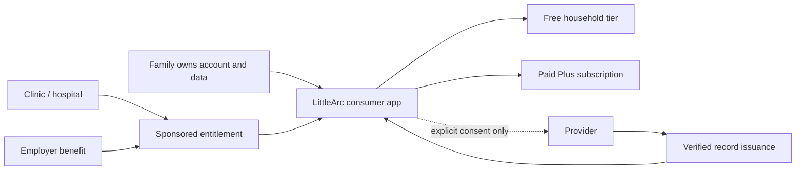
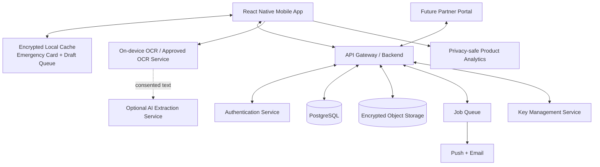
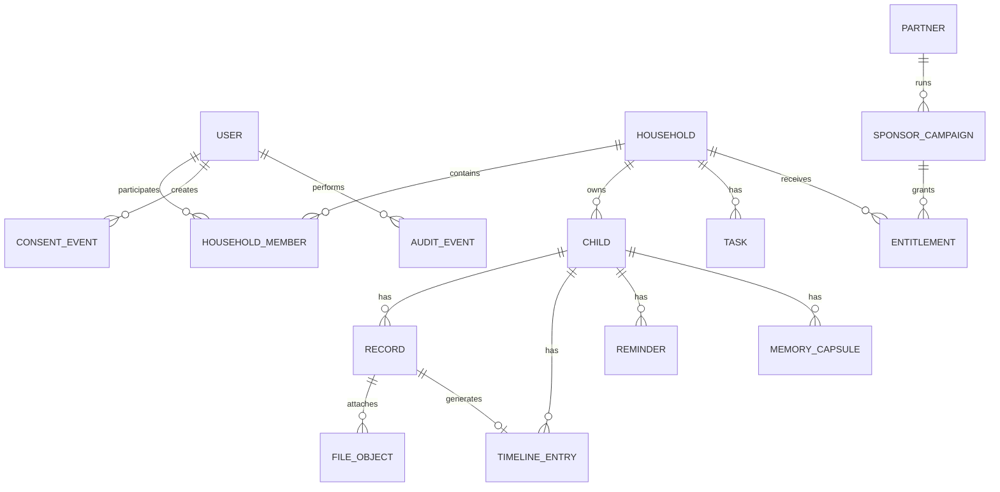

# LittleArc — Complete Product Plan

> **Status:** Accepted product strategy
> **Date:** 17 July 2026
> **Owner:** Founder/product lead

**Product:** LittleArc mobile application  
**Market:** India-first  
**Business model:** B2C-first, B2B2C-ready  
**Primary audience:** Parents of children aged 0–3, beginning with first-time parents of children aged 0–18 months  
**Document status:** Strategy and MVP execution plan  
**Version:** 1.0  
**Date:** 17 July 2026  

> This plan is a product and business strategy document, not legal, medical, tax, or information-security certification. India-facing privacy, health, subscription, and security claims must be reviewed by qualified counsel and security professionals before public release.

---

## Table of Contents

1. [Executive Decision](#1-executive-decision)
2. [Product Vision](#2-product-vision)
3. [Strategic Thesis](#3-strategic-thesis)
4. [Problem Definition](#4-problem-definition)
5. [Market Context](#5-market-context)
6. [Competitive Landscape](#6-competitive-landscape)
7. [Target Customer and Personas](#7-target-customer-and-personas)
8. [Jobs to Be Done](#8-jobs-to-be-done)
9. [Positioning and Messaging](#9-positioning-and-messaging)
10. [Business Model](#10-business-model)
11. [Product Principles](#11-product-principles)
12. [Product Scope Strategy](#12-product-scope-strategy)
13. [MVP Information Architecture](#13-mvp-information-architecture)
14. [MVP Functional Specification](#14-mvp-functional-specification)
15. [Onboarding and Activation](#15-onboarding-and-activation)
16. [Core User Journeys](#16-core-user-journeys)
17. [Retention Loops](#17-retention-loops)
18. [Free and Plus Packaging](#18-free-and-plus-packaging)
19. [Pricing and Monetization Experiments](#19-pricing-and-monetization-experiments)
20. [B2B2C Partner Model](#20-b2b2c-partner-model)
21. [Go-to-Market Plan](#21-go-to-market-plan)
22. [Validation and Research Plan](#22-validation-and-research-plan)
23. [Metrics and Product Analytics](#23-metrics-and-product-analytics)
24. [Privacy, Security, Legal, and Trust](#24-privacy-security-legal-and-trust)
25. [AI Product Policy](#25-ai-product-policy)
26. [Technical Architecture](#26-technical-architecture)
27. [Core Data Model](#27-core-data-model)
28. [Integration Strategy](#28-integration-strategy)
29. [Roadmap and Build Plan](#29-roadmap-and-build-plan)
30. [Team and Operating Model](#30-team-and-operating-model)
31. [Customer Support and Operations](#31-customer-support-and-operations)
32. [Risks and Mitigations](#32-risks-and-mitigations)
33. [Decision Gates and Kill Criteria](#33-decision-gates-and-kill-criteria)
34. [M0 Product Decisions and Review Triggers](#34-m0-product-decisions-and-review-triggers)
35. [Launch Checklists](#35-launch-checklists)
36. [Appendices](#36-appendices)
37. [Sources](#37-sources)

---

## 1. Executive Decision

LittleArc should launch as a **consumer-owned, subscription-capable mobile product** and be architected from the beginning to support **partner-sponsored distribution**.

The recommended model is:

> **B2C for product identity, trust, ownership, and recurring household revenue. B2B2C for efficient acquisition, sponsored access, and verified records.**

LittleArc should **not** begin as a pure B2B hospital, clinic, or pediatric EMR product. That would require solving provider workflows such as appointment management, prescriptions, billing, clinical documentation, vaccine inventory, and staff operations. It would also move the emotional childhood archive to the edge of the product rather than keeping it at the center.

### 1.1 MVP scope decision

The MVP is intentionally focused on the smallest set of capabilities that proves LittleArc's core value.

**Core MVP capabilities:**

- Child profile and offline emergency card
- Health and document vault
- Vaccination and care reminders
- Age-based child timeline
- A small monthly memory workflow
- One additional caregiver and simple handover/task coordination

**Deferred beyond the MVP:**

- Full screen-free activity engine
- Complex family roles and permissions
- Real-time multi-device collaboration
- WhatsApp and SMS automation
- Government and hospital integrations
- Large media archive and rich yearbook generation
- Child-facing mode
- School command center

### 1.2 The MVP product surfaces

The first public product should have three primary surfaces:

1. **Today** — what requires attention now
2. **Vault** — records, vaccinations, prescriptions, emergency information, and retrieval
3. **Timeline** — the child’s age-based operational and emotional history

Memory and family collaboration appear inside these surfaces rather than becoming large standalone modules at launch.

### 1.3 Core strategic objective

Prove that parents repeatedly use LittleArc for a high-trust, high-frequency job:

> “When something important about my child needs to be stored, found, remembered, or handed over, LittleArc is where I go.”

### 1.4 Business objective for the first 12 months

Validate four things in order:

1. **Problem intensity:** Parents have a real retrieval and coordination problem.
2. **Activation:** Parents can reach value in their first session and first week.
3. **Retention:** The product becomes useful at least monthly and preferably weekly.
4. **Payment and distribution:** Activated parents pay, or trusted partners sponsor access at sustainable economics.

---

## 2. Product Vision

LittleArc is a private, parent-first mobile app that helps a family manage and preserve a child’s early life in one continuous, age-based record.

It combines:

- Essential health and identity records
- Vaccination and care reminders
- Emergency information
- Doctor visits and prescriptions
- Growth and milestone entries
- Family handovers and tasks
- Meaningful memories, voice notes, letters, and monthly capsules

LittleArc is not intended to replace U-WIN, ABHA, DigiLocker, hospital applications, Google Photos, WhatsApp, or school software. It is the **parent-owned continuity layer above them**.

### 2.1 Long-term promise

> Parents use LittleArc to manage childhood today. Children later use it to understand their own story.

### 2.2 Immediate promise

> Keep your child’s essential records together, know what is due next, and find emergency information in seconds—even without a network connection.

### 2.3 Product category

LittleArc should avoid describing itself as a generic parenting application. The intended category is:

> **Private childhood continuity app**

Alternative category language for testing:

- Child health and memory vault
- Parent-owned childhood record
- Family care timeline
- Private child life archive

### 2.4 North-star experience

A parent should be able to say:

- “I no longer search WhatsApp for prescriptions.”
- “I know the next vaccination date.”
- “My spouse or parent can handle a doctor visit without calling me for every detail.”
- “Important moments are becoming a story, not just thousands of photos.”
- “The records belong to us even when we change doctors or cities.”

---

## 3. Strategic Thesis

### 3.1 Consumer ownership is the differentiator

Health systems, hospitals, schools, and government platforms naturally organize information around their own institution or program. LittleArc organizes information around the child and family, across institutions and over time.

The defensible value is not any single feature. It is the combination of:

- Parent ownership
- Portability across providers
- Operational usefulness
- Family coordination
- Longitudinal history
- Emotional continuity
- Privacy and trust

### 3.2 The wedge must solve an urgent problem

The health and document vault is the acquisition wedge because it creates immediate value:

- Records are currently scattered.
- Retrieval can be urgent.
- Vaccination dates and prescriptions have consequences.
- The information must travel across caregivers and providers.

Memories make the product emotionally durable, but they should not be the primary reason to install the MVP.

### 3.3 Distribution is likely harder than feature development

Large free parenting applications, hospital apps, government programs, general cloud storage, and family-photo products already exist. LittleArc must therefore win through a focused promise, high trust, strong onboarding, and trusted distribution—not through a larger feature checklist.

### 3.4 B2B2C should not compromise consumer trust

A hospital, pediatrician, employer, or insurer may fund or distribute LittleArc, but the family must remain the account and data owner.

A partner may:

- Sponsor access
- Issue a verified record
- Invite a family through a QR code or link
- Receive consented, aggregate pilot reporting

A partner must not automatically:

- See the family vault
- Search child records
- Receive health or memory content
- Track family behaviour at an individual level
- Retain access after sponsorship ends

---

## 4. Problem Definition

### 4.1 Primary problem

A child’s important information is fragmented across:

- Paper vaccination cards
- Discharge summaries
- Prescriptions
- Laboratory reports
- Hospital portals
- U-WIN and ABHA
- Email
- WhatsApp conversations
- Phone galleries
- Cloud drives
- Physical folders
- Notes and reminders
- The memory of one parent who carries most of the mental load

### 4.2 Consequences

This fragmentation produces five problems:

1. **Retrieval friction:** Important information is difficult to find at the moment it is needed.
2. **Planning friction:** Parents may not have a single dependable view of what is due next.
3. **Coordination friction:** Caregivers lack consistent context during handovers or doctor visits.
4. **Continuity loss:** Records remain trapped inside individual institutions or channels.
5. **Meaning loss:** Photos are abundant, but stories, voices, context, and family memories are not systematically preserved.

### 4.3 Existing workarounds

Parents currently solve the problem with combinations of:

- WhatsApp messages to themselves
- Google Drive folders
- Photo albums and screenshots
- Calendar reminders
- Notes applications
- Paper folders
- Spreadsheets
- Hospital applications
- Memory or baby-tracking apps

These tools are individually useful but do not create a child-centered, structured, portable timeline.

### 4.4 Problem statement

> Parents need a trusted, portable place to store, retrieve, coordinate, and preserve important information about their child because existing records and memories are fragmented across institutions, people, and channels.

---

## 5. Market Context

### 5.1 Why India is a meaningful starting market

UNICEF reports approximately 25 million births per year in India, creating a large continuous cohort of new parents. [S1]

The addressable market should not initially be treated as all Indian parents. The practical serviceable market is narrower:

- Smartphone-first households
- First-time parents
- Children aged 0–18 months
- Metro and Tier-1/Tier-2 cities
- Private or mixed public/private healthcare usage
- Multiple caregivers
- Parents comfortable paying for convenience, privacy, and family organization

### 5.2 Public digital health systems validate the need but narrow the differentiation

U-WIN already digitizes vaccination records and supports vaccination-related workflows. As of 18 March 2026, the Government of India reported 11.87 crore children and 3.96 crore pregnant women registered on U-WIN. [S2]

ABHA provides a national health identity and enables individuals to link and share health records through the ABDM ecosystem. [S3]

Therefore, LittleArc should not claim that it is the only place for vaccination records or a replacement for India’s health infrastructure. Its value is cross-source continuity, family coordination, emergency access, and the combination of health records with the child’s broader life timeline.

### 5.3 Market-sizing method

Use a bottom-up model rather than broad “parenting market” reports.

#### Illustrative serviceable market model

| Variable | Conservative case | Base case | Expansion case |
|---|---:|---:|---:|
| Annual birth cohort | 25 million | 25 million | 25 million |
| Digitally addressable target | 3% | 7% | 12% |
| Households in segment | 750,000 | 1,750,000 | 3,000,000 |
| Paid penetration after maturity | 2% | 5% | 8% |
| Paying households | 15,000 | 87,500 | 240,000 |
| Annual revenue per household | ₹999 | ₹1,299 | ₹1,499 |
| Illustrative annual subscription revenue | ₹1.50 crore | ₹11.37 crore | ₹35.98 crore |

These figures are planning scenarios, not forecasts. They are useful for testing whether a focused, profitable company is possible without requiring mass-market adoption.

### 5.4 Market-entry implication

The company should optimize for a high-value niche before attempting broader India expansion:

> First-time, digitally comfortable parents with an infant, multiple caregivers, private-healthcare exposure, and an immediate document/reminder problem.

---

## 6. Competitive Landscape

### 6.1 Competitive categories

LittleArc competes with behaviours and bundles, not only direct products.

| Category | Examples | Existing strength | LittleArc opportunity |
|---|---|---|---|
| Government health records | U-WIN, ABHA | Scale, legitimacy, official records | Family-owned aggregation and context across sources |
| Hospital apps | Cloudnine and other hospital apps | Provider records, appointments, vaccination charts | Portability across providers and cities |
| Health record apps | Eka Care and similar products | Structured health records and ABDM workflows | Child-first, family-first, operational plus emotional timeline |
| Parenting platforms | Mylo, Healofy | Content, community, trackers, large free audiences | Privacy, record utility, no advertising, family continuity |
| Private family albums | FamilyAlbum | Easy private photo sharing and memory organization | Health, documents, reminders, emergency information, structured life record |
| General tools | Google Photos, Drive, WhatsApp, Notes | Familiarity and low friction | Purpose-built organization, reminders, provenance, child age context |

Official product descriptions show that FamilyAlbum already offers private family photo sharing and free unlimited storage; Mylo and Healofy offer broad pregnancy and parenting tools and communities; Cloudnine includes vaccination charts and medical records; and Eka Care provides structured medical record and pediatric workflows. [S8][S9][S10][S11][S12]

### 6.2 Strategic differentiation

LittleArc should differentiate on five dimensions:

1. **Institution-independent:** Works across doctors, hospitals, schools, cities, and government sources.
2. **Parent-owned:** The family owns the account, archive, access, and export.
3. **Operational plus emotional:** Health and coordination today; memories and story over time.
4. **Private by default:** No public feed, behavioural advertising, or child-profile discovery.
5. **Age-based continuity:** Every event becomes part of one child timeline.

### 6.3 What is not defensible by itself

The following features are useful but not unique:

- Vaccination reminders
- OCR document scanning
- Photo albums
- Growth charts
- Parenting content
- AI summaries
- Family invitations
- Emergency cards

The defensible product is the trusted system created when these capabilities reinforce the same household-owned record over years.

### 6.4 Competitive response strategy

LittleArc should not attempt feature parity with large platforms. It should:

- Make capture faster than filing into Drive.
- Make retrieval more structured than WhatsApp search.
- Make the archive warmer than a health-record application.
- Make family sharing more purposeful than a photo album.
- Remain portable when a hospital relationship ends.

---

## 7. Target Customer and Personas

## 7.1 Primary ideal customer profile

**First-time parent of a child aged 0–18 months** who:

- Lives in a metro or Tier-1/Tier-2 city
- Uses Android or iOS daily
- Receives records through paper, WhatsApp, email, and hospital apps
- Has visited more than one healthcare provider or expects to
- Coordinates with a spouse, grandparent, nanny, or guardian
- Is concerned about missing vaccinations, medicines, or documents
- Values privacy and does not want the child’s life to become public content
- Can pay ₹1,000–₹1,500 annually for dependable family utility

### 7.2 Persona A — The mental-load owner

**Profile:** Usually the parent who remembers appointments, stores reports, tracks medicine, and communicates instructions.

**Needs:**

- A single source of truth
- Faster capture
- Reliable reminders
- A clear “needs action” list
- Less repeated explanation to family members

**Pain:** “Everything is in my head, and everyone calls me when they need something.”

**Success:** Another caregiver can act correctly without asking for basic context.

### 7.3 Persona B — The participating co-parent

**Profile:** Wants to help but may not know the latest medication, due date, or document location.

**Needs:**

- Shared visibility
- Clear handovers
- Simple tasks
- The ability to access the emergency card and selected records

**Pain:** “I want to help, but I do not know what has already happened or what is due.”

**Success:** Can take the child to a doctor and update the family record independently.

### 7.4 Persona C — The grandparent or caregiver

**Profile:** Provides regular or occasional childcare and may be less comfortable with complex apps.

**Needs:**

- A simple Today view
- Medicine and allergy instructions
- Emergency contacts
- Minimal navigation
- Local-language support later

**Pain:** “Tell me exactly what I need to do and what to do in an emergency.”

**Success:** Completes a handover task and views emergency details without confusion.

### 7.5 Persona D — The pediatrician or clinic champion

**Profile:** A trusted referral partner, not the primary product user.

**Needs:**

- A simple way to recommend LittleArc
- Reduced repeat requests for documents or vaccination charts
- A provider-issued or verified record flow later
- No added clinical workflow burden

**Pain:** “Parents often do not have the previous prescription or reliable vaccine history available.”

**Success:** Parents arrive better prepared without the clinic operating another full software system.

### 7.6 Persona E — Partner administrator

**Profile:** Clinic manager, maternity program manager, or employer-benefits owner.

**Needs:**

- Sponsorship-code management
- Aggregate activation reporting
- Privacy-safe cohort metrics
- Contract and support visibility

**Success:** Can demonstrate that sponsored families activated and retained without accessing family content.

---

## 8. Jobs to Be Done

### 8.1 Functional jobs

- When I receive a child-related document, help me store it in the correct place with minimal effort.
- When I need a record urgently, help me find it in seconds.
- When a vaccination or medicine is due, help me remember and act.
- When another caregiver takes over, help me hand over the necessary context.
- When I change hospitals or doctors, help me carry the child’s history with me.
- When the month ends, help me preserve one meaningful story without creating a large project.

### 8.2 Emotional jobs

- Help me feel that I am not forgetting something important.
- Help me feel in control without becoming obsessive.
- Help me preserve what I will otherwise regret losing.
- Help me trust that my child’s private information is not being exploited.

### 8.3 Social jobs

- Help both parents participate.
- Help grandparents feel connected without public social media.
- Help me present organized information to a doctor or school.

### 8.4 Highest-priority jobs for MVP

1. Store and retrieve essential records.
2. Know what is due next.
3. Access emergency information offline.
4. Share selected context with one trusted caregiver.
5. Preserve one small monthly memory.

---

## 9. Positioning and Messaging

### 9.1 Positioning statement

> For Indian parents who have child information scattered across paper files, WhatsApp, galleries, and hospital systems, LittleArc is a private childhood continuity app that keeps essential records, reminders, family handovers, and meaningful memories in one parent-owned timeline. Unlike hospital portals, generic storage, and parenting-content apps, LittleArc belongs to the family and remains useful across providers and over time.

### 9.2 Consumer headline

> **Everything important about your child, ready when you need it and preserved for later.**

### 9.3 Consumer supporting copy

> Keep health records, emergency information, care reminders, and meaningful memories together in one private, parent-owned timeline.

### 9.4 Partner headline

> **Give every new family a portable child-care companion without building another hospital portal.**

### 9.5 Trust messages

- Private by default
- No public child profiles
- No advertising or sale of family data
- Parent-controlled sharing
- Export and delete anytime
- AI is optional and reviewable
- Emergency details available offline

### 9.6 Messaging to avoid

Do not claim:

- “All medical records in India in one place”
- “Never miss a vaccination”
- “100% secure”
- “Military-grade security” without a defined, validated meaning
- “End-to-end encrypted” until the complete data path genuinely supports it
- “AI doctor” or “medical advice”
- “Official vaccination record” unless the record has verifiable provider or government provenance
- “Replaces U-WIN, ABHA, or DigiLocker”

---

## 10. Business Model

### 10.1 Recommended model

### 10.2 Revenue lines

**Primary:**

- Household Plus subscription

**Secondary:**

- Sponsored Plus access purchased by clinics, maternity hospitals, employers, or insurers
- Partner onboarding or program fee for larger deployments

**Later:**

- Printed yearbook or photobook margin
- Premium archival storage
- Paid family migration or concierge digitization
- Provider-verified record services or integration fees

### 10.3 Revenue lines to reject

- Behavioural advertising
- Targeted advertising using child or parent data
- Sale of health or family data
- Lead generation based on sensitive records
- Commission-driven medical recommendations that are not transparently disclosed
- Default partner access to family data

### 10.4 Why the model is B2C-first

- The product requires emotional trust and long-term continuity.
- Parents must own the archive.
- Consumer testing produces faster product learning.
- Pure B2B sales would introduce long procurement cycles and customization pressure.
- A consumer subscription provides continuity when a sponsor relationship ends.

### 10.5 Why the model is B2B2C-ready

- Trusted partners can reduce acquisition cost.
- The moment of birth, discharge, or first pediatric visit is a high-intent onboarding moment.
- A sponsor can fund access without owning the data.
- A clinic can later issue verified records into the parent’s vault.

---

## 11. Product Principles

1. **The child timeline is the product spine.** Every meaningful record can appear in an age-based history.
2. **The family owns the record.** Institutions may contribute but do not control the archive.
3. **Utility earns the right to preserve memories.** Solve urgent operational jobs before asking for sentimental effort.
4. **Private by default.** No public profiles, discovery, social feed, or growth loop based on child content.
5. **Review before automation.** AI and OCR may suggest; the parent confirms.
6. **Offline when urgency requires it.** Emergency information and selected core records must work without connectivity.
7. **Progressive disclosure.** A new parent should not face a six-module dashboard.
8. **One useful action per visit.** Today should make the next action obvious.
9. **Warm, not childish.** The design should respect adults while feeling emotionally human.
10. **Interoperability over replacement.** Import, export, and provenance are strategic capabilities.
11. **Trust over growth hacks.** No contact scraping, forced invitations, or manipulative paywalls.
12. **India-first without becoming India-only.** Design for local healthcare, languages, payments, devices, and family structures while keeping the core model portable.

---

## 12. Product Scope Strategy

### 12.1 MVP product surfaces

| Surface | Job | Core content |
|---|---|---|
| **Today** | Know what needs attention | Due reminders, tasks, pending record review, emergency shortcut, memory prompt |
| **Vault** | Store and retrieve | Documents, vaccinations, visits, prescriptions, growth, identity, emergency card |
| **Timeline** | Understand what happened | Age-based feed of health events, records, milestones, notes, and monthly memories |

### 12.2 Embedded capabilities

The following are capabilities, not launch tabs:

- **Family:** one co-parent/caregiver, simple permissions, task and handover note
- **Memory:** one monthly capsule workflow surfaced through Today and Timeline
- **Search:** global retrieval across record metadata and approved extracted text
- **Share:** selected-record export or expiring link in a later MVP increment

### 12.3 MVP scope

#### Required

- Email, Google, and Apple-compatible authentication
- Parent account and consent record
- One child profile
- Offline emergency card
- Document scan, upload, and share-sheet import
- On-device OCR where feasible
- Manual record creation and correction
- Vaccination due/given tracking
- Doctor visit and prescription records
- Push reminders
- Age-based timeline
- Global search by record metadata
- One additional caregiver invite
- Simple task/handover note
- Monthly memory capsule with text and limited media
- Biometric app lock
- Export and account/data deletion flow
- Product analytics with a strict sensitive-data exclusion policy

#### Should have

- Email reminder backup
- Record provenance labels
- Duplicate-record warning
- Local draft queue when offline
- Basic growth entries
- Selected-record PDF export
- Partner referral code attribution
- Sponsored entitlement support behind feature flags

#### Could have

- Expiring share link
- Provider verification badge
- Audio note in memory capsule
- Custom reminder recurrence
- More than one child

### 12.4 Explicit MVP non-goals

- Full activity recommendation engine
- Parenting content feed
- Open community
- Social networking
- Real-time chat
- Medical diagnosis or treatment recommendations
- Full pediatric EMR
- Appointment booking marketplace
- Vaccine inventory or clinic operations
- School management
- Full multilingual localization
- Unlimited video archive
- Real-time collaboration across many family members
- Automated ingestion from WhatsApp accounts
- Dependence on U-WIN, ABHA, DigiLocker, hospital, or insurer integrations

---

## 13. MVP Information Architecture

### 13.1 Bottom navigation

| Tab | Purpose |
|---|---|
| **Today** | Immediate actions and status |
| **Vault** | Records, vaccinations, emergency information, search |
| **Timeline** | Child history and memories |

### 13.2 Persistent header

- Child avatar/name and age
- Child switcher placeholder for future use
- Emergency card shortcut
- Notifications indicator
- Settings

### 13.3 Today screen hierarchy

1. Urgent or overdue item
2. Next vaccination or health action
3. Family task or handover
4. Pending record review
5. Quick add
6. Monthly memory prompt when relevant

### 13.4 Vault hierarchy

- Search
- Emergency card
- Vaccinations
- Doctor visits
- Prescriptions
- Documents
- Growth
- Identity and insurance
- Recently added

### 13.5 Timeline hierarchy

- Current age header
- Add entry
- Filters: health, documents, growth, milestones, memories, notes
- Entries grouped by month/age
- Source record link
- Monthly capsule cards

### 13.6 Settings hierarchy

- Parent profile
- Child profile
- Family access
- Privacy and AI controls
- Notifications
- Export data
- Delete child/account
- Subscription
- Help and support
- Legal documents

---

## 14. MVP Functional Specification

## 14.1 Account and authentication

### User stories

- As a parent, I can create an account using email or an approved social login.
- As an iOS user, I have an Apple-compatible equivalent login option when third-party social login is offered. Apple’s current guidelines require an equivalent privacy-preserving login option for apps using third-party or social login services. [S6]
- As a parent, I can recover access securely.
- As a parent, I can delete my account from inside the application.

### Acceptance criteria

- Authentication errors are understandable and recoverable.
- The child profile is not created before the parent accepts the required notice
  and consent flow and completes the approved adult identity/age verification.
- Account deletion identifies what is deleted immediately, what may be retained for legal/security obligations, and the expected completion time.
- Sensitive local data is inaccessible when the user is signed out.

## 14.2 Parent and child profile

### Required fields

**Parent:**

- Name
- Email
- Relationship to child
- Country and time zone
- Consent and notice versions

**Child:**

- Preferred name
- Date of birth
- Sex/gender field only where product or care workflow requires it
- Blood group, optional
- Allergies, optional
- Health notes, optional
- Pediatrician, optional
- Emergency contacts

### Acceptance criteria

- Optional health fields are clearly optional.
- The app does not imply that an empty field means “none.”
- Age is calculated accurately and displayed in parent-friendly terms.
- Changes create an audit event.

## 14.3 Offline emergency card

### Contents

- Child name and date of birth
- Photo, optional
- Blood group with “not provided” state
- Allergies with “none confirmed” versus “not provided” distinction
- Critical health notes
- Current urgent medication, optional
- Parent/guardian contacts
- Pediatrician contact

### Requirements

- Reachable in no more than two deliberate taps after unlocking the application.
- Available without a network connection.
- Cached data is encrypted using platform-appropriate secure storage.
- Device unlock and app re-authentication are the default before display.
- The parent may explicitly enable a deliberate quick-access view containing
  only preferred name/age, confirmed blood group and allergies, critical notes,
  urgent medication, and emergency/pediatrician contacts.
- Quick access excludes the photo, exact date of birth, identity documents,
  attachments, Timeline, and unconfirmed suggestions.
- A shareable emergency-card image/PDF is optional and must warn the parent about privacy implications.

## 14.4 Document capture

### Capture methods

- Native document scanner
- Camera
- Gallery/file upload
- PDF upload
- Mobile share-sheet import

### Record flow

1. Select or capture source.
2. Crop and improve readability.
3. Perform local OCR when available.
4. Suggest category and fields.
5. Show review screen.
6. Parent corrects and confirms.
7. Save source file and structured record.
8. Add timeline event.
9. Offer reminder creation when relevant.

### Acceptance criteria

- Manual completion is always possible.
- No extracted health value is silently committed.
- The original file remains available unless the parent deletes it.
- The record displays provenance: manual, imported, OCR-assisted, AI-assisted, provider-issued, or government-imported.
- Failed uploads can resume or be retried.

## 14.5 Smart Capture

### Structured-assistance categories at launch

- Vaccination record
- Prescription
- Doctor visit summary
- Discharge summary

### Document-only capture at launch

- Birth certificate
- Laboratory report as a document only; no diagnostic interpretation

### Extractable fields

- Document date
- Provider/facility name
- Child name match indicator
- Category
- Vaccine name and due/given date
- Medicine name and written schedule as text
- Follow-up date
- Freeform notes

### Safety constraints

- Do not infer a diagnosis not explicitly written.
- Do not calculate or alter dosage.
- Do not convert ambiguous handwriting into an action without high-visibility confirmation.
- Do not recommend a vaccination schedule based solely on an AI model.
- Do not create reminders until the parent confirms the date and meaning.

## 14.6 Vaccination tracking

### Capabilities

- Parent enters dates manually at launch. A later pediatric-approved schedule
  template may suggest dates, but every date remains non-authoritative until the
  parent confirms it.
- Each vaccination item has due, scheduled, given, skipped, and not-applicable states.
- Parent can attach a certificate or card image.
- Parent can record provider and batch information optionally.
- Parent can set reminders.

### Important product rule

The app must clearly distinguish:

- Schedule template suggestion
- Parent-confirmed due date
- Provider-recorded administration
- Official government/provider record

### Acceptance criteria

- The parent can correct any date.
- Reminder copy avoids medical certainty.
- The application advises the parent to confirm schedules with a qualified provider.
- Overdue status does not shame the parent.

## 14.7 Doctor visits and prescriptions

### Doctor visit record

- Date/time
- Provider/facility
- Reason for visit
- Parent notes
- Documents
- Follow-up date
- Tags

### Prescription record

- Prescription image/PDF
- Provider
- Date
- Medicines as structured, parent-confirmed text
- Duration or end date, optional
- Reminder links, optional

### Acceptance criteria

- The application does not independently modify medicine instructions.
- Each reminder links back to the source prescription.
- The parent can mark a medication as completed or discontinued with a reason note.

## 14.8 Search and retrieval

### Search dimensions

- Record title
- Category
- Provider/facility
- Date range
- Tag
- Vaccine or medicine name after confirmation
- Approved OCR text, where enabled

### Performance target

- Metadata search result in less than one second for a typical household dataset on a healthy connection.
- Recently used and offline-cached records remain quickly available.

## 14.9 Today dashboard

### Cards

- Overdue/urgent
- Due today
- Upcoming this week
- Pending review
- Family handover
- Quick capture
- Monthly memory prompt

### Acceptance criteria

- The screen remains useful even when there are no due items.
- It never becomes a generic content feed.
- A parent can complete the most important action without navigating through multiple modules.

## 14.10 Timeline

### Entry types

- Vaccination
- Visit
- Prescription
- Document
- Growth
- Milestone
- Note
- Memory capsule
- Family story

### Requirements

- Automatically add linked events from the vault.
- Show child age at event time.
- Link to the source record.
- Allow manual notes and milestone entries.
- Filter by type.
- Avoid complex editing and reordering in MVP.

## 14.11 Monthly memory capsule

### MVP template

- Up to five photos
- One short written memory
- “What changed this month?”
- “What made us laugh?”
- One milestone
- Optional note from another caregiver
- Future-unlock flag

### Product rule

The capsule should be completable in under five minutes. It is a small reflective habit, not a scrapbook project.

Capsule text, prompts, dates, and non-sensitive metadata may synchronize. Photos
remain device-local until the owner explicitly uploads them for that capsule.
Each photo exposes `local only`, `uploading`, `synced`, `failed`, or `removed
from cloud` state.

## 14.12 Family access

### MVP roles

- **Owner:** full access and subscription control
- **Co-parent:** broad record, task, and memory access
- **Caregiver:** emergency card, assigned tasks, and selected records

### Requirements

- One invited member in Free; more in Plus later.
- The owner can revoke access.
- Revocation removes future access but does not pretend to erase copies previously exported by the member.
- Sensitive categories may be excluded from caregiver access.
- All role changes are audited.

## 14.13 Tasks and handover

### Capabilities

- Create a child-related task
- Assign to owner or invited caregiver
- Due date/time
- Notes
- Link to a record
- Complete or reopen

### MVP use cases

- Give medicine according to attached prescription
- Bring vaccination card
- Upload discharge summary
- Call pediatrician
- Record temperature note without diagnosis

## 14.14 Notifications

### Channels

- Push as primary
- Local notifications for device-resident schedules
- Email is reserved for authentication, recovery, and essential account
  operations; it is not an MVP reminder channel

### Rules

- Ask for notification permission only after explaining value.
- Allow category-level controls.
- Avoid including sensitive health details on the lock screen by default.
- Deep-link to the relevant item after authentication.

## 14.15 Export and deletion

### Export

- Machine-readable JSON/CSV for structured records
- Original files in organized folders
- Human-readable PDF summary
- Timeline export

### Deletion

- Delete individual record
- Delete child profile
- Delete account
- Explain retained security, billing, or compliance logs where applicable
- Propagate deletion to processors according to contract and policy

---

## 15. Onboarding and Activation

### 15.1 Onboarding objective

Reach a concrete outcome before asking the parent to explore the broader product.

### 15.2 Recommended onboarding flow

1. Value proposition and privacy promise
2. Create parent account
3. Parent notice and consent
4. Create child with name and date of birth
5. Create emergency card basics
6. Add the first real document
7. Confirm the next vaccination or follow-up date
8. Land on Today with visible progress

### 15.3 Progressive profile completion

Do not request every profile field at sign-up. Ask for data when it enables a visible benefit.

| Data | Ask when | Benefit shown |
|---|---|---|
| Date of birth | Initial setup | Age-based timeline and schedule |
| Allergy information | Emergency card setup | Offline emergency access |
| Notifications | After first reminder | Due-date alert |
| Photos | When creating capsule | Memory preservation |
| Contacts | Never request address-book access for growth | Manual caregiver invitation |

### 15.4 Activation definition

A household is **activated** when, within seven days, it has:

- Completed the emergency card
- Added at least three real records
- Confirmed at least one upcoming vaccination, follow-up, or care reminder

A stronger activation state includes:

- One successful record retrieval
- One invited co-parent or caregiver

### 15.5 Time-to-value target

- Child and emergency basics: under three minutes
- First document captured: under two additional minutes
- First reminder confirmed: under one additional minute

Target: first meaningful value within six minutes, excluding document-scanning time.

---

## 16. Core User Journeys

## 16.1 New parent after hospital discharge

1. Parent receives a discharge summary.
2. Clinic provides a LittleArc QR code or parent finds the app directly.
3. Parent creates the child profile.
4. Parent scans the discharge summary.
5. LittleArc suggests date, hospital, category, and follow-up.
6. Parent reviews and confirms.
7. Record appears in Vault and Timeline.
8. Follow-up appears on Today.
9. Parent creates an emergency card.

**Success outcome:** The parent has immediate utility before leaving the first session.

## 16.2 Vaccination preparation

1. Today shows an upcoming vaccination.
2. Parent opens the item.
3. Parent sees source, confirmed due date, and previous relevant record.
4. Parent marks appointment scheduled.
5. After the visit, parent scans the updated card or certificate.
6. Parent confirms given date.
7. Timeline updates.

**Success outcome:** The workflow closes the loop from reminder to evidence.

## 16.3 Co-parent doctor visit

1. Owner assigns “Take child to pediatrician” to co-parent.
2. Owner shares selected records and notes.
3. Co-parent opens emergency and recent-record summary.
4. Co-parent attends visit.
5. Co-parent scans prescription and enters follow-up.
6. Owner receives a summary notification.

**Success outcome:** The mental-load owner does not have to coordinate every detail manually.

## 16.4 Urgent retrieval without network

1. Parent opens LittleArc during poor connectivity.
2. Parent unlocks with biometrics.
3. Parent opens emergency card.
4. Parent sees allergies, contacts, and selected critical information.

**Success outcome:** Core emergency context remains readable.

## 16.5 Monthly memory

1. At month end, Today shows a gentle prompt.
2. Parent selects up to five recent photos.
3. Parent answers two short prompts.
4. Parent saves the capsule.
5. Capsule appears in Timeline.

**Success outcome:** Emotional value accumulates without heavy effort.

---

## 17. Retention Loops

### 17.1 Retrieval loop

**Trigger:** Parent needs a record.  
**Action:** Searches or opens a recent record.  
**Reward:** Finds it quickly.  
**Investment:** Adds the new or updated record, increasing future value.

### 17.2 Reminder loop

**Trigger:** Upcoming vaccination, follow-up, or task.  
**Action:** Parent opens Today and completes action.  
**Reward:** Reduced uncertainty.  
**Investment:** Confirms result and attaches evidence.

### 17.3 Family loop

**Trigger:** Handover or shared responsibility.  
**Action:** Assign task or share selected context.  
**Reward:** Less repeated coordination.  
**Investment:** More complete household record.

### 17.4 Monthly memory loop

**Trigger:** Child reaches a new month or month-end prompt.  
**Action:** Create small capsule.  
**Reward:** Meaningful retrospective view.  
**Investment:** Archive becomes emotionally irreplaceable.

### 17.5 Annual loop later

- Birthday recap
- Growth and health summary
- Printable yearbook
- Parent letter

### 17.6 Anti-loop rules

Do not manufacture engagement through:

- Daily generic content
- Excessive push notifications
- Streak pressure
- Shame-based overdue messages
- Public sharing incentives
- Contact-list spam

The product should be used because family work exists, not because the app demands attention.

---

## 18. Free and Plus Packaging

### 18.1 Packaging principles

- Safety, export, privacy controls, and account deletion remain free.
- The free tier must deliver a complete first outcome.
- The paid tier should unlock sustained household usage, not remove artificial pain.
- Storage and AI usage must have understandable limits.
- One household subscription covers invited members and children within plan limits.

### 18.2 Recommended launch packaging

| Capability | Free | Plus |
|---|---|---|
| Child profiles | 1 | Up to 3 initially |
| Emergency card | Included | Included |
| Structured records | Up to 25 | Higher or fair-use limit |
| Original document storage | 250 MB or trial allowance | 10–25 GB initial target |
| Vaccination reminders | Included | Included with advanced controls |
| Timeline | Basic | Full filters, richer summaries |
| Caregiver access | 1 invited member | Up to 6 |
| Family permissions | Fixed roles | Granular roles |
| Monthly capsules | 3 capsules | Ongoing |
| Media per capsule | Limited | Higher limits and voice/video |
| Smart Capture | 5 assisted captures per calendar month | Higher quota |
| Advanced OCR search | No or limited | Included |
| Export and deletion | Included | Included |
| WhatsApp/SMS reminders | No | Later paid add-on or included quota |
| Printed yearbook preparation | No | Included; printing charged separately |

### 18.3 Why Smart Capture should not be completely unlimited in Free

Smart Capture creates variable OCR/AI and processing costs. A limited quota allows the parent to experience value while preserving a meaningful paid reason.

### 18.4 Founding-family protection

Early adopters may receive:

- Lower annual price for a defined renewal period
- Additional storage
- Founder feedback channel
- No permanent promise of unlimited lifetime storage

Avoid unrestricted lifetime subscriptions while storage and compliance obligations continue indefinitely.

---

## 19. Pricing and Monetization Experiments

### 19.1 Initial consumer price tests

Test rather than commit to one price.

| Test | Monthly | Annual | Purpose |
|---|---:|---:|---|
| A — accessible | ₹99 | ₹799 | Price sensitivity |
| B — recommended starting point | ₹149 | ₹999 | Balanced adoption and value |
| C — premium trust | ₹199 | ₹1,499 | Willingness to pay for stronger archive and family features |

Recommend leading with the annual plan and retaining monthly as a lower-commitment option.

### 19.2 Trial strategy

RevenueCat’s 2026 subscription benchmarks indicate that longer trials can convert better than very short trials in aggregate, but LittleArc should validate this within its own segment. [S7]

Recommended tests:

- No card, 14-day Plus preview after activation
- Seven-day trial only after at least three records are added
- No trial; use Free until the household hits a meaningful limit

Do not present a paywall before the parent experiences record capture and retrieval.

### 19.3 Payment implementation

For digital features and subscriptions consumed inside the mobile app, Apple requires in-app purchase in the standard case, and Google Play provides its billing system for digital products and subscriptions. Google also documents an alternative-billing program for users in India with program conditions and adjusted service fees. [S5][S13][S14]

Implementation plan:

- Use StoreKit for iOS subscriptions.
- Use Google Play Billing for Android.
- Maintain server-side household entitlements.
- Support sponsored entitlements independent of store subscription state.
- Obtain specialist review before adding external purchase links or alternative billing.

### 19.4 Internal unit-economics targets

These are operating targets, not external promises:

- Gross margin above 75% after storage, AI, messaging, payment fees, and support
- AI and storage variable cost below 15% of subscription revenue
- Consumer LTV:CAC above 3:1 before scaling paid acquisition
- Payback within 12 months
- Partner channel cost per activated household at least 40% lower than direct paid acquisition
- Annual renewal above 60% before considering the subscription highly durable

### 19.5 Partner pricing hypotheses

For pilots, test:

- ₹600–₹1,000 per activated household for 12 months of sponsored access
- Minimum pilot commitment plus per-activated-household fee
- Free referral-only pilot first, followed by paid sponsorship

Do not price by number of patient records or data volume shared with the partner. The commercial unit should be sponsorship/activation, not access to child data.

---

## 20. B2B2C Partner Model

### 20.1 Partner priority

1. Independent pediatric clinics
2. Small and mid-sized maternity hospitals
3. Lactation consultants, childbirth educators, and postnatal-care programs
4. Employers offering parental benefits
5. Insurers and TPAs later
6. Schools and daycares after age-three product expansion

### 20.2 First partner proposition

> Give every new family six or twelve months of LittleArc Plus, helping them organize records, prepare for follow-ups, and retain a portable child history—without the clinic gaining automatic access to family data.

### 20.3 Pilot design

**Duration:** 8–12 weeks  
**Partner count:** 2–3  
**Target families:** 50–150 per partner  
**Integration:** None initially  
**Distribution:** QR card, discharge packet, WhatsApp link sent by clinic, or consultation follow-up message  
**Sponsor:** Free or discounted Plus entitlement  

### 20.4 Partner-visible metrics

Allowed aggregate metrics:

- Invites issued
- App installs attributed
- Households activated
- Sponsored entitlements redeemed
- Aggregate retention
- Aggregate number of records added in broad bands
- Support volume

Not visible by default:

- Child names
- Document names or content
- Vaccination details
- Health values
- Memories
- Family-member identities
- Individual household activity history

### 20.5 Partner portal — post-MVP

The partner portal should support:

- Organization and admin accounts
- Campaign/sponsorship codes
- Entitlement duration
- Aggregate privacy-safe reporting
- Approved onboarding material
- Support requests
- Provider-issued record templates
- Contract and data-processing documents

### 20.6 Verified records — later

A provider-issued record should include:

- Issuer organization and professional identity
- Issue date
- Record type
- Digital signature or verifiable provenance mechanism
- Revision/revocation status
- Parent-controlled acceptance into the vault

A “verified” label must refer to provenance, not medical correctness beyond the issuer’s responsibility.

### 20.7 Employer-benefit model

An employer may sponsor access for employees during pregnancy, parental leave, or return to work.

Rules:

- Employer receives no individual usage or health data.
- Employee participation is voluntary.
- Entitlement persists for the promised period even if employment changes, subject to contract.
- The family can convert to a direct subscription afterward.

---

## 21. Go-to-Market Plan

### 21.1 Launch sequence

#### Stage 1 — Founder network usability

- 10–15 families, including the founder’s wife and relatives
- Objective: eliminate onboarding and workflow confusion
- Do not use this group to validate willingness to pay

#### Stage 2 — Outside-network problem validation

- 30–50 families unknown to the founder
- Recruit through parent communities, pediatric referrals, apartments, workplaces, and childbirth professionals
- Objective: measure activation and retention

#### Stage 3 — Paid founding cohort

- 50–100 activated households
- Real annual payment or refundable deposit
- Objective: validate payment behaviour

#### Stage 4 — Partner distribution pilots

- Two pediatric/maternity partners
- One employer pilot if accessible
- Objective: compare acquisition quality and cost

#### Stage 5 — Focused city launch

- One or two cities where support and partner relationships are manageable
- Expand only after retention and trust metrics are healthy

### 21.2 Acquisition channels

**Highest priority:**

- Pediatrician referrals
- Maternity discharge kits
- Lactation and postnatal consultants
- Parent-community demonstrations
- Founder-led content about organizing child records
- Partner QR onboarding
- Referral from one parent to another

**Secondary:**

- App-store optimization
- Search content for vaccination-card organization, newborn document checklist, and emergency information
- Instagram/YouTube educational content without child-data exploitation
- Apartment-community workshops
- Employer parental-benefit programs

**Avoid initially:**

- Broad paid app-install campaigns
- Influencer campaigns optimized only for downloads
- Discount marketplaces
- Parenting-content feed as acquisition bait
- Brand sponsorships that conflict with privacy positioning

### 21.3 Referral design

A referral should offer:

- Additional Plus time or storage to both households
- No requirement to upload contacts
- Shareable link or QR code
- Clear statement that no child information is shared

### 21.4 Launch content pillars

- “Where to keep a newborn’s important documents”
- “Emergency information every caregiver should have”
- “How to hand over child care without repeated phone calls”
- “How to preserve the story behind baby photos”
- “What LittleArc does—and does not do—with AI”
- “How parent-owned records differ from hospital records”

---

## 22. Validation and Research Plan

### 22.1 Research questions

- Which moment creates the strongest urgency: discharge, first vaccination, illness, travel, daycare, or lost document?
- Who carries the household mental load?
- Which records are hardest to retrieve?
- Do parents trust cloud storage for child health information?
- Which privacy message matters most?
- Does a caregiver invitation create value or anxiety?
- Are parents willing to pay for utility, memory preservation, or both?
- Does partner endorsement increase trust?

### 22.2 Interview plan

Conduct at least:

- 20 first-time-parent problem interviews
- 10 co-parent interviews
- 5 grandparent/caregiver interviews
- 10 pediatrician/clinic interviews
- 5 employer-benefit interviews later

### 22.3 Prototype tests

Test five critical flows before full build:

1. Emergency-card creation
2. Scan and review a prescription
3. Confirm a vaccination reminder
4. Find a record from Timeline
5. Invite a co-parent and assign a handover

### 22.4 Concierge test

Before building advanced OCR/AI:

- Allow parents to upload a record.
- Manually structure it with explicit consent and secure handling.
- Measure correction rate and which fields matter.
- Use findings to define extraction schemas.

### 22.5 Payment validation

Do not rely only on survey answers. Test:

- Real annual purchase
- Refundable founding deposit
- Paid pilot cohort
- Partner-funded access

### 22.6 Pricing interview language

Ask:

- “What would you use instead if LittleArc did not exist?”
- “What happened the last time you needed a record?”
- “Which part would you be most disappointed to lose?”
- “Would you purchase the annual plan today at ₹999?”

Avoid leading questions such as “Wouldn’t this be useful?”

### 22.7 Validation gates

| Gate | Minimum signal to proceed |
|---|---|
| Problem | 60% of target interviews describe a recent concrete retrieval or coordination failure |
| Usability | 80% complete first record capture without moderator intervention |
| Activation | 40% of qualified beta households activate within 7 days |
| Week-4 retention | 30% of activated households perform a core action in week 4 |
| Payment | 8% of activated non-family households pay or place a deposit |
| Partner | Referred households activate at least 1.5× the direct cohort rate |

These are internal decision thresholds and should be adjusted as evidence accumulates.

---

## 23. Metrics and Product Analytics

### 23.1 North-star metric

> **Monthly Active Organized Households (MAOH): households that complete at least one high-value action in a month and have at least three retained records.**

High-value actions:

- Add or confirm a record
- Retrieve/open a stored record from search or reminder
- Complete a health/care reminder
- Complete a family handover task
- Create a monthly capsule

### 23.2 Primary funnel

1. Install
2. Account created
3. Child created
4. Emergency card completed
5. First record saved
6. Three records saved
7. Reminder confirmed
8. Activated household
9. Week-4 retained household
10. Plus conversion or sponsored entitlement
11. Annual renewal

### 23.3 Core metrics

#### Acquisition

- Cost per qualified install
- Referral-to-install conversion
- Partner QR-to-install conversion
- Cost per activated household

#### Activation

- Time to first record
- Time to activated state
- Percentage completing emergency card
- Percentage confirming next care date
- OCR review completion rate

#### Engagement

- Core actions per active household
- Search success rate
- Reminder completion rate
- Record retrieval latency
- Caregiver invitation rate
- Monthly capsule completion

#### Retention

- Week 1, Week 4, Month 3, Month 6 household retention
- Cohort retention by acquisition channel
- Retention by activated-state components
- Dormant household reactivation

#### Monetization

- Free-to-paid conversion among activated households
- Trial-to-paid conversion
- Annual versus monthly mix
- Revenue per paying household
- Renewal and churn
- Sponsored-to-direct conversion after expiry

#### Trust and quality

- Export success rate
- Deletion completion time
- Privacy support requests
- Security incidents
- OCR correction rate
- Incorrect reminder reports
- App crash-free sessions
- Support tickets per 100 active households

### 23.4 Sensitive-data analytics policy

Analytics must never include:

- Child or parent names
- Dates of birth
- Document text
- Filenames
- Health values
- Medicine or vaccine names
- Contact information
- Raw record IDs usable outside the application context
- Media URLs

Use coarse event names and privacy-safe internal identifiers.

### 23.5 Example event taxonomy

| Event | Allowed properties |
|---|---|
| `child_profile_created` | acquisition_channel, platform, app_version |
| `emergency_card_completed` | completion_duration_bucket |
| `record_capture_started` | capture_method, generic_category |
| `record_saved` | generic_category, ai_assisted_boolean, correction_count_bucket |
| `record_search_completed` | result_count_bucket, success_boolean, latency_bucket |
| `reminder_confirmed` | reminder_type_group, lead_time_bucket |
| `caregiver_invited` | role_template |
| `monthly_capsule_saved` | media_count_bucket, duration_bucket |
| `subscription_started` | plan_id, storefront, acquisition_channel |
| `sponsored_entitlement_redeemed` | partner_campaign_id |

---

## 24. Privacy, Security, Legal, and Trust

### 24.1 Regulatory posture

LittleArc processes personal data about children and may process health-related information. The product must be designed for high sensitivity even where a specific data category is not separately defined as “sensitive” under a given law.

India’s Digital Personal Data Protection Act, 2023 requires verifiable parental consent before processing a child’s personal data and prohibits processing likely to cause detrimental effects, tracking or behavioural monitoring of children, and targeted advertising directed at children. [S4]

The Digital Personal Data Protection Rules, 2025 were notified in November 2025 with phased commencement. The rules specify technical and organizational measures for verifiable parental consent and set out reasonable-security and breach-notification requirements. [S15]

The implementation plan must be reviewed against the commencement date applicable to each obligation before launch.

### 24.2 Privacy product requirements

- Clear, plain-language notice
- Purpose-specific consent
- Verifiable parent/adult process appropriate to legal advice
- Consent version history
- Separate AI consent
- Separate consent before sending a document image to a third-party vision provider
- Parent-controlled family access
- Data minimization
- Export
- Correction
- Withdrawal and deletion
- Grievance/contact channel
- Processor inventory
- Retention schedule
- Breach-response plan

### 24.3 Security baseline

#### Transport and storage

- TLS for all network communication
- Encryption at rest for databases and object storage
- Application-level envelope encryption for document objects where feasible
- Keys managed through a cloud KMS/HSM-backed service
- Separate production, staging, and development environments
- No production child data in developer environments

#### Identity and access

- Short-lived access tokens and secure refresh-token handling
- Role-based household authorization checked server-side
- Tenant/household isolation tests
- Admin access with phishing-resistant MFA
- Just-in-time privileged access
- Audit logs for sensitive administrative actions

#### Mobile

- Secure keychain/keystore
- Encrypted local cache
- Biometric app lock
- Screen snapshot protection for highly sensitive screens where platform-appropriate
- Root/jailbreak risk signals without blocking legitimate users indiscriminately
- Remote session revocation

#### Operations

- Dependency scanning
- Secret scanning
- Static and dynamic security testing
- Independent penetration test before broad launch
- Incident-response runbook
- Backup and restoration tests
- Processor security review
- Vulnerability disclosure channel

### 24.4 Emergency card and biometric trade-off

A fully locked card may be unavailable when another person needs it. Offer parent-controlled modes:

- Standard: biometric/device unlock required
- Quick emergency access: limited fields visible after a deliberate emergency action
- Exported wallet card: parent accepts the risk of an external copy

Do not make the choice silently.

### 24.5 Data retention

Define retention by data type:

| Data type | Default retention |
|---|---|
| Active household records | Until parent deletes or account terminates, subject to law |
| Deleted documents | Tombstoned immediately; purge from active systems within a published period |
| Backups | Purged through backup lifecycle |
| Security and processing logs | Retain according to applicable DPDP Rules and legal advice |
| Billing records | Retain as required by tax/payment law |
| Support attachments | Short, purpose-bound retention |
| AI request content | No provider retention where contractually available; otherwise explicit disclosure |

### 24.6 Trust center

Before public scale, publish:

- Plain-language privacy policy
- Security overview
- AI data-use policy
- Subprocessor list
- Data retention summary
- Export and deletion guide
- Incident contact
- Government-request policy when appropriate

### 24.7 Medical safety boundary

LittleArc is an organizational and record-management product, not a medical device or diagnostic service.

- No diagnosis
- No dosage calculation
- No treatment recommendation
- No emergency triage beyond displaying stored information and directing users to emergency services
- Schedule templates require provider confirmation
- AI-extracted fields require parent review
- Every health reminder links to its source and status

---

## 25. AI Product Policy

### 25.1 Allowed MVP uses

- Category suggestion
- Field extraction from parent-approved OCR text
- Document-title suggestion
- Timeline-summary draft
- Memory-capsule writing assistance
- Search-query interpretation without exposing unnecessary content

### 25.2 Disallowed MVP uses

- Diagnosis
- Symptom triage
- Treatment recommendation
- Medicine dosage calculation or modification
- Predictive health scoring
- Automatic vaccine scheduling without parent/provider confirmation
- Training models on family content by default
- Sending full document images without separate explicit permission

### 25.3 Consent model

AI settings should be per feature:

- Smart Capture from OCR text
- Image/vision extraction
- Memory writing assistance
- Timeline summary

Each setting explains:

- What data is sent
- Which provider class receives it
- The purpose
- Retention/training policy
- How to turn it off
- Manual alternative

### 25.4 Human review

Every AI-generated structured health field must be displayed in a review interface with:

- Source snippet
- Confidence or ambiguity indicator when meaningful
- Editable value
- Explicit confirm action
- “Could not determine” state

### 25.5 AI vendor requirements

- Contractual no-training commitment for customer data
- Configurable or zero retention where available
- Data-processing agreement
- Regional processing assessment
- Security documentation
- Incident-notification terms
- Subprocessor transparency
- Ability to delete data

### 25.6 AI quality metrics

- Field-level precision after parent correction
- Percentage of records saved without correction
- Critical-field correction rate
- Abandonment at review
- False reminder creation rate—target zero before parent confirmation
- Cost per processed record

---

## 26. Technical Architecture

### 26.1 Recommended high-level stack

**Mobile:**

- React Native with Expo and TypeScript
- Native modules where scanner, secure storage, biometrics, background tasks, or share-sheet behaviour require them
- Local encrypted database/cache
- Feature flags and remote configuration

**Backend:**

- TypeScript/Node.js or another strongly supported stack familiar to the team
- REST or typed RPC API
- PostgreSQL for structured data
- Object storage for documents and media
- Queue for OCR, notifications, export, deletion, and partner jobs
- KMS-backed encryption
- Push provider integration
- Transactional email provider

**Operations:**

- Infrastructure as code
- Central logs with sensitive-data filtering
- Metrics and tracing
- Error reporting configured to exclude payload contents
- CI/CD with security checks

### 26.2 Architecture diagram

### 26.3 Multi-tenant boundary

The primary authorization boundary is the **household**.

Every record must have:

- Household ID
- Child ID
- Owner/creator
- Access policy
- Provenance
- Created/updated timestamps
- Deletion status

Server-side authorization must verify household membership and role for every request. Never rely only on client filtering.

### 26.4 Offline strategy

MVP offline support:

- Emergency card read
- Selected recent records read
- Draft record creation
- Pending upload queue
- Local task view

Conflict resolution:

- Server remains authoritative.
- Drafts receive client-generated identifiers.
- Simple last-write rules are acceptable for non-critical notes.
- Critical structured health fields require explicit conflict review.

### 26.5 Document pipeline

1. Capture and pre-process on device.
2. Encrypt for upload.
3. Store original object.
4. Run malware/file validation.
5. Extract OCR text locally or through an approved processor.
6. Redact or minimize text before optional AI processing where feasible.
7. Save suggestions separately from confirmed fields.
8. Parent confirms.
9. Create immutable provenance/audit event.

### 26.6 Entitlement architecture

Household entitlement sources:

- Free
- Apple subscription
- Google subscription
- Partner sponsorship
- Founding grant
- Support override with audit

Entitlement service should resolve precedence and expiry without changing data ownership.

---

## 27. Core Data Model

### 27.1 Primary entities

### 27.2 Record fields

- Record ID
- Household ID
- Child ID
- Record type
- Title
- Event/document date
- Provider/facility
- Parent notes
- Structured fields by category
- Source/provenance type
- Source issuer ID, optional
- Verification state
- AI-assisted flag
- Parent-confirmed timestamp
- Sensitivity/access policy
- Created by
- Created/updated timestamps
- Deletion state

### 27.3 Suggested versus confirmed data

Store AI/OCR suggestions separately from confirmed values:

- `suggested_value`
- `suggested_source_span`
- `confidence_bucket`
- `confirmed_value`
- `confirmed_by`
- `confirmed_at`

This preserves reviewability and allows quality measurement without representing suggestions as truth.

### 27.4 Provenance states

- Parent entered
- Imported file
- OCR assisted
- AI assisted
- Caregiver entered
- Provider issued
- Provider verified
- Government imported

### 27.5 Access-policy model

For MVP, fixed role templates are sufficient. The schema should support later field/category controls:

- View emergency card
- View health records
- View identity documents
- View memories
- Add records
- Edit records
- Manage tasks
- Invite members
- Export
- Manage subscription

---

## 28. Integration Strategy

### 28.1 Principle

The MVP must deliver value without any external institutional integration.

### 28.2 Integration order

1. Mobile share sheet
2. PDF/image import
3. Export
4. Calendar export or deep link
5. Provider-issued record pilot
6. Guided U-WIN/ABHA import
7. DigiLocker document import
8. Hospital/clinic APIs
9. School/daycare integrations

### 28.3 U-WIN and ABHA posture

- Treat them as authoritative sources where applicable.
- Do not duplicate official identity or certificate claims.
- Preserve source links and provenance.
- Use consented import rather than screen scraping.
- Validate current government API and participation requirements before implementation.

### 28.4 WhatsApp strategy

MVP:

- Use the operating-system share sheet to import a file from WhatsApp.

Later:

- Reminder delivery or conversational flows only after cost, consent, template, and privacy review.
- Never ingest private chats in bulk.

### 28.5 Provider integration boundary

Providers should issue or receive selected records through narrow, consented flows. Do not make the family vault a hidden extension of a clinic EMR.

---

## 29. Roadmap and Build Plan

### 29.1 Phase 0 — Discovery and prototype, 3–4 weeks

**Deliverables:**

- 20 parent interviews
- 5 clinic interviews
- Clickable prototype
- Privacy data map
- Record taxonomy
- Activation definition
- Pricing concept test

**Exit criteria:**

- Clear evidence of a retrieval/coordination problem
- Critical flows test successfully
- No unresolved fatal privacy architecture issue

### 29.2 Phase 1 — Foundation, 3 weeks

- Authentication
- Household and child profile
- Consent records
- Biometric lock
- Encrypted local cache
- Basic backend and authorization
- Emergency card

### 29.3 Phase 2 — Vault wedge, 4–5 weeks

- Scan/upload/share sheet
- File storage
- Manual record creation
- OCR review
- Vaccination, visit, prescription, and document records
- Search
- Provenance

### 29.4 Phase 3 — Today and reminders, 3 weeks

- Reminder model
- Push notifications
- Today dashboard
- Pending review
- Task foundation

### 29.5 Phase 4 — Timeline, family, and memory, 3–4 weeks

- Age-based timeline
- One caregiver invitation
- Simple task/handover
- Monthly memory capsule
- Basic export

### 29.6 Phase 5 — Private beta hardening, 3–4 weeks

- Security review
- Performance testing
- Accessibility
- Analytics verification
- Crash/error hardening
- Data deletion tests
- App-store preparation
- Support workflows

### 29.7 Phase 6 — Payment and partner pilot, after retention signal

- Store subscriptions
- Entitlement service
- Sponsored codes
- Partner attribution
- Partner pilot materials

### 29.8 Estimated MVP duration

For a focused small team, approximately **19–23 weeks** from discovery start to a hardened external beta is realistic, excluding major integration or regulatory delays.

### 29.9 Post-MVP roadmap

#### Phase 1.5

- Multiple children
- Granular family permissions
- Expiring record sharing
- Provider-issued records
- More robust offline writes and synchronization
- Client-side end-to-end document encryption if product requirements and recovery design are resolved
- Home-screen emergency widget
- Growth charts
- WhatsApp/SMS reminder options

#### Phase 2 — Ages 3–8

- School documents
- Allergies and pickup authorization
- Certificates and portfolio
- Hobbies and activities
- Richer caregiver coordination

#### Phase 3 — Ages 8–18

- Child participation with age-appropriate permissions
- Achievement and reflection timeline
- Family knowledge archive
- Controlled future unlocks

#### Phase 4 — Adulthood

- Transfer of selected archive ownership
- Exportable life archive
- Parent letters and family stories
- Health-history handover
- Long-term archival products

---

## 30. Team and Operating Model

### 30.1 Minimum core team

- Founder/product lead
- Product designer
- Two mobile/full-stack engineers or one mobile plus one backend engineer
- QA/automation engineer, full or part time
- Pediatric advisor
- Privacy counsel and security advisor on a retained basis

### 30.2 Stronger launch team

- Product manager/founder
- Product designer/researcher
- Two React Native engineers
- Backend/platform engineer
- QA engineer
- DevOps/security support
- Customer success/operations owner
- Pediatric clinical advisor
- Legal/privacy counsel

### 30.3 Operating cadence

- Weekly user-research review
- Weekly product metric review
- Fortnightly release train during beta
- Monthly privacy/security review
- Monthly partner-pipeline review after B2B2C pilots begin
- Quarterly product-scope reset

### 30.4 Decision ownership

| Area | Owner |
|---|---|
| Product scope | Founder/product lead |
| Clinical safety boundary | Product plus pediatric advisor |
| Privacy claims | Counsel plus product owner |
| Security architecture | Engineering/security lead |
| Pricing | Founder/product with finance input |
| Partner data access | Privacy owner; no sales-only exception |

---

## 31. Customer Support and Operations

### 31.1 Support channels

- In-app help
- Email support
- Privacy and deletion contact
- Security reporting address
- Partner-admin support channel later

### 31.2 Support categories

- Sign-in/account recovery
- Document upload
- Incorrect OCR extraction
- Reminder correction
- Family access
- Subscription and entitlement
- Export/deletion
- Privacy concern
- Security incident

### 31.3 Support service targets for beta

- Security/privacy concern: acknowledge within one business day
- Account access: acknowledge within one business day
- Data export/deletion: published completion target
- General issue: acknowledge within two business days

### 31.4 Operational tooling

Support tooling must mask sensitive fields by default. Staff should not need to open documents to solve routine account or billing problems.

### 31.5 Record-correction policy

LittleArc should allow parents to correct records while preserving a change history. Provider-issued records should be amended through a new version or parent annotation rather than silently altered.

---

## 32. Risks and Mitigations

| Risk | Impact | Mitigation |
|---|---|---|
| Product is too broad | Slow delivery and weak quality | Three-surface MVP; explicit non-goals |
| Parents do not return | No subscription value | Build reminder and retrieval loops; measure Week-4 retention before paywall optimization |
| Free government/hospital alternatives reduce willingness to pay | Weak conversion | Position on portability, family coordination, and emotional continuity |
| Health-data breach | Severe trust and legal damage | Data minimization, encryption, access controls, pen testing, incident response |
| OCR creates incorrect reminder | Potential harm | Separate suggestions from confirmed data; explicit parent confirmation |
| AI vendor uses data unexpectedly | Trust/legal damage | No-training contract, retention controls, explicit consent, processor review |
| Partner demands access to individual family data | Trust conflict | Contractual boundary and privacy-safe aggregate metrics only |
| Family conflict over access | Privacy and safety issue | Owner controls, revocation, audit history, category permissions later |
| Storage costs grow indefinitely | Margin pressure | Quotas, compression, storage tiers, annual pricing, no unlimited lifetime promise |
| App-store payment rejection | Delayed monetization | Store billing first; legal/policy review for alternatives |
| Low willingness to pay in India | Revenue risk | Paid founding cohort, regional pricing, B2B2C sponsorship |
| Founder-network bias | False product confidence | At least half of beta outside personal network; separate usability from payment validation |
| Medical-device classification concerns | Regulatory complexity | Avoid diagnosis/treatment and medical accuracy claims; obtain specialist advice |
| Loss of encryption/recovery keys | Data loss or support burden | Design recovery before E2E launch; staged encryption architecture |
| Notifications reveal sensitive information | Privacy leak | Generic lock-screen copy and authenticated deep links |

---

## 33. Decision Gates and Kill Criteria

### 33.1 Continue the consumer product when

- Qualified parents activate without founder assistance.
- Week-4 retention reaches the internal threshold.
- Record retrieval and reminder completion are recurring behaviours.
- Non-family users make real payments.
- Trust concerns are manageable and transparent.

### 33.2 Narrow or pivot when

- Parents use only the emergency card and never return.
- Memory is loved but operational features are ignored.
- Only clinics, not parents, perceive value.
- Parents refuse cloud storage regardless of controls.
- OCR correction burden makes capture slower than existing workarounds.

### 33.3 Do not scale paid acquisition when

- Week-4 activated-household retention is below 25%.
- Free-to-paid conversion among activated households is below 5% without evidence of sponsor demand.
- Support or storage cost makes gross margin structurally weak.
- Security and deletion operations are not reliable.

### 33.4 Advance B2B2C when

- Partner-referred families activate at least 1.5× direct cohorts.
- The partner requires little or no integration.
- The partner accepts family-owned data boundaries.
- A paid sponsorship pilot is commercially viable.

### 33.5 Reject a partner when

- It requires default access to family records.
- It wants behavioural advertising or sensitive lead targeting.
- It demands white-label customization before product-market fit.
- It creates an exclusive dependency that undermines portability.

---

## 34. M0 Product Decisions and Review Triggers

The M0 decisions are recorded in the
[M0 Readiness and Evidence Dossier](./m0-readiness-and-evidence.md). The accepted
implementation defaults are:

1. Vaccination tracking is manual-first; schedule templates require pediatric
   approval and remain suggestions until parent confirmation.
2. Emergency quick access is disabled by default and uses the restricted field
   set defined in Section 14.3 when explicitly enabled.
3. Structured Smart Capture launches for vaccination records, prescriptions,
   doctor-visit summaries, and discharge summaries. Birth certificates and
   laboratory reports remain document-only.
4. Free includes one child, 25 structured records, 250 MB, one invited member,
   three capsules, and five assisted captures per calendar month.
5. Push and local notifications are the MVP reminder channels; email is not.
6. Sharing begins only through an owner invitation. Co-parents receive the
   fixed broad role and caregivers receive emergency, assigned-task, and
   selected-record access.
7. Capsule media remains local until the owner explicitly uploads it.
8. Railway Singapore remains the initial region, subject to live plan, cost,
   restore, processor, and legal verification before real-data use.
9. Child-data creation is blocked until a counsel-approved adult identity/age
   verification method is implemented; self-attestation alone is insufficient.
10. Apple and Google accounts will be organization-owned after legal entity and
    D-U-N-S setup.
11. Subscriptions remain deferred until the retention gate.
12. Partner-sponsored Plus activates only after household activation.

Items 8–10 are external pre-pilot or pre-real-data dependencies with named
owners; they are not engineering choices or permission to use weaker temporary
behavior. Every decision has an evidence-based review trigger in the dossier.

---

## 35. Launch Checklists

## 35.1 Product readiness

- [ ] Onboarding tested with at least ten target parents
- [ ] Activation events implemented and verified
- [ ] Emergency card works offline
- [ ] Manual path exists for every AI/OCR flow
- [ ] Search works across supported categories
- [ ] Reminder dates require confirmation
- [ ] Timeline links back to source records
- [ ] Export tested with a realistic household
- [ ] Delete child and delete account tested end to end
- [ ] Accessibility review completed
- [ ] Low-end Android performance tested

## 35.2 Trust and security readiness

- [ ] Data inventory and flow map complete
- [ ] Privacy policy and notices reviewed
- [ ] Parent-consent flow reviewed
- [ ] Processor agreements complete
- [ ] No sensitive analytics payloads
- [ ] Admin MFA enforced
- [ ] Penetration test completed or scheduled before broad launch
- [ ] Backup restoration tested
- [ ] Incident-response owners assigned
- [ ] Subprocessor list published
- [ ] Security contact published

## 35.3 App-store readiness

- [ ] In-app account deletion
- [ ] Privacy labels/data safety form accurate
- [ ] Social-login compliance reviewed
- [ ] Health claims reviewed
- [ ] Subscription disclosures clear
- [ ] Restore purchases implemented when billing launches
- [ ] Review notes explain OCR, AI, and account behaviour
- [ ] Demo account or review instructions available

## 35.4 Partner-pilot readiness

- [ ] Partner contract defines data boundaries
- [ ] QR/referral attribution tested
- [ ] Sponsorship entitlement tested
- [ ] Aggregate dashboard contains no sensitive content
- [ ] Parent-facing sponsor disclosure is clear
- [ ] Support escalation path agreed
- [ ] Pilot success metrics agreed before launch

---

## 36. Appendices

## Appendix A — One-page MVP summary

### User

First-time Indian parent of a child aged 0–18 months with records scattered across paper, WhatsApp, galleries, and hospital systems.

### Problem

Important child information is hard to store, retrieve, remember, and hand over.

### Promise

LittleArc privately organizes essential records, reminders, emergency details, and meaningful memories in one parent-owned timeline.

### Product

- Today
- Vault
- Timeline
- Embedded one-caregiver handover
- Embedded monthly memory capsule

### Activation

Emergency card + three records + one confirmed reminder in seven days.

### Revenue

Household Plus subscription, supplemented by partner-sponsored access.

### Distribution

Pediatricians, maternity programs, parent communities, and referrals.

### Key risk

Parents may appreciate the concept but fail to build a recurring habit.

### Key proof

Week-4 retention and real payment from activated, non-family households.

---

## Appendix B — Parent interview guide

### Context

1. Tell me about your child and who participates in care.
2. Who usually remembers appointments, medicines, and documents?
3. Which apps or physical systems do you currently use?

### Recent behaviour

4. Tell me about the last time you needed a vaccination card, prescription, report, or emergency detail.
5. Where did you look first?
6. How long did it take?
7. What went wrong or felt stressful?

### Coordination

8. What happens when another person takes the child to a doctor?
9. What do you repeatedly explain to your spouse, parent, or caregiver?
10. Have instructions ever been missed or misunderstood?

### Memories

11. How do you preserve stories behind photos?
12. What do you think you may regret not saving?

### Trust

13. Would you store child health documents in a dedicated cloud app? Why or why not?
14. What would the product need to show before you trust it?
15. How do you feel about optional AI extraction?

### Payment

16. Which feature would be hardest to lose after three months?
17. What would you use instead?
18. Would you pay ₹999 for one year today?

---

## Appendix C — Clinic interview guide

1. How do parents currently receive vaccination and visit records?
2. Which information is most often missing at follow-up?
3. How frequently do parents ask the clinic to resend documents?
4. Does the clinic already have an app or patient portal?
5. Would the clinic recommend a family-owned app it cannot automatically access?
6. What outcome would justify sponsorship?
7. Would QR onboarding at discharge or consultation be practical?
8. What would make the product unacceptable?
9. Would provider-issued verified records be valuable later?
10. Who controls procurement and budget?

---

## Appendix D — Partner pilot one-pager

### Program

**LittleArc New Family Companion Pilot**

### Offer

Six or twelve months of LittleArc Plus for eligible families.

### Family benefit

- Organize child records
- Prepare for vaccinations and follow-ups
- Keep emergency details accessible
- Share selected context with a caregiver
- Preserve a monthly memory

### Partner benefit

- Differentiated family experience
- Better prepared follow-up visits
- Fewer repeat document requests
- Privacy-safe activation reporting

### Data boundary

The family owns the account. The partner does not receive access to child records or memories unless a parent explicitly shares a selected item.

### Pilot measurement

- Invitation redemption
- Activation
- Week-4 retention
- Parent satisfaction
- Partner operational burden
- Willingness to sponsor a larger cohort

---

## Appendix E — Initial backlog by epic

### Epic 1 — Household foundation

- Account creation
- Parent notice and consent
- Child creation
- Household membership
- App lock
- Session management

### Epic 2 — Emergency card

- Profile fields
- Offline cache
- Quick access
- Contact actions
- Export option

### Epic 3 — Vault

- Scanner
- Upload
- Share-sheet import
- Record categories
- File storage
- Search
- Delete

### Epic 4 — Smart Capture

- OCR
- Field schemas
- Review interface
- Suggestions versus confirmed values
- Quality events

### Epic 5 — Vaccination and reminders

- Schedule template
- Due/given states
- Reminder engine
- Push notifications
- Completion

### Epic 6 — Timeline

- Age calculation
- Event cards
- Filters
- Source links
- Manual entries

### Epic 7 — Family handover

- Invite
- Role templates
- Task assignment
- Selected record access
- Revocation

### Epic 8 — Memory capsule

- Monthly prompt
- Photo selection
- Text prompts
- Save to timeline
- Future unlock metadata

### Epic 9 — Trust operations

- Export
- Account deletion
- Consent history
- Audit events
- Privacy settings
- Support contact

### Epic 10 — Monetization and partners

- Entitlements
- Store billing
- Sponsorship codes
- Partner attribution
- Aggregate reporting

---

## Appendix F — Product copy examples

### Empty Today state

> You are caught up. Add a record, check the emergency card, or save one small memory from this month.

### OCR review warning

> We filled these details from the document. Please check every value before saving—especially dates, vaccine names, and medicine instructions.

### Reminder copy

> A vaccination is marked as due soon. Open LittleArc to review the date and source, and confirm the plan with your child’s healthcare provider.

### Partner disclosure

> Your LittleArc Plus access is sponsored by this partner. Your family owns the account, and the partner cannot see your records or memories unless you explicitly share something.

### AI consent

> When enabled, LittleArc sends the text extracted from this document to an approved AI provider to suggest fields. The original image is not sent unless you separately allow image analysis. You can always enter details manually.

---

## 37. Sources

The market and policy context in this document was checked against the following sources on 17 July 2026. Product assumptions, pricing, targets, forecasts, and roadmap estimates are LittleArc planning hypotheses and are not claims made by these sources.

- **[S1] UNICEF India — Key data:** India has approximately 25 million births annually.  
  https://www.unicef.org/india/key-data

- **[S2] Press Information Bureau — Update on U-WIN Portal, 24 March 2026:** reported 11.87 crore children and 3.96 crore pregnant women registered as of 18 March 2026.  
  https://www.pib.gov.in/PressReleasePage.aspx?PRID=2244518&lang=1&reg=1

- **[S3] Ayushman Bharat Digital Mission — Official site and ABHA:** health identity and consented health-record linking/sharing.  
  https://abdm.gov.in/  
  https://abha.abdm.gov.in/

- **[S4] Digital Personal Data Protection Act, 2023 — Ministry of Electronics and Information Technology:** child-data obligations, including verifiable parental consent and restrictions on tracking/targeted advertising directed at children.  
  https://www.meity.gov.in/static/uploads/2024/06/2bf1f0e9f04e6fb4f8fef35e82c42aa5.pdf

- **[S5] Apple App Review Guidelines:** in-app purchase, subscriptions, login services, privacy, health, and account deletion requirements.  
  https://developer.apple.com/app-store/review/guidelines/

- **[S6] Apple App Review Guidelines, section 4.8 — Login Services.**  
  https://developer.apple.com/app-store/review/guidelines/#login-services

- **[S7] RevenueCat — State of Subscription Apps 2026:** current subscription-app benchmark context.  
  https://www.revenuecat.com/state-of-subscription-apps/

- **[S8] FamilyAlbum — Official product site:** private family photo/video sharing and free unlimited storage positioning.  
  https://family-album.com/

- **[S9] Mylo — Google Play listing:** broad pregnancy and parenting tools and stated user scale.  
  https://play.google.com/store/apps/details?id=in.mylo.pregnancy.baby.app

- **[S10] Healofy — Google Play listing:** pregnancy, parenting, growth, and community positioning.  
  https://play.google.com/store/apps/details?id=com.healofy

- **[S11] Cloudnine — Google Play listing:** vaccination chart, child growth, and medical-record access.  
  https://play.google.com/store/apps/details?id=com.cloudnine

- **[S12] Eka Care — Official site and pediatric EMR information:** structured medical records, reminders, and pediatric workflows.  
  https://www.eka.care/  
  https://info.eka.care/services/best-emr-for-a-pediatrician

- **[S13] Google Play Billing — Official documentation:** billing for digital products and subscriptions.  
  https://support.google.com/googleplay/android-developer/answer/1072599

- **[S14] Google Play — Alternative billing for users in India:** program conditions, reporting, and adjusted service fee.  
  https://support.google.com/googleplay/android-developer/answer/13306652

- **[S15] Digital Personal Data Protection Rules, 2025 — Gazette notification:** phased commencement, reasonable-security safeguards, breach notification, and verifiable parental consent measures.  
  https://www.meity.gov.in/static/uploads/2025/11/53450e6e5dc0bfa85ebd78686cadad39.pdf

---

## Final Direction

LittleArc should be built as a focused, private consumer product that earns trust through urgent utility and compounds value through a child’s timeline.

The immediate company strategy is:

1. Prove the Vault/Today/Timeline wedge with non-family beta users.
2. Prove repeat usage before adding breadth.
3. Charge activated households, not hypothetical users.
4. Use pediatric and maternity partners to reduce acquisition cost.
5. Keep the household—not the partner—as the permanent owner of the account and archive.

The concise company pitch is:

> **LittleArc is the parent-owned continuity layer for childhood: essential records and care today, the child’s story for tomorrow.**
