# LittleArc Mobile Application Flow

> **Status:** Planned target specification
> **Version:** 1.0
> **Last updated:** 2026-07-19
> **Owner:** Product, design, mobile, API, QA, and security
> **Delivery boundary:** Approved MVP behavior across M2 through M5; M7 and
> later behavior is explicitly separated

---

## 1. Executive Summary

LittleArc is a private, parent-first mobile application for maintaining a
continuous, parent-owned record of a child's early life. The MVP centers on
three native tabs: **Today**, **Vault**, and **Timeline**. It combines an
offline emergency card, health and identity records, reminders, one-caregiver
coordination, and a small monthly memory workflow.

This document defines the target mobile experience approved by the product
plan and architecture. It is not evidence that these routes exist today. The
current executable application is the accepted M1 foundation shell; the
consumer flows in this document are implemented incrementally by M2 through M5.
M2 must not begin until Gate 1 closes.

The flow has five governing rules:

1. The household owns the record and the owner controls access.
2. Emergency information and selected records remain useful offline.
3. OCR and AI suggest; a parent confirms every material health value.
4. Every protected read and write is authorized by household membership,
   capability, and row-level tenant isolation.
5. Failure states preserve safe local work and always identify the next action.

## 2. Source Documents Reviewed

| Source | Authority used in this document |
| --- | --- |
| [Implementation status](../IMPLEMENTATION_STATUS.md) | Current delivery state, gates, blockers, and evidence boundary |
| [Product plan](./littlearc-complete-product-plan.md) | Personas, approved MVP scope, information architecture, workflows, safety, privacy, analytics, and future scope |
| [Architecture and technology stack](./littlearc-architecture-and-tech-stack.md) | Route grouping, authentication, authorization, offline sync, API groups, capture, notification, export, deletion, and security constraints |
| [Backend data model and database schema](./backend-data-model-and-database-schema.md) | Persistence entities, relationships, lifecycles, tenant constraints, retention, and migration boundary |
| [Design-system foundation](./design-system.md) | Semantic UI components, trust states, accessibility, responsive behavior, and reference flows |
| [Implementation roadmap](../impl-plan/roadmap.md) | M2-M7 sequencing, entry gates, work-package ownership, and acceptance boundaries |
| [ADR index](../adr/README.md) | Accepted architecture decisions for mobile, API, persistence, privacy-safe telemetry, and semantic UI |
| Current `apps/mobile` routes | Executable M1 shell and error/deep-link entry behavior |
| Current contracts and domain kernel | Reserved `/v1` resource groups, roles, capabilities, consent purposes, audit actions, categories, provenance, and confirmation states |

Source precedence follows the repository guide. Current executable routes and
contracts prevail when describing what exists; the product plan and roadmap
define planned behavior. No proposed route or operation in this document
overrides an accepted ADR or generated OpenAPI contract.

## 3. Assumptions and Open Decisions

### 3.1 Assumptions

| ID | Classification | Statement | Review trigger |
| --- | --- | --- | --- |
| `A-01` | Assumption | MVP navigation presents one active child. The child-switcher affordance is a disabled or hidden future placeholder. | Multi-child scope is promoted from could-have |
| `A-02` | Assumption | “Co-parent” and “Caregiver” are permission templates over the current `caregiver` domain role; they are not separate persisted roles. | `UTL-06` domain review |
| `A-03` | Assumption | The owner is the first verified adult who creates the household and child. | Adult-verification policy approval |
| `A-04` | Assumption | Email OTP uses the same entry and verification screens for sign-up, sign-in, and recovery because MVP has no password. | `OFF-01` UX and threat review |
| `A-05` | Assumption | Route paths below are stable design identifiers until their owning work package accepts the Expo Router implementation. | First implementation of each route group |
| `A-06` | Assumption | Support begins with help content and a privacy-safe contact form; there is no real-time chat. | `BTA-11` support design |

### 3.2 Recommendations and open decisions

| ID | Classification | Decision or recommendation | Owner / gate |
| --- | --- | --- | --- |
| `OD-01` | Open Decision | Select the legally approved adult identity/age-verification method and evidence retention model. | Founder, privacy/legal; pre-real-data gate |
| `OD-02` | Open Decision | Define minimum OS versions and the signed remote policy for mandatory update, optional update, and maintenance mode. | Mobile/platform; Gate 5 |
| `OD-03` | Open Decision | Approve the exact emergency quick-access OS implementation, exposure warning, screenshot posture, and reauthentication timeout. | Product, security, privacy; `OFF-05` |
| `OD-04` | Open Decision | Define deletion grace periods, processor time limits, and legally retained audit/billing fields. | Privacy/legal; `BTA-02` |
| `OD-05` | Open Decision | Decide whether selected-record PDF export is synchronous on-device or part of the asynchronous export service. | Product/architecture; `BTA-01` |
| `OD-06` | Open Decision | Specify account-linking UX for users who deliberately link Apple, Google, and email after recent reauthentication. | Security/product; `OFF-01` |
| `R-01` | Recommendation | Use generic notification previews by default and reveal details only after authentication and authorization. | Adopted architecture rule |
| `R-02` | Recommendation | Preserve unfinished form input locally across session expiry, crashes, and recoverable API failures when safe. | Each owning workflow |

### 3.3 Future enhancements

Expiring share links, provider verification, audio memory notes, custom reminder
recurrence, multiple children, store billing, sponsored entitlements, partner
administration, government/provider integrations, and richer family roles are
future-phase behavior. They must not appear as enabled MVP controls before their
roadmap gate authorizes them.

## 4. Product and User Overview

### 4.1 Product context

| Attribute | Definition |
| --- | --- |
| Product | LittleArc |
| Purpose | Keep a child's essential records together, show what is due, preserve a small age-based story, and provide urgent information offline |
| Primary users | Parents of children aged 0-3 at initial pilot, especially first-time parents with fragmented paper and digital records |
| Supporting users | One invited co-parent or caregiver |
| Non-mobile stakeholders | Pediatric clinic champion, partner administrator, and least-privilege support staff |
| Business problem | Child records, reminders, and handovers are fragmented across paper, WhatsApp, email, memory, and provider applications |
| Value proposition | A private, parent-owned continuity layer that stores, retrieves, reminds, coordinates, and preserves provenance |
| Platforms | Android and iOS through Expo development/custom clients |
| Initial geography | India-first, portable beyond India; product and launch policy must satisfy applicable child-data, consent, privacy, and app-store rules |
| MVP surfaces | Today, Vault, Timeline; embedded Family, Search, Memory, Notifications, Privacy, Export, Deletion, and Support |
| Explicit exclusions | Diagnosis, treatment recommendations, full EMR, appointment marketplace, public/social feed, real-time chat, child mode, school management, broad WhatsApp ingestion, and required government/provider integration |

### 4.2 Mobile roles

**Household owner.** A verified parent/adult with complete household control,
including consent, invitations, access grants, export, deletion, sessions, and
entitlements.

**Co-parent template.** An invited `caregiver` member normally granted broad
record, task, and memory capabilities, but never owner-only export, deletion,
invitation, or entitlement control.

**Caregiver template.** An invited `caregiver` member with explicitly selected
access, normally limited to the emergency card, assigned tasks, and selected
records.

**Staff.** Not a consumer-mobile role. Staff use the separate operations web
application and can see workflow status or perform audited entitlement/support
actions only. Family content is hidden by default.

**Clinic champion and partner administrator.** Referral/sponsorship
stakeholders, not mobile household members. They cannot access household
content by virtue of referral or sponsorship.

## 5. Role-to-Capability Matrix

Legend: `Yes` is intrinsic, `Grant` requires an owner-selected capability or
record policy, and `No` is prohibited in the MVP.

| Capability | Owner | Co-parent template | Caregiver template | Staff / partner |
| --- | --- | --- | --- | --- |
| View emergency card | Yes | Grant | Grant | No |
| Use opt-in device quick access | Yes, on own device | Grant, on enrolled device | Grant, on enrolled device | No |
| View selected health records | Yes | Grant | Grant | No |
| View identity documents | Yes | Explicit grant | Explicit grant | No |
| Create records | Yes | Grant | Grant | No |
| Edit confirmed records | Yes | Grant | Usually no; explicit grant only | No |
| Confirm OCR suggestions | Yes | Grant with edit capability | Usually no | No |
| Search accessible records | Yes | Grant | Grant | No |
| Manage reminders | Yes | Grant where source record is visible | Usually no | No |
| View Timeline | Yes | Grant | Selected events only | No |
| Create memory capsule | Yes | Grant | Optional invited note only | No |
| Create/complete tasks | Yes | Grant | Assigned or granted tasks | No |
| Invite or revoke members | Yes | No | No | No |
| Change member access | Yes | No | No | No |
| Manage consent and AI controls | Yes | No | No | No |
| Export household | Yes after reauthentication | No | No | Workflow status only |
| Delete record | Yes; co-author policy may apply | Grant for created/editable records | No by default | No |
| Delete child or account | Yes after reauthentication | No | No | Workflow status only |
| Manage entitlement | Yes | No | No | Audited support action only |
| Revoke sessions/devices | Yes for own/household policy | Own session only | Own session only | No |

Every API operation re-evaluates membership, selected capabilities, record
access policy, active child, consent where applicable, and PostgreSQL RLS. A
route being visible never grants authority.

## 6. Application Entry Flows

| Scenario | Starting condition and initial screen | Validation and branch | Destination / failure handling |
| --- | --- | --- | --- |
| First launch | No enrollment or local session; Launch | Integrity/config, OS support, maintenance/update policy, secure-storage readiness | Welcome; unsupported or blocked states stop before repositories mount |
| Returning authenticated | Valid local session and enrolled device; Launch/Unlock | Refresh session when online, validate device and household membership | Unlock then last safe route or Today; revoked membership signs out safely |
| Returning unauthenticated | No valid session; Launch | Clear decrypted repositories and sensitive cache | Welcome with Sign in / Continue |
| Session expired | Local content may exist but API session is invalid | Attempt refresh once; preserve safe drafts | Reauthenticate, then restore intended route; failed refresh pauses sync |
| Deep link | Universal/app link opened | Normalize route, require auth, child, capability, and resource existence | Authorized destination; otherwise sign-in, Access unavailable, or Not found |
| Push notification | Generic payload with route identifier | Validate environment, session, membership, capability, and fresh resource | Target screen; removed resource opens Notifications with unavailable state |
| Invitation link | Signed invitation token | Validate signature, expiry, intended email, invitation state, and active owner | Sign in/up, review invitation, accept, enroll device, then permitted Today |
| Shared-link entry | Future enhancement | Validate token, expiry, revocation, resource policy, and authentication policy | Minimal shared-record viewer or safe unavailable page; not an MVP dependency |
| Offline launch | No network; enrolled device with valid local key | Local session freshness, biometric/app lock, local enrollment state | Offline Today/Vault/Emergency; auth or first enrollment cannot complete offline |
| Mandatory update | Signed policy blocks build | Compare app/build/OS, verify store destination | Blocking Update required screen; emergency quick access remains per approved policy |
| Optional update | Supported build with newer release | Suppression window and release policy | Non-blocking prompt; Continue opens normal flow |
| Maintenance mode | Signed policy disables affected online operations | Distinguish global, read-only, and provider-specific outage | Cached read-only experience; queued safe writes stay local; show status/retry |
| Unsupported device/OS | OS or security capability below supported baseline | Minimum OS, secure storage, SQLCipher/native capability, tamper policy | Unsupported screen with safe guidance; do not process household data |

Global entry order is: native integrity/configuration → support/update policy →
session state → device enrollment/unlock → household/child readiness → pending
intent → normal navigation. Decrypted household repositories must not mount
before successful enrollment and unlock.

## 7. Authentication and Onboarding

### 7.1 Authentication policy

MVP supports Sign in with Apple, Sign in with Google, and passwordless email
OTP. Password creation and password reset are not applicable. Email OTP is the
recovery path. Social scopes remain minimal; implicit linking by matching email
is disabled. OTP responses resist account enumeration and are short-lived,
one-time, attempt-limited, and rate-limited.

### 7.2 Authentication screen flow

| Screen | User intent and fields | Primary / secondary action | Backend and validation | Success / failure |
| --- | --- | --- | --- | --- |
| Welcome (`AUTH-01`) | Understand value and privacy; no fields | Continue; Sign in | Read local policy/config only | Authentication method; offline explains that first setup needs a network |
| Authentication method (`AUTH-02`) | Choose Apple, Google, or email | Continue with provider; Use email | Provider availability, platform, minimal scopes | Provider callback or Email entry; cancellation returns without account creation |
| Email entry (`AUTH-03`) | Enter normalized email | Send code; Back | Syntax client-side; enumeration-safe API response; rate limits | OTP screen even when account existence is undisclosed |
| OTP verification (`AUTH-04`) | Enter one-time code | Verify; Resend after timer; Change email | Length/format locally; expiry, single-use, attempt, IP/email/device limits server-side | Session established; expired/used code can be resent without losing email |
| Provider callback (`AUTH-05`) | Complete external provider result | Continue | State, nonce, PKCE/origin, provider identity, explicit linking rules | Session established; cancel/provider failure returns to method screen |
| Reauthenticate (`AUTH-06`) | Confirm recent identity for sensitive action | Apple/Google/email OTP | Active session plus recent-auth window | Resume export/deletion/link/revoke action; cancellation preserves prior screen |
| Unlock (`AUTH-07`) | Unlock enrolled local data | Biometric/device credential; Use account recovery | Key availability, biometric policy, enrollment validity | Restore safe destination; invalidated key starts safe reenrollment |
| Session/device list (`AUTH-08`) | Review and revoke sessions | Revoke selected/all other sessions | Owner/member ownership, recent authentication for broad revoke | Revoked sessions stop API/sync access; current-device revoke signs out |

Authentication analytics use coarse provider categories and outcome codes only.
They never include email, provider subject, OTP metadata, token, or route IDs
containing household resources.

### 7.3 Owner onboarding flow

| Step / screen | Required input | Validation and permission | Backend operation | Success destination / recovery |
| --- | --- | --- | --- | --- |
| Privacy promise (`ONB-01`) | Acknowledgement | Current notice versions loaded | None until continue | Adult verification; legal links remain available |
| Adult verification (`ONB-02`) | Method-specific evidence per `OD-01` | Approved adult/parent proof; no child profile before pass | Logical `verifyAdult` operation | Consent; failure gives retry/support and does not create child |
| Notice and consent (`ONB-03`) | Parent notice, child-data consent; optional AI/vision remain separate and off | Required versions, affirmative action, jurisdiction | Record versioned grants | Parent profile; withdrawal before child creation exits safely |
| Parent profile (`ONB-04`) | Name, relationship, country, timezone; email from identity | Required/length/allowed values; owner only | Create household and owner profile atomically | Child basics; retry is idempotent |
| Child basics (`ONB-05`) | Preferred name, date of birth; optional clinically required sex/gender | Valid date, not future, age precision, consent present | Create child and audit event | Emergency basics; errors preserve input locally |
| Emergency basics (`ONB-06`) | Contacts; optional blood group, allergies, critical notes, urgent medication, pediatrician | “Not provided” distinct from “none confirmed”; contact validation | Create emergency-card version | First record; can defer optional fields but not misstate completeness |
| First record (`ONB-07`) | Capture/import/manual source | File/type/size, child match warning, explicit field confirmation | Create local draft, upload if online, create record after confirm | First reminder; offline draft remains local and onboarding can resume |
| First reminder (`ONB-08`) | Confirmed vaccination/follow-up/care date and timezone | Source visibility, confirmed meaning/date, non-authoritative copy | Create reminder | Notification value explanation |
| Notification permission (`ONB-09`) | Category choice, then OS permission | Ask only after value is demonstrated | Register push token only if granted | Completion; denial keeps in-app/local behavior and settings path |
| Completion (`ONB-10`) | No fields | Household, child, emergency basics, first-record state summarized | Record onboarding completion event | Today with progress; incomplete safe steps remain visible |

Biometric app lock is offered after device enrollment and local keys exist. It
is not presented as a substitute for account authentication. Camera, gallery,
file, notification, and biometric permissions are requested in context, not as
a first-launch bundle. Address-book access is never requested for invitations.

### 7.4 Invitation onboarding

1. User opens the signed invitation link.
2. App validates token shape locally and sends it to the API when online.
3. API checks signature, expiry, intended email, household state, inviter
   membership, and invitation status without returning household content.
4. User signs in or creates an account with the invited email.
5. User reviews household label, relationship template, selected capabilities,
   privacy notice, and the fact that exported copies cannot be remotely erased.
6. User accepts or declines. Acceptance creates membership and an audit event.
7. User enrolls the device and configures the app lock.
8. App opens Today using only granted data. A revoked or expired invitation
   shows a safe unavailable state with sign-out and support actions.

## 8. Information Architecture

The root is an Expo Router stack with launch gates, authentication,
onboarding, and the enrolled application. The enrolled application uses three
native tabs and stacked detail/action routes. Modal sheets handle compact
choices; full-screen routes handle capture, consent, conflicts, destructive
actions, and any flow whose state must survive interruption.

- **Root stack:** policy gates, auth, onboarding, enrolled app, not found.
- **Authentication stack:** welcome, methods, email OTP, callback,
  reauthentication, unlock.
- **Onboarding stack:** privacy, adult verification, consent, profiles,
  emergency, first record/reminder, permissions, completion.
- **Main tabs:** Today, Vault, Timeline.
- **Nested stacks:** record detail/edit/review, capture/import, emergency,
  reminders, tasks, memories, notifications, sync conflicts, and settings.
- **Role-based presentation:** navigation is filtered for usability, but every
  destination independently authorizes access.
- **Deep links:** only route identifiers and opaque resource IDs are accepted;
  destination data is fetched locally/server-side after authorization.

## 9. Navigation Hierarchy

```text
Application
├── Launch and policy gates
│   ├── Update required / update available
│   ├── Maintenance / unsupported device
│   └── Unlock / pending intent resolver
├── Authentication
│   ├── Welcome and method selection
│   ├── Email OTP
│   ├── Apple / Google callback
│   └── Reauthentication and sessions
├── Onboarding
│   ├── Privacy promise and adult verification
│   ├── Notice and consent
│   ├── Parent and child profiles
│   ├── Emergency basics
│   ├── First record and reminder
│   └── Notification permission and completion
└── Main Application
    ├── Today tab
    │   ├── Reminder detail
    │   ├── Task detail
    │   └── Pending review / monthly memory
    ├── Vault tab
    │   ├── Search and filters
    │   ├── Emergency card
    │   ├── Vaccinations / visits / prescriptions / documents
    │   ├── Record detail / edit / history
    │   └── Capture / import / OCR review
    ├── Timeline tab
    │   ├── Event detail / source record
    │   └── Note / milestone / memory capsule
    ├── Notifications
    ├── Tasks and handover
    ├── Sync status and conflict review
    └── Settings
        ├── Parent and child profiles
        ├── Family access
        ├── Privacy and AI controls
        ├── Notifications and app lock
        ├── Sessions and devices
        ├── Export and deletion
        └── Help, support, and legal
```

Back behavior returns to the originating list/tab where possible. Completing a
modal flow replaces transient routes and opens the resulting resource, so a
system back gesture never returns to a submitted confirmation form.

## 10. Route Registry

All paths except current foundation routes are **planned target routes**. Route
IDs are stable specification identifiers, not evidence of implementation.

| Route ID | Proposed path | Screen | Parent | Auth | Allowed roles | Deep link |
| --- | --- | --- | --- | --- | --- | --- |
| `R-LAUNCH` | `/` | Launch resolver | Root | Conditional | Public/member | Native only |
| `R-UPDATE` | `/update` | Update policy | Root | No | Public/member | No |
| `R-MAINT` | `/maintenance` | Maintenance | Root | No | Public/member | No |
| `R-AUTH-WELCOME` | `/(auth)/welcome` | Welcome | Auth | No | Public | Yes |
| `R-AUTH-METHOD` | `/(auth)/method` | Authentication method | Auth | No | Public | No |
| `R-AUTH-EMAIL` | `/(auth)/email` | Email entry | Auth | No | Public | No |
| `R-AUTH-OTP` | `/(auth)/otp` | OTP verification | Auth | No | Public | No |
| `R-AUTH-CALLBACK` | `/(auth)/callback` | Provider callback | Auth | No | Public | Provider only |
| `R-AUTH-UNLOCK` | `/(auth)/unlock` | App unlock | Auth | Session | Member | No |
| `R-AUTH-SESSIONS` | `/(app)/settings/sessions` | Sessions/devices | Settings | Yes | Member | Yes |
| `R-ONB-PRIVACY` | `/(onboarding)/privacy` | Privacy promise | Onboarding | Yes | Prospective owner | No |
| `R-ONB-VERIFY` | `/(onboarding)/adult-verification` | Adult verification | Onboarding | Yes | Prospective owner | Yes |
| `R-ONB-CONSENT` | `/(onboarding)/consent` | Notice and consent | Onboarding | Yes | Prospective owner | No |
| `R-ONB-PARENT` | `/(onboarding)/parent` | Parent profile | Onboarding | Yes | Prospective owner | No |
| `R-ONB-CHILD` | `/(onboarding)/child` | Child basics | Onboarding | Yes | Owner | No |
| `R-ONB-EMERGENCY` | `/(onboarding)/emergency` | Emergency basics | Onboarding | Yes | Owner | No |
| `R-ONB-RECORD` | `/(onboarding)/first-record` | First record | Onboarding | Yes | Owner | No |
| `R-ONB-REMINDER` | `/(onboarding)/first-reminder` | First reminder | Onboarding | Yes | Owner | No |
| `R-ONB-PERMISSION` | `/(onboarding)/notifications` | Notification value/permission | Onboarding | Yes | Owner | No |
| `R-INVITE` | `/(onboarding)/invitation/[token]` | Invitation review | Root/onboarding | Conditional | Invitee | Yes |
| `R-TODAY` | `/(app)/(today)` | Today | Tabs | Yes | Member | Yes |
| `R-VAULT` | `/(app)/(vault)` | Vault | Tabs | Yes | Member | Yes |
| `R-TIMELINE` | `/(app)/(timeline)` | Timeline | Tabs | Yes | Granted member | Yes |
| `R-SEARCH` | `/(app)/search` | Global search | App | Yes | Member | Yes |
| `R-EMERGENCY` | `/(app)/emergency` | Emergency card | App | Unlock/grant | Granted member | Yes |
| `R-CAPTURE` | `/(app)/capture` | Capture source | App | Yes | Add-record grant | Yes/share intent |
| `R-CAPTURE-EDIT` | `/(app)/capture/edit` | Crop/quality | Capture | Yes | Add-record grant | No |
| `R-CAPTURE-REVIEW` | `/(app)/capture/review/[draft-id]` | Suggested-field review | Capture | Yes | Edit/confirm grant | Yes |
| `R-RECORD-NEW` | `/(app)/records/new` | Manual record | App | Yes | Add-record grant | Yes |
| `R-RECORD` | `/(app)/records/[record-id]` | Record detail | App | Yes | Record policy | Yes |
| `R-RECORD-EDIT` | `/(app)/records/[record-id]/edit` | Record edit | Record | Yes | Edit grant | No |
| `R-RECORD-HISTORY` | `/(app)/records/[record-id]/history` | Version/history | Record | Yes | Record policy | Yes |
| `R-VACCINES` | `/(app)/vaccinations` | Vaccinations | Vault | Yes | Record policy | Yes |
| `R-REMINDER` | `/(app)/reminders/[reminder-id]` | Reminder detail | App | Yes | Source-record policy | Yes |
| `R-TASKS` | `/(app)/tasks` | Tasks | App | Yes | Manage-task grant | Yes |
| `R-TASK-NEW` | `/(app)/tasks/new` | Create task | Tasks | Yes | Manage-task grant | No |
| `R-TASK` | `/(app)/tasks/[task-id]` | Task detail | Tasks | Yes | Assignee/grant | Yes |
| `R-MEMORY-NEW` | `/(app)/memories/new` | Monthly capsule | App | Yes | Memory grant | Yes |
| `R-MEMORY` | `/(app)/memories/[memory-id]` | Capsule detail | App | Yes | Record policy | Yes |
| `R-NOTIFICATIONS` | `/(app)/notifications` | Notification center | App | Yes | Member | Yes |
| `R-SYNC` | `/(app)/sync` | Sync status | App | Yes | Member | Yes |
| `R-CONFLICT` | `/(app)/sync/conflicts/[conflict-id]` | Conflict review | Sync | Yes | Edit grant | Yes |
| `R-SETTINGS` | `/(app)/settings` | Settings | App | Yes | Member | Yes |
| `R-FAMILY` | `/(app)/settings/family` | Family access | Settings | Yes | Member; manage owner only | Yes |
| `R-FAMILY-INVITE` | `/(app)/settings/family/invite` | Invite member | Family | Yes | Owner | No |
| `R-FAMILY-MEMBER` | `/(app)/settings/family/[member-id]` | Member access | Family | Yes | Owner/self summary | Yes |
| `R-PRIVACY` | `/(app)/settings/privacy` | Privacy and AI controls | Settings | Yes | Owner | Yes |
| `R-NOTIF-SETTINGS` | `/(app)/settings/notifications` | Notification settings | Settings | Yes | Member | Yes |
| `R-EXPORT` | `/(app)/settings/export` | Export data | Settings | Recent auth | Owner | Yes |
| `R-DELETE` | `/(app)/settings/delete` | Delete child/account | Settings | Recent auth | Owner | No |
| `R-SUPPORT` | `/(app)/settings/support` | Help and support | Settings | Yes | Member | Yes |
| `R-LEGAL` | `/(app)/settings/legal/[document-id]` | Legal document | Settings | Conditional | Public/member | Yes |

The current M1-only `/status` and development-only `/design-system` routes are
engineering surfaces, excluded from the consumer inventory and release sitemap.

## 11. Screen Inventory

| Screen IDs | Module | Purpose / entry and exit | Principal composition | Required states | Phase |
| --- | --- | --- | --- | --- | --- |
| `SYS-01..04` | Launch | Resolve policy/session/intent; exits to auth, onboarding, app, update, maintenance, or unsupported | Brand mark, textual status, safe action | Checking, offline, blocked, update optional/required, maintenance, unsupported | M2/M5 |
| `AUTH-01..08` | Identity | Authenticate, unlock, reauthenticate, and revoke sessions | Provider buttons, email/OTP fields, session list, recovery guidance | Idle, validating, rate-limited, expired, canceled, revoked, biometric invalidated | M2 |
| `ONB-01..10` | Onboarding | Establish verified owner, consent, household, child, emergency basics, first record/reminder | Progress, plain-language notice, forms, capture, confirmation summary | Draft, validation, offline pause, permission denied, partial, complete | M2/M3 |
| `INV-01` | Family | Review and accept/decline invite | Household label, inviter, access summary, expiry, actions | Valid, expired, revoked, accepted, declined, wrong identity | M4 |
| `TOD-01` | Today | Show one highest-value next action and current status | Priority cards, emergency shortcut, quick add, memory prompt | Loading, empty/useful, offline, stale, partial, error | M4 |
| `VLT-01` | Vault | Browse record categories and recent items | Search, category cards/list, recent records, quick capture | Loading, empty, offline, stale, partial, paginated | M3 |
| `SCH-01` | Search | Retrieve accessible records quickly | Query, recent searches without terms in telemetry, filters, results | Initial, searching, no results, offline-local, partial, error | M3 |
| `EMR-01` | Emergency | Read confirmed critical facts in <=2 taps after unlock | EmergencyCard, offline/freshness label, contacts, privacy warning/share | Offline, stale, not provided, none confirmed, partial, access denied | M2 |
| `CAP-01..03` | Capture | Select source, crop/assess quality, review suggestions | Scanner/camera/gallery/file/share, preview, SuggestedField list | Permission denied, processing, local-only, upload queued/failed, ambiguity | M3 |
| `REC-01..04` | Records | Create, view, edit/correct, and inspect versions | Typed forms, source preview, provenance, attachments, action menu, history | Draft, suggested, confirmed, archived, conflict, tombstoned | M3 |
| `VAC-01` | Vaccination | List and manage due/scheduled/given/skipped/not-applicable items | State sections, source labels, non-shaming reminder action | Empty, suggested, confirmed, overdue, offline, conflict | M3/M4 |
| `REM-01` | Reminders | Inspect source and confirm/snooze/complete where supported | ReminderCard, source link, date/timezone, actions | Upcoming, due, overdue, completed, canceled, permission unavailable | M4 |
| `TSK-01..03` | Tasks | List, create, assign, complete/reopen tasks | Filtered list, form, assignee, due time, record link, activity | Empty, open, overdue, completed, reopened, revoked assignee, offline | M4 |
| `TML-01` | Timeline | Browse age-based confirmed history | Age header, filters, event list, add entry, capsule cards | Empty, filtered empty, offline, stale, corrected/superseded | M3/M4 |
| `MEM-01..02` | Memory | Create/view a <=5-minute monthly capsule | Prompts, up to five photos, local/cloud state, caregiver note | Draft, local-only, uploading, synced, failed, completed | M4 |
| `NTF-01` | Notifications | Review safe event summaries and navigate to resources | Unread/read list, category filters, clear/read actions | Empty, loading, unavailable resource, offline | M4 |
| `SYN-01..02` | Sync | Explain queued work and resolve critical conflicts | Queue list, last sync, retry, ConflictPanel | Offline, reconnecting, syncing, failed, rejected, conflict, reset | M2/M3 |
| `SET-01` | Settings | Reach profile, family, privacy, app, trust, and support controls | Grouped list, account summary, app version | Loaded, offline, restricted member | M2-M5 |
| `FAM-01..03` | Family | Invite, inspect, change, and revoke selected access | CaregiverAccessSummary, capability controls, invite form, confirmation | Pending, active, expired, revoked, invite limit | M4 |
| `PRV-01` | Privacy | Review consent, AI/vision controls, quick access, and notices | Versioned consent cards, switches, warnings, legal links | Granted, withdrawn, required, processor unavailable | M2-M5 |
| `EXP-01` | Export | Request, monitor, download, retry export | Scope/format, reauth, status, expiry, download | Preparing, ready, failed, expired, downloaded | M5 |
| `DEL-01` | Deletion | Delete record, child, or account through explicit scope | Consequence summary, reauth, typed/explicit confirmation, status | Warning, grace, processing, failed, complete | M5 |
| `SUP-01` | Support | Self-help and privacy-safe contact | Topics, searchable help, contact form, diagnostic code opt-in | Empty query, offline help, submission queued/failed | M5 |
| `LEG-01` | Legal | Display current/versioned notice, terms, and policy | Selectable document, version/effective date | Cached, loading, unavailable, superseded | M2 |

## 12. Detailed Screen Specifications

This section supplements the inventory. All screens use semantic tokens,
scalable typography, explicit labels, minimum touch targets, safe areas,
keyboard avoidance, reduced motion, and textual state feedback. Color is never
the only signal.

### 12.1 Today (`TOD-01`)

- **Goal:** Complete the highest-value current action without exploring modules.
- **Entry:** Successful launch, tab selection, or an authorized generic reminder
  deep link with no more specific destination.
- **UI:** persistent child header, emergency shortcut, one urgent/overdue card,
  next vaccination/care card, handover card, pending review, quick add, and the
  monthly memory prompt only when relevant.
- **Actions:** open/complete reminder, open task, review draft, start capture,
  open memory, open emergency card. Each action checks source-record visibility.
- **Backend:** load authorized Today projection; local repository renders first;
  refresh/sync in background. Writes use idempotency and optimistic local state.
- **States:** useful empty copy (“Add a record or reminder”), offline banner,
  stale timestamp, partial cards, retryable failure, and per-card permission loss.
- **Exit:** detail route or tab; completion returns with updated projection and
  an accessible success announcement.
- **Analytics:** `screen_viewed(today)` and coarse action/outcome events; never
  card text, child identity, record ID, or exact date.

### 12.2 Vault and Search (`VLT-01`, `SCH-01`)

- **Goal:** Store or retrieve emergency, vaccination, visit, prescription,
  document, growth, identity, and recently added records.
- **UI:** search field, category list, recent records, provenance/sync badges,
  filter sheet for category/provider/date/tag, sort by effective date or added
  date, and capture/manual-add actions.
- **Actions:** search, filter, sort, open, capture, manually add, download for
  offline use, edit if granted. Server filtering never widens local authorization.
- **Backend:** local metadata search first; server-authorized paginated search
  may augment online results. Search terms are never logged or sent to analytics.
- **States:** local-only results, synced results, no results, filtered empty,
  offline limitation, index rebuilding, partial server failure, deleted result.
- **Performance:** typical local/healthy metadata result under one second;
  result lists remain virtualized and preserve position on detail return.

### 12.3 Emergency Card (`EMR-01`)

- **Goal:** Read confirmed critical facts during urgent or offline use.
- **UI:** large child name/age, explicitly labeled blood group/allergy/critical
  note/urgent medicine states, guardian and pediatrician actions, offline and
  last-updated labels, and quick-access exposure warning when enabled.
- **Actions:** call a contact, copy/select value, edit as owner/granted editor,
  opt into/out of quick access, optionally generate a warned share artifact.
- **Checks:** enrolled device, app unlock unless approved quick access, card
  capability, active membership, local key, and confirmed-only quick-access data.
- **Backend:** cached version opens without network; online refresh creates a new
  version and audit event on edit. “Not provided,” “none confirmed,” and stale
  are never conflated.
- **Failure:** never replace cached confirmed data with a skeleton or generic
  error; show last-known version and freshness, or a safe unavailable screen if
  local decryption fails.

### 12.4 Capture and OCR Review (`CAP-01..03`)

- **Goal:** Turn a scanner, camera, gallery, file, PDF, or share-sheet source
  into a reviewed record while preserving the original.
- **UI:** source chooser, just-in-time permission rationale, crop/rotation/quality
  preview, processing progress, category suggestion, source snippets, editable
  suggested fields, child-match warning, and explicit confirm/reject controls.
- **Validation:** allowed media/type/size, readable page count, local hash,
  available storage, active child, duplicate warning, consent for third-party
  vision/cloud extraction, and explicit parent confirmation.
- **Backend:** create resumable upload session, upload encrypted chunks, complete
  with hash/metadata, validate server-side, create record/version/timeline event,
  optionally create a confirmed reminder. Cloud AI is a separate consented path.
- **States:** permission denied, canceled, low quality, processing, local-only,
  queued, uploading, retrying, failed, suggested, confirmed, duplicate warning,
  and processor disabled. Manual completion always remains possible.
- **Exit:** confirmed record detail; cancel preserves or discards draft only after
  an explicit choice. Upload failure never deletes the local source.

### 12.5 Record Detail, Edit, and History (`REC-01..04`)

- **Goal:** Understand a record, its source, confirmation state, corrections,
  attachments, reminder links, and timeline projection.
- **UI:** category/title, effective date precision, provider, ConfirmedField and
  ProvenanceBadge components, source preview, linked reminders/tasks, version
  history, correction action, archive/delete action where allowed.
- **Actions:** open attachment through a short-lived authorized grant, edit,
  correct, archive, restore when policy permits, delete, link reminder/task, and
  view history. Destructive actions explain propagation and exported-copy limits.
- **Backend:** conditional mutation with `baseRevision`, idempotency key, audit,
  change event, and timeline projection. Critical stale fields return explicit
  conflict review; noncritical note policy may use server-ordered last-write-wins.
- **States:** draft, suggested, confirmed, corrected, provider-issued, verified,
  archived, local-only, syncing, conflict, read-only, access revoked, tombstoned.

### 12.6 Vaccinations and Reminders (`VAC-01`, `REM-01`)

- **Goal:** Close the loop from a parent-confirmed due date to evidence of an
  administered/skipped/not-applicable outcome without implying medical authority.
- **UI:** due/scheduled/given/skipped/not-applicable sections, template-versus-
  confirmed source label, source record, reminder time/timezone, evidence attach.
- **Actions:** add manually, confirm due date, schedule, mark given with evidence,
  skip/not-applicable with optional reason, correct, create/cancel reminder.
- **Checks:** source visibility, date meaning, valid sequence, qualified-provider
  disclaimer, and owner/editor capability. A model cannot set schedule authority.
- **Backend:** record/reminder conditional mutations, deterministic delivery job,
  timeline update, audit and safe notification. Exact vaccine or date never
  appears in lock-screen text or analytics.
- **States:** empty, suggested, due, scheduled, overdue with non-shaming copy,
  given, skipped, not applicable, conflicting update, notifications denied.

### 12.7 Timeline and Memory (`TML-01`, `MEM-01..02`)

- **Goal:** Browse the child's age-based history and complete a small monthly
  reflection rather than a complex scrapbook.
- **UI:** current-age header, type filters, month/age groups, source links,
  corrected/superseded labels, capsule card, two short prompts, one milestone,
  optional caregiver note, and up to five photos.
- **Actions:** filter, open source, add note/milestone, start/save capsule,
  choose local photos, explicitly upload/remove cloud photo, add future-unlock flag.
- **Backend:** Timeline is a confirmed projection; capsule text and allowed
  metadata sync. Photos remain local until explicit per-capsule upload.
- **States:** empty/filtered empty, offline, stale, source deleted, draft capsule,
  local-only/uploading/synced/failed/removed-cloud media, completed capsule.
- **Rule:** a capsule should be completable in under five minutes.

### 12.8 Tasks and Family Access (`TSK-01..03`, `FAM-01..03`, `INV-01`)

- **Goal:** Hand over a clear action and only the context required to complete it.
- **UI:** task status/assignee/due time/notes/source record, member invitation,
  role template, granular capability summary, sensitive-category exclusions,
  pending/active/revoked state, and revoke warning.
- **Actions:** create, assign/reassign to eligible member, complete, reopen,
  invite, resend, change grants, revoke. The client never scrapes contacts.
- **Checks:** owner-only invite/grant/revoke, manage-task capability for task
  mutations, assignee membership, linked-record access, one-invite Free limit.
- **Backend:** idempotent task/membership mutations, audit, safe invitation email,
  generic push/in-app notification. Revocation updates sync authorization and
  tombstones inaccessible local content; it cannot erase prior exports.
- **States:** empty, open, overdue, completed, reopened, offline queued, pending
  invite, expired, active, revoked, invite limit, linked record unavailable.

### 12.9 Settings, Privacy, Export, Deletion, and Support

- **Settings (`SET-01`):** routes to parent/child profile, family access,
  privacy/AI, notifications, app lock, sessions, export, deletion, subscription
  placeholder, help, and legal. Non-owners see owner-only rows as absent or
  clearly read-only, never as authority-bearing disabled controls.
- **Privacy (`PRV-01`):** shows notice/consent versions and independent child
  processing, third-party vision, cloud AI, notification, and emergency quick-
  access choices. Withdrawal states its effect before confirmation and stops new
  processing immediately; required-consent withdrawal begins the approved
  restricted/deletion path rather than silently continuing.
- **Export (`EXP-01`):** owner selects approved scope/format, reauthenticates,
  requests an asynchronous job, monitors progress, downloads through a short-
  lived authenticated grant, and sees expiry/purge status.
- **Deletion (`DEL-01`):** owner selects record/child/account scope, reviews
  effects and retained-log policy, reauthenticates, confirms explicitly, and
  monitors processor/device propagation. There is no swipe-to-delete for child
  or account.
- **Support (`SUP-01`):** offers cached help, stable diagnostic codes, privacy-
  safe contact fields, and explicit consent before attaching diagnostics. It
  never attaches documents, OCR text, screenshots, or request bodies.

## 13. Module-Level User Flows

### `FLOW-AUTH-001` — Establish or recover a session

- **Actor / goal:** Prospective or returning member; authenticate securely.
- **Preconditions:** Online, supported app/OS, provider or email available.
- **Trigger:** Continue/sign in, expired session, or sensitive reauthentication.
- **Main flow:** (1) choose provider; (2) complete Apple/Google or email OTP;
  (3) API validates anti-abuse and provider proof; (4) app stores mobile session
  in SecureStore; (5) device enrollment/unlock runs; (6) route to onboarding,
  invitation, intended authorized route, or Today.
- **Alternates:** provider cancellation; resend OTP; deliberate provider linking
  after recent auth; offline returning member uses an eligible local unlock.
- **Exceptions:** expired/used OTP, rate limit, provider outage, revoked session,
  invalidated biometric key, wrong invitation identity.
- **Backend / audit:** `/v1/auth`; session/device create/revoke events; no email
  or token in telemetry.
- **Completion:** active session and safe destination; sync remains paused until
  online authorization succeeds.

### `FLOW-ONB-001` — Activate an owner household

- **Actor / goal:** Verified parent/owner; reach useful Today state.
- **Preconditions:** Authenticated, no active household, approved adult method.
- **Main flow:** (1) privacy promise; (2) adult verification; (3) notice and
  required consent; (4) parent/household create; (5) child create; (6) emergency
  basics; (7) first record; (8) first reminder; (9) notification explanation;
  (10) Today progress.
- **Alternates:** defer optional fields; first record remains local offline after
  enrollment; notification denied; manual record instead of capture.
- **Exceptions:** verification rejected, consent missing, duplicate idempotent
  create, invalid child date, upload failure.
- **Backend / entities:** auth, household, member, child, consent, emergency-card
  version, record/file, reminder, audit, change feed.
- **Completion:** child and emergency basics exist; activation metrics distinguish
  onboarding completion from the seven-day three-record activation definition.

### `FLOW-EMR-001` — Retrieve emergency information offline

- **Actor / goal:** Owner or granted member; read critical information quickly.
- **Preconditions:** Enrolled device, local encrypted card, eligible unlock or
  owner-enabled quick access.
- **Main flow:** (1) launch/unlock; (2) open persistent emergency shortcut;
  (3) local repository decrypts confirmed card; (4) app shows data state and last
  update; (5) user calls/copies a contact or reads critical facts.
- **Alternates:** approved minimal quick access; online background refresh.
- **Exceptions:** key invalidated, card not provisioned, capability revoked,
  corrupt local cache. The app never guesses or labels missing data as “none.”
- **Audit / analytics:** edits and quick-access configuration are audited;
  offline reads are not queued as sensitive content analytics.
- **Completion:** useful confirmed context is visible within two deliberate taps
  after unlock.

### `FLOW-VLT-001` — Capture, review, and save a record

- **Actor / goal:** Owner or member with add/edit grants; store an original and
  confirmed structured record.
- **Main flow:** (1) choose scanner/camera/gallery/file/share; (2) acquire source;
  (3) crop/quality review; (4) local OCR where available; (5) suggest category
  and fields; (6) show source snippets; (7) user corrects and confirms; (8) save
  local source/draft; (9) upload online/resume; (10) API validates and creates
  record/version; (11) Timeline updates; (12) offer reminder.
- **Alternates:** fully manual record; document-only save; save draft; explicit
  consented cloud extraction; duplicate retained after user confirmation.
- **Exceptions:** permission denied, low quality, child mismatch, ambiguous text,
  unsupported type, storage full, upload/hash failure, conflict, lost access.
- **Backend / notifications / audit:** `/records`, `/files`, optional
  `/ai-extractions`, `/timeline`, `/reminders`; record/upload/audit/change events;
  no notification until a meaningful confirmed outcome.
- **Completion:** original is retained, material values are confirmed, provenance
  is visible, and local/server state is explicit.

### `FLOW-VAC-001` — Vaccination due-to-given loop

- **Actor / goal:** Owner/editor; track a parent-confirmed care event.
- **Main flow:** (1) open Today due item; (2) inspect source and authority label;
  (3) schedule or correct date; (4) receive generic reminder; (5) after visit,
  capture certificate/card; (6) confirm given date and optional provider/batch;
  (7) close reminder; (8) update Timeline.
- **Alternates:** skipped or not applicable with reason; provider-recorded source;
  notification permission denied but Today remains functional.
- **Exceptions:** stale critical revision opens conflict review; OCR ambiguity
  remains suggested; source deleted; unauthorized member sees unavailable.
- **Completion:** status, source, evidence, reminder, and timeline agree without
  asserting that a suggested schedule is authoritative.

### `FLOW-TOD-001` — Complete the next action

- **Actor / goal:** Any member; understand and complete one relevant action.
- **Main flow:** (1) open Today; (2) local projection renders; (3) sync refreshes;
  (4) priority policy shows urgent, due, task, review, quick add, then memory;
  (5) user opens an item; (6) completes its domain flow; (7) Today recomputes.
- **Alternates:** no due items shows emergency/quick-add/useful summary; offline
  actions queue; revoked linked resource is removed with explanation.
- **Completion:** action is confirmed or a safe draft exists; no content-feed
  fallback is introduced.

### `FLOW-FAM-001` — Invite and hand over to one caregiver

- **Actor / goal:** Owner; allow another adult to complete selected work.
- **Main flow:** (1) enter email manually; (2) choose co-parent/caregiver template;
  (3) select capabilities and sensitive exclusions; (4) API creates expiring
  invitation; (5) invitee authenticates/reviews/accepts; (6) owner creates task
  and attaches an accessible record; (7) caregiver completes and adds permitted
  output; (8) owner receives generic summary.
- **Alternates:** resend/expire/decline; owner adjusts grants; reassign task.
- **Exceptions:** invite limit, existing member, wrong email identity, revoked
  invitation, record not granted, owner loses session.
- **Audit / notification:** membership and role changes always audited; invitation
  email and pushes contain no child health content.
- **Completion:** caregiver can complete the task without broader household
  access; revocation blocks future access and sync.

### `FLOW-MEM-001` — Create a monthly capsule

- **Actor / goal:** Owner or granted co-parent; preserve a small monthly story.
- **Main flow:** (1) open Today prompt or Timeline add; (2) answer two prompts;
  (3) add one milestone; (4) select up to five photos; (5) optionally request/add
  caregiver note; (6) save; (7) Timeline displays capsule.
- **Alternates:** text-only; photos local-only; explicit upload later; draft resume.
- **Exceptions:** photo permission denied, upload failed, local photo removed,
  member revoked. Text remains editable and status is explicit.
- **Completion:** capsule saves in under five minutes without requiring cloud
  media upload.

### `FLOW-TRUST-001` — Export household data

- **Actor / goal:** Owner; receive a portable copy.
- **Preconditions:** Online, recent reauthentication, no conflicting deletion.
- **Main flow:** (1) choose scope/format; (2) review privacy warning; (3)
  reauthenticate; (4) request idempotent export; (5) worker builds encrypted
  manifest/files/PDF/Timeline; (6) app receives generic ready notification;
  (7) owner downloads via short-lived authenticated grant; (8) object expires.
- **Exceptions:** worker failure/retry, expiry, storage failure, session revoked.
- **Audit:** requested, ready, downloaded, expired, purged; never log contents.
- **Completion:** portable output includes provenance and confirmed values.

### `FLOW-TRUST-002` — Delete record, child, or account

- **Actor / goal:** Owner; remove selected data with understood consequences.
- **Main flow:** (1) select scope; (2) app explains immediate, retained-data,
  grace-period, and exported-copy effects; (3) reauthenticate; (4) explicitly confirm; (5) API
  records request and restricts access per policy; (6) tombstones propagate;
  (7) records/files/sessions/tokens/derived data and processors are purged;
  (8) minimized lawful logs/backups age out; (9) completion is reported.
- **Alternates:** cancel before irreversible point or approved grace expiry;
  retry failed processor step.
- **Exceptions:** non-owner, stale auth, export in progress, legal hold, processor
  outage. Each yields a specific state and support route.
- **Completion:** active and derived content is inaccessible and deletion status
  is recorded without retaining deleted content.

## 14. Cross-Module Flows

| Flow | Modules crossed | Required behavior |
| --- | --- | --- |
| Global search | Vault, Timeline, records | Search only authorized metadata/approved text; local results first; source opens with capability recheck |
| Notifications | Reminders, tasks, family, exports, support | Generic preview → authentication → authorization → current resource or unavailable state |
| File upload | Capture, records, memory | Local encrypted source → resumable upload → server validation → explicit state; no silent deletion |
| Document preview | Records, search, Timeline | Short-lived authorized download grant; cache according to offline selection; revoke/tombstone on access loss |
| Sharing/export | Emergency, selected records, export | Warn about copies; owner/capability checks; no broad public link in required MVP |
| Profile correction | Child, emergency, Timeline, reminders | Conditional mutation, audit, projection refresh; critical conflicts require review |
| Consent withdrawal | Privacy, capture/AI, sync, deletion | Stop new affected processing immediately; cancel/reject queued processor jobs; guide required-consent consequences |
| Support | Any error, settings, export/deletion | Stable diagnostic code and user-chosen context only; never attach sensitive content automatically |
| Logout | Auth, sync, local storage | Pause queue, clear session and decrypted state, enforce local retention policy, return to Welcome |

Payments, subscriptions, partner codes, comments, mentions, favorites, location,
real-time activity feeds, bulk edit, and public sharing are not required MVP
cross-module flows. M7 may add entitlement and billing screens only after its
retention gate.

## 15. Entity Lifecycle Flows

### 15.1 Lifecycle inventory

| Entity | States / transitions | Who can transition | Key guards and side effects |
| --- | --- | --- | --- |
| Record | Draft → Suggested → Confirmed → Archived; Confirmed → Corrected version; any active → Deleted/tombstoned | Owner or granted add/edit member; delete per policy | Consent, capability, source, required fields, revision; audit/change/timeline |
| Vaccination item | Due → Scheduled → Given; Due/Scheduled → Skipped or Not applicable; any → Corrected | Owner/editor | Source authority and date validation; reminder/timeline update |
| Task | Open → Completed → Reopened; Open → Reassigned; active → Canceled | Manage-task member; assignee can complete where granted | Active assignee and linked-record access; audit + generic notification |
| Invitation | Pending → Accepted/Declined/Expired/Revoked | Invitee accepts/declines; owner revokes/resends | Signed token, intended identity, limit, current owner; membership audit |
| Upload | Local only → Queued → Uploading → Synced; Uploading → Retrying/Failed/Canceled; Synced → Removed cloud | Creator/editor; owner removal | Hash/type/size/session; original retained on failure |
| Memory photo | Local only → Uploading → Synced/Failed; Synced → Removed cloud | Capsule editor | Explicit upload consent; no implicit cloud transfer |
| Export | Requested → Preparing → Ready → Downloaded/Expired → Purged; Preparing → Failed → Retrying | Owner after recent auth | No conflicting deletion; audit; short-lived grant |
| Deletion request | Requested → Grace/Restricted → Processing → Completed; Processing → Partial failure → Retrying | Owner after recent auth | Scope, legal policy, processor status, tombstones, audit |
| Session/device | Active → Expired/Revoked; local enrollment → Locked/Reenrollment required | Member/self; owner policy where approved | Refresh, device proof, key state; revoke pauses sync |

### 15.2 Record lifecycle diagram

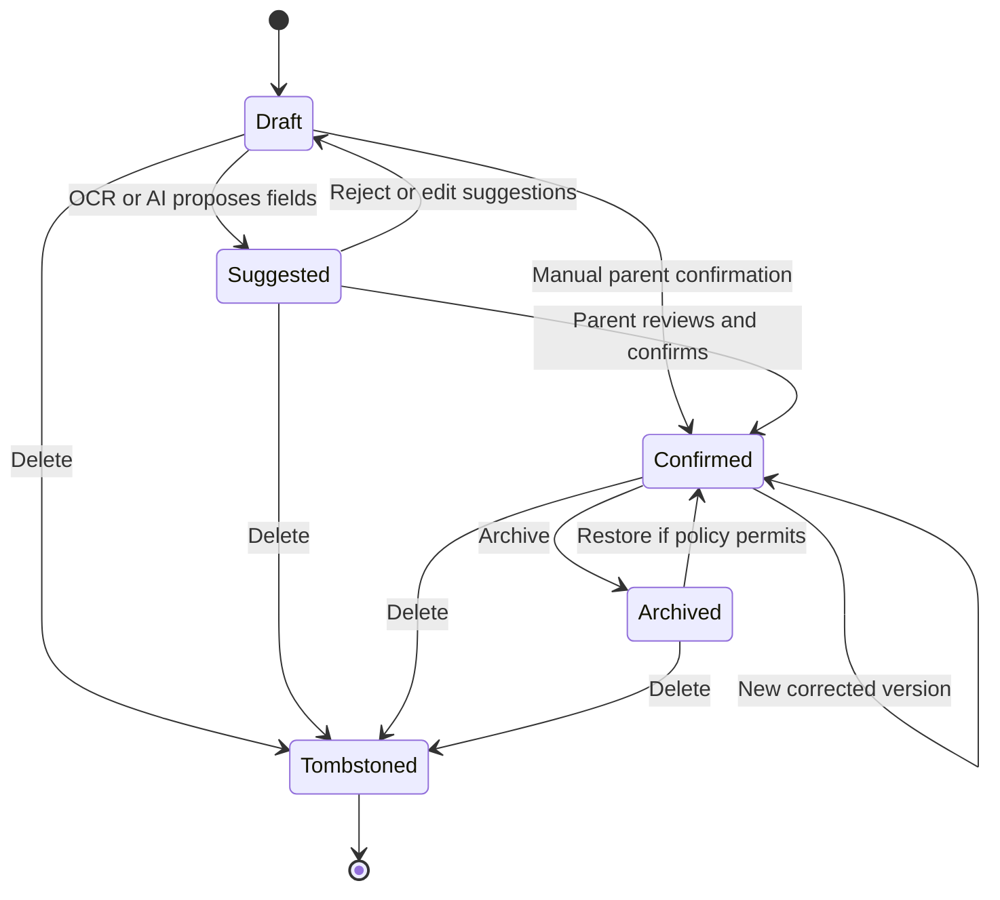

Tombstones beat stale background updates. Restore is allowed only for an
archived record, not an already purged deletion, unless a future approved
recovery policy explicitly says otherwise.

## 16. Mobile-Specific Behaviour

| Concern | Required behavior |
| --- | --- |
| Android back | Close keyboard/sheet first, then pop nested stack; warn before discarding unsaved work; tab root back follows platform exit convention |
| iOS back/swipe | Native back and edge swipe where safe; disable interactive dismissal during irreversible submission or require discard confirmation |
| Tabs | Preserve each tab's stack and scroll position; tapping active tab returns to its root/scrolls to top according to accepted UX behavior |
| Keyboard | Avoid focused fields, support next/done actions, keep validation near field, never hide submit/error behind keyboard |
| Safe areas | Use `react-native-safe-area-context` and native insets for all screens, sheets, and capture controls |
| Orientation | Portrait is primary; document preview/crop may rotate; emergency facts remain usable in supported orientations |
| Responsiveness | Flex layout and `useWindowDimensions`; support narrow phones, tablets/foldables as adaptive single/limited two-pane layouts; no cached global dimensions |
| Accessibility | VoiceOver/TalkBack labels, values, hints, headings, focus restoration, live announcements, 200% text, AA contrast, minimum targets, non-color state labels |
| Motion/haptics | Respect reduced motion; use subtle haptics only for deliberate success/warning, never as sole feedback |
| Biometrics | App lock after enrollment; fallback to device/account recovery; biometric invalidation triggers safe reenrollment, not plaintext fallback |
| Camera/gallery/file | Explain purpose just in time; handle limited-library mode, denial, cancellation, file-provider latency, multiple pages, and low storage |
| Notifications | Explain value before OS prompt; category controls; generic previews; denied state links to system settings without blocking Today |
| App lifecycle | Obscure sensitive views in app switcher where supported, lock after policy timeout, persist safe drafts, resume uploads/sync idempotently |
| Network changes | Render local state immediately, show offline/reconnecting/syncing text, debounce reconnect, and retry with jitter |
| Battery | No continuous polling/location; batch sync, respect OS background limits, schedule deterministic jobs server-side/local as appropriate |
| Screenshots | `OD-03`: decide per sensitive screen/platform; never claim prevention is absolute; warn before exposed emergency/share artifacts |

Location permission is not required for the approved MVP. Address-book access
is prohibited for growth invitations. Screen reader and physical-device
acceptance remain named Gate 1/Gate 5 evidence obligations and cannot be
substituted by simulator screenshots.

## 17. Offline and Synchronization

The server is authoritative. SQLCipher is the local read model plus an ordered
outbox. Client UUIDv7 identifiers, `baseRevision`, mutation UUIDs, and
`Idempotency-Key` make safe offline creation and retry possible.

| Action | Offline supported | Local storage | Sync trigger | Conflict strategy | User feedback |
| --- | --- | --- | --- | --- | --- |
| Open Today | Yes, cached projection | SQLCipher | App foreground/reconnect/manual | Server projection refresh | Offline + last updated; local actions remain visible |
| Open emergency card | Required | Encrypted version + approved fields | Foreground/reconnect | Critical changes require review | Confirmed state, freshness, offline label |
| Browse/search cached records | Yes | Authorized metadata and selected files | Reconnect/manual | Tombstones remove inaccessible items | Local-only/offline-result labels |
| Create manual record/draft | Yes after enrollment | Record draft + outbox mutation | Reconnect/background/manual | Critical stale base requires review | Local-only → queued → syncing → synced |
| Capture source | Yes when device storage permits | Encrypted local file + draft | Reconnect/manual upload | Duplicate/hash warning; no overwrite | Queued/failed/retry; source retained |
| Confirm critical field | Yes, queued | Confirmed local proposal + mutation | Reconnect | Never silent merge; ConflictPanel | Pending sync; review required on conflict |
| Edit noncritical note | Yes | Local patch + mutation | Reconnect | Server-ordered LWW with audit where approved | Sync outcome and corrected state |
| Complete task | Yes if task/access cached | Task mutation | Reconnect | Current membership/status wins | Pending completion; rejected copy preserved safely |
| Create capsule text | Yes | Draft + outbox | Reconnect | Approved noncritical policy | Draft/local-only/synced |
| Upload capsule photo | No network transfer offline | Encrypted local photo | Explicit user upload + network | Content hash/explicit replacement | Local only/queued/uploading/failed/synced |
| Accept invitation | No | Token only, not household content | Online user action | Server invitation state wins | Explain network requirement |
| Export/delete | No initiation offline | No false local completion | Online + recent auth | Server workflow authoritative | Request not submitted; retry online |

Sync pushes independent mutations with explicit dependencies and returns
`applied`, `duplicate`, `conflict`, or `rejected` per item. Pull applies ordered
pages transactionally. Expired cursors trigger a typed full reconciliation.
Authentication pauses sync; authorization permanently rejects the unsafe write
and retains an editable local copy where safe; validation errors remain
editable; server failures retry with jitter. Failed file operations never
delete the source automatically.

## 18. API Interaction Mapping

Existing contracts reserve the resource groups below. Operations are logical
until their owning work package adds them to generated OpenAPI; suggested paths
must be reviewed rather than copied directly into production.

| Screen/action | Logical operation | Method / reserved group | Request / response | Principal failures |
| --- | --- | --- | --- | --- |
| Email send/verify | Request and verify OTP | `POST /v1/auth/*` | Normalized email or code → enumeration-safe outcome/session | 400, 401, 429, provider unavailable |
| Provider sign-in | Complete OAuth/OIDC | `/v1/auth/*` | Provider proof/state → session | Canceled, invalid state, linking conflict |
| Session list/revoke | List/revoke devices | `/v1/auth/*` | Session ID + recent auth → status | 401, 403, 404, conflict |
| Owner onboarding | Create household/profile | `POST /v1/households` | Idempotent profile → household | Consent missing, duplicate, validation |
| Child basics | Create/update child | `POST/PATCH /v1/children` | Child fields + revision → child | 403, invalid date, 409 |
| Consent | Grant/withdraw version | `POST /v1/consents` | Purpose/version/state → consent record | Required version, 403, conflict |
| Emergency view/edit | Get/create version | `GET/PUT /v1/emergency-cards/{id}` | Card/version → confirmed card | 403, 404, 409, offline uses local |
| Today | Read projection | Logical M4 projection over reminders/tasks/reviews | Cursor/timezone → cards | Partial provider failure, stale data |
| Vault/search | List/search records | `GET /v1/records` | Cursor/filters → authorized page | 400, 403, cursor expired |
| Record create/update | Mutate record/version | `POST/PATCH /v1/records` | Mutation ID, base revision, values → record | 409 conflict, duplicate, validation |
| Record delete | Tombstone record | `DELETE /v1/records/{id}` | Recent policy/base revision → status | 403, 409, legal/relationship guard |
| Upload start | Create upload session | `POST /v1/files` | Hash/type/size/pages → session | Type/size/quota, provider failure |
| Upload complete | Verify object | `POST /v1/files/{id}/complete` | Hash/metadata → file state | Hash mismatch, malware/format rejection |
| OCR review | Create/read extraction | `/v1/ai-extractions` when consented | File/consent → suggested fields | Consent absent/withdrawn, killed provider |
| Timeline | List projection | `GET /v1/timeline` | Child/cursor/filter → events | 403, stale projection |
| Reminder mutate | Create/update/complete | `/v1/reminders` | Source/date/timezone/revision → reminder | Invalid source/date, 409, notification disabled |
| Task mutate | Create/assign/complete | `/v1/tasks` | Assignee/source/revision → task | Assignee/access invalid, 409 |
| Invitation/membership | Invite/accept/revoke | `/v1/households/*` | Email/template/grants/token → membership | Expired, wrong identity, limit, 403 |
| Memory | Create/update capsule | `/v1/memories` | Prompt text/media refs → capsule | Limit, lost local media, conflict |
| Sync | Pull/push mutations | `GET/POST /v1/sync` | Cursor/mutations → page/outcomes | Auth pause, cursor reset, per-item conflict |
| Export | Request/status/download | `/v1/exports` | Scope/format → job/status/grant | Recent auth, failed, expired |
| Deletion | Request/status/cancel | `/v1/deletion-requests` | Scope/reason policy → status | Recent auth, legal hold, partial processor failure |

All errors use safe `application/problem+json`; list endpoints use opaque
cursors; mutable resources expose revisions; retryable mutations are idempotent.

## 19. Validation Catalogue

| ID | Module / screen | Field/action | Client validation | Server/business validation | Safe message / severity |
| --- | --- | --- | --- | --- | --- |
| `VAL-AUTH-01` | Auth email | Email | Trim, normalize, syntax | Rate/account-enumeration policy | “Check the email format.” blocking |
| `VAL-AUTH-02` | OTP | Code | Required shape | One-time, expiry, attempts, device/IP/email limits | “That code could not be verified. Request a new code.” blocking |
| `VAL-ONB-01` | Adult verification | Submit | Required method fields | Approved proof and policy | “We could not verify eligibility. Try again or contact support.” blocking |
| `VAL-CNS-01` | Consent | Required grant | Affirmative checkbox/action | Current notice/version/jurisdiction | “Review and accept the required notice to continue.” blocking |
| `VAL-CHD-01` | Child | Preferred name | Required, trimmed, bounded | Allowed content and ownership | “Enter the name you use for your child.” blocking |
| `VAL-CHD-02` | Child | Date of birth | Valid date, not future | Policy age/jurisdiction and precision | “Enter a valid date of birth.” blocking |
| `VAL-EMR-01` | Emergency | Allergy state | Select not provided / none confirmed / values | Confirmed semantics and revision | “Choose what is known; do not leave the meaning unclear.” blocking |
| `VAL-EMR-02` | Emergency | Contact | Phone/email shape if supplied | Ownership/allowed destination | “Check the contact details.” blocking |
| `VAL-FIL-01` | Capture | File | Supported type, size/page bounds, nonzero | MIME/signature/hash/malware/quota | “This file cannot be added. Choose a supported file.” blocking |
| `VAL-CAP-01` | OCR review | Suggested value | Explicit confirm/edit/reject | Consent, category schema, provenance | “Review this suggestion before saving.” blocking for material value |
| `VAL-CAP-02` | Capture | Child match | Local mismatch warning | Household child and duplicate checks | “This may belong to a different child. Review before continuing.” blocking confirmation |
| `VAL-REC-01` | Record edit | Base revision | Include current local revision | Reject stale critical revision | “This record changed on another device. Review both versions.” blocking |
| `VAL-VAC-01` | Vaccination | State/date | Valid date order; meaning selected | Source authority and transition | “Confirm what this date means.” blocking |
| `VAL-REM-01` | Reminder | Fire time | Valid timezone/future policy | Source access, deterministic schedule | “Choose a valid reminder time.” blocking |
| `VAL-TSK-01` | Task | Assignee | Required active selectable member | Membership/capability/source access | “This person no longer has access. Choose another assignee.” blocking |
| `VAL-MEM-01` | Memory | Photos | 0-5, supported media | Quota/consent/file validation | “Choose up to five supported photos.” blocking |
| `VAL-INV-01` | Invitation | Email/grants | Email shape; at least one useful grant | Owner, limit, duplicate, intended identity | “Review the email and access before inviting.” blocking |
| `VAL-EXP-01` | Export | Request | Scope and format | Owner, recent auth, entitlement/policy | “Reauthenticate to request an export.” blocking |
| `VAL-DEL-01` | Deletion | Confirmation | Exact scope acknowledgement | Owner, recent auth, hold/workflow conflict | “Review what will be deleted before confirming.” blocking |
| `VAL-ANA-01` | Analytics | Event properties | Compile-time allowlist | Runtime prohibited-value rejection | Silent product fallback + privacy alert; never block user task |

Unknown, not provided, none confirmed, suggested, confirmed, corrected, and
verified are business states, not interchangeable placeholder copy.

## 20. Error and Recovery Behaviour

| Condition | User message and navigation | Data preservation / retry | Logging and escalation |
| --- | --- | --- | --- |
| No internet | “You’re offline. Showing saved information.” Stay in context | Queue eligible writes; manual retry; no false completion | Stable network-state event only |
| Slow network | Inline textual progress; keep content usable | Timeout with idempotent retry; avoid duplicate spinners | Duration bucket, operation code |
| Timeout | “This is taking longer than expected.” | Preserve input; retry/cancel | Stable timeout code, request ID |
| 400 validation | Field/action-specific safe copy | Preserve and focus first error | Validation code, no input value |
| 401/session expired | Reauthenticate, then restore intended route | Pause sync; preserve safe drafts | Auth outcome code |
| 403/access revoked | “You no longer have access to this item.” Return to safe parent | Reject queued unsafe mutation; purge/tombstone local unauthorized content | Authorization code and opaque operational ID only if essential |
| 404/deleted | “This item is no longer available.” | Remove stale navigation/result after sync | Resource-unavailable code |
| 409 conflict | Open ConflictPanel with both safe values/provenance | User chooses/corrects; never auto-merge critical fields | Conflict type, not values |
| 429 rate limit | “Too many attempts. Try again later.” | Honor retry window; disable resend timer | Rate-limit policy code |
| 5xx/service unavailable | Banner with retry and cached state | Backoff/jitter; keep queued work | Stable service code/request ID; alert by aggregate |
| Partial response | Show available sections and name unavailable section | Retry only failed source | Partial-operation code |
| Upload/download failure | Keep local source; show retry/cancel or expired-grant refresh | Resume from verified boundary | File state/code, no name/path |
| Permission denied | Explain feature impact and Settings route | Manual alternative where possible | Coarse permission outcome |
| Token refresh failure | Reauthenticate | Pause sync and preserve safe drafts | Stable auth code |
| Crash recovery | Root error boundary with `LA-MOBILE-UNHANDLED`; restart safe route | Persisted drafts/outbox survive; never restore unsafe modal blindly | Scrubbed stable error only; no screenshot/view hierarchy |
| Local key invalidated | Explain secure reenrollment | Do not fall back to plaintext; reconcile after verified login | Security lifecycle code; support path |

## 21. Notifications and Deep Links

### 21.1 Notification catalogue

| ID | Trigger / recipient | Channel | Safe purpose | Destination | Read/action behavior |
| --- | --- | --- | --- | --- | --- |
| `NTF-AUTH-01` | OTP/recovery to authenticating user | Email | Complete authentication | Auth flow, not health resource | One-time/expiring; no child data |
| `NTF-INV-01` | Owner invites adult | Email + optional in-app | Review household invitation | `R-INVITE` | Accept/decline after identity validation |
| `NTF-REM-01` | Reminder due to eligible member | Local/push + in-app | “You have a LittleArc reminder.” | `R-REMINDER` | Mark read on open; complete in destination |
| `NTF-TSK-01` | Task assigned/reassigned | Push + in-app | “A family task needs your attention.” | `R-TASK` | Validate assignee and linked-record grant |
| `NTF-TSK-02` | Task completed to creator/owner | Push + in-app | “A family task was updated.” | `R-TASK` | Current task or unavailable state |
| `NTF-REV-01` | Record pending review | In-app; generic push if enabled | “A saved item needs review.” | `R-CAPTURE-REVIEW` | Requires editor capability |
| `NTF-MEM-01` | Monthly prompt | Local/in-app | “Your monthly LittleArc moment is ready.” | `R-MEMORY-NEW` | Dismiss/snooze per policy |
| `NTF-EXP-01` | Export ready/failed | Push + in-app; account email optional | “Your export status changed.” | `R-EXPORT` | Reauthenticate before download |
| `NTF-SEC-01` | Session/device/security change | Email + in-app | Protect account | `R-AUTH-SESSIONS` | Review/revoke; no household content |
| `NTF-SUP-01` | Support status | Email + in-app | Support response available | `R-SUPPORT` | Authenticate before sensitive discussion |

SMS and WhatsApp are not MVP notification channels. Email is for auth,
invitations, security, export/account, and essential operations—not health
reminder details.

### 21.2 Runtime behavior

- **Foreground:** add/update Notification Center and show a non-blocking banner;
  do not interrupt capture or destructive confirmation.
- **Background:** OS displays generic preview; tap resolves through launch gates.
- **Terminated:** launch, update/maintenance, session, unlock, and authorization
  run before opening the route.
- **Logged out:** preserve only the route intent, authenticate, then resolve
  again. Never cache decrypted payload in the push.
- **Unavailable resource:** show safe unavailable state and route to relevant
  parent list, not a blank screen.
- **Wrong role or revoked access:** return 403 behavior, remove stale local
  resource, and never reveal title/category in the error.

## 22. Analytics Events

The analytics wrapper permits only enums, booleans, bounded counts, coarse
duration buckets, app/build/platform, and acquisition categories. It excludes
names, emails, dates of birth, health values, filenames, document/OCR/AI text,
search terms, provider/resource IDs, exact dates, media URLs, and dynamic errors.

| Event | Trigger / screen | Allowed properties | Purpose |
| --- | --- | --- | --- |
| `app_opened` | Launch | platform, app_version, launch_type | Reliability/acquisition |
| `entry_gate_shown` | Policy gate | gate_type, supported_boolean | Update/compatibility health |
| `authentication_started` | Auth method | provider_category | Funnel |
| `authentication_completed` | Auth outcome | provider_category, outcome | Auth reliability |
| `onboarding_started` | Privacy promise | acquisition_channel | Funnel |
| `onboarding_step_completed` | Onboarding | step_id, duration_bucket | Friction |
| `onboarding_completed` | Today arrival | duration_bucket | Activation |
| `child_profile_created` | Child save | acquisition_channel, platform, app_version | Activation |
| `emergency_card_completed` | Emergency basics | completion_duration_bucket | Activation |
| `screen_viewed` | Major screen | screen_id, role_template | Navigation health |
| `record_capture_started` | Capture | capture_method, generic_category | Capture usage |
| `record_capture_abandoned` | Capture exit | stage_id, reason_category | UX improvement |
| `record_saved` | Confirmed save | generic_category, ai_assisted_boolean, correction_count_bucket | Core value |
| `validation_failed` | Form/action | validation_id, screen_id | Quality; no input |
| `record_search_completed` | Search | result_count_bucket, success_boolean, latency_bucket | Retrieval success |
| `reminder_confirmed` | Reminder | reminder_type_group, lead_time_bucket | Utility |
| `task_completed` | Task | role_template, completion_time_bucket | Handover value |
| `caregiver_invited` | Invite created | role_template | Collaboration activation |
| `monthly_capsule_saved` | Capsule | media_count_bucket, duration_bucket | Emotional retention |
| `notification_opened` | Deep link resolved | notification_type, outcome | Delivery effectiveness |
| `sync_outcome` | Sync cycle | outcome, mutation_count_bucket, duration_bucket | Offline reliability |
| `error_encountered` | Recoverable error | stable_error_code, screen_id | Quality; no dynamic message |
| `export_outcome` | Export lifecycle | format_group, outcome | Trust |
| `deletion_outcome` | Deletion lifecycle | scope_group, outcome | Trust/operations |

Session replay, autocapture, heatmaps, automatic properties, and health-based
targeting are disabled. Analytics failures never block the user action.

## 23. Security and Privacy Flows

1. **Authentication:** Apple, Google, or passwordless OTP establishes a server
   session; mobile stores it only in SecureStore. No password flow exists.
2. **Device enrollment:** after authenticated setup, local SQLCipher/file keys
   are provisioned and protected by platform secure storage/app-lock policy.
3. **Authorization:** Fastify policy checks household membership, role,
   capability, resource access policy, and recent auth; PostgreSQL RLS enforces
   the same tenant boundary inside the query transaction.
4. **Local protection:** no sensitive local data is accessible signed out;
   app-switcher exposure and re-lock follow approved platform policy; key
   invalidation triggers reenrollment.
5. **Sensitive-screen access:** emergency quick access is explicit, minimal,
   owner-controlled, warned, and excludes photo, exact DOB, attachments,
   identity documents, Timeline, and unconfirmed suggestions.
6. **Consent:** versioned parent notice and child-data grants precede child
   creation. Third-party vision and cloud AI use independent opt-in consent.
7. **Files:** local/server encryption, short-lived authorized download grants,
   server hash/type validation, and no sensitive filenames in logs.
8. **Corrections/audit:** material creates, edits, confirmations, access changes,
   exports, deletions, and staff actions create privacy-safe audit events.
9. **Session revocation:** revoked sessions immediately stop API/sync; the next
   local authorization check locks/purges inaccessible data according to policy.
10. **Export/deletion:** owner-only, recent reauthentication, explicit scope,
    asynchronous status, processor propagation, and minimized retention.
11. **Staff boundary:** separate passkey-protected console; least privilege,
    purpose code/recent auth for privileged work, no content by default.
12. **Telemetry:** allowlisted analytics and scrubbed errors/logs; no payloads,
    screenshots, view hierarchies, search terms, tokens, or child identifiers.

## 24. QA Acceptance Scenarios

The following are minimum cross-platform scenarios. Each must run with synthetic
fixtures and include light/dark/high-contrast, 200% text, VoiceOver/TalkBack,
reduced motion, and applicable physical-device evidence at its gate.

### 24.1 Authentication and onboarding

- **Happy:** Given a new eligible adult, when they verify by an approved method,
  grant required consent, create a child, emergency basics, first record, and
  reminder, then Today shows visible progress and the household is not yet
  falsely labeled seven-day activated.
- **Validation:** Given a future date of birth, when the parent submits, then the
  form blocks, focuses the field, preserves other input, and sends no child write.
- **Authorization:** Given an invited caregiver, when they open owner onboarding,
  then the app denies household creation in that context and routes safely.
- **Error:** Given OTP rate limiting, when another code is requested, then the
  app shows the retry window without revealing account existence.
- **Offline:** Given first launch offline, when Continue is tapped, then the app
  explains that enrollment needs a network and creates no partial household.
- **Recovery:** Given a crash after an idempotent household create, when the app
  resumes, then it loads the same household and continues without duplication.
- **Edge:** Given an invitation and mismatched authenticated email, when accept
  is attempted, then no membership is created and household data is not shown.

### 24.2 Emergency card

- **Happy:** Given an enrolled unlocked device with a cached confirmed card,
  when the user taps Emergency, then the card opens within two deliberate taps.
- **Validation:** Given allergy state is unspecified, when save is attempted,
  then the user must choose not provided, none confirmed, or enter values.
- **Authorization:** Given a caregiver without emergency capability, when a deep
  link opens, then no card content is rendered and a safe 403 state appears.
- **Error:** Given online refresh fails, when a cached version exists, then it
  remains visible with offline/stale and last-updated labels.
- **Offline:** Given airplane mode, when an authorized user unlocks, then all
  cached confirmed emergency fields and contact actions remain usable.
- **Recovery:** Given biometric keys invalidate, when opening the card, then the
  app requires safe account reenrollment and never falls back to plaintext.
- **Edge:** Given quick access is enabled, when opened locked, then excluded
  fields and all suggestions remain absent.

### 24.3 Capture and record confirmation

- **Happy:** Given a readable synthetic prescription, when scanned and reviewed,
  then the original, confirmed fields, provenance, record, and Timeline event
  are saved and a reminder is offered only after date confirmation.
- **Validation:** Given ambiguous medicine instructions, when the user tries to
  confirm without review, then save blocks and the source snippet is focused.
- **Authorization:** Given add but not edit/confirm capability, when a caregiver
  saves a source, then it remains an allowed draft/pending-owner-review state.
- **Error:** Given upload hash failure, when completion runs, then the server
  rejects it, the local source remains, and retry starts safely.
- **Offline:** Given no network after enrollment, when capture completes, then a
  local-only draft survives process termination and queues one mutation/upload.
- **Recovery:** Given reconnect retries the same mutation, then idempotency yields
  one record and marks the queue item complete.
- **Edge:** Given a likely duplicate, when the user continues after reviewing
  both sources, then the decision is audited and neither record is silently lost.

### 24.4 Vaccination/reminder and Today

- **Happy:** Given a parent-confirmed due item, when scheduled and later marked
  given with evidence, then reminder, Vault, Today, and Timeline agree.
- **Validation:** Given an unconfirmed suggested date, when reminder creation is
  attempted, then the app requires date meaning and confirmation.
- **Authorization:** Given source-record access is revoked, when a notification
  opens, then details are hidden and the stale notification becomes unavailable.
- **Error:** Given push delivery fails, when the app opens, then the Today item
  remains visible and actionable without claiming notification success.
- **Offline:** Given offline Today, when a cached task/reminder is completed,
  then it shows pending sync and later reconciles idempotently.
- **Recovery:** Given a server 5xx, when retry succeeds, then the local pending
  state resolves once without duplicate completion.
- **Edge:** Given device timezone changes, then future fire times recalculate
  while historical event timestamps remain unchanged.

### 24.5 Family handover and revocation

- **Happy:** Given an owner invites one caregiver with selected records and a
  task, when accepted, then the caregiver can complete only that granted flow.
- **Validation:** Given no useful capability is selected, when inviting, then
  the form blocks and explains access selection.
- **Authorization:** Given a caregiver attempts to invite another member, then
  client and API deny it and no invitation/audit mutation is created.
- **Error:** Given invitation email delivery fails, then invitation state remains
  visible and owner can retry without creating a duplicate token/member.
- **Offline:** Given the invitee is offline, then acceptance waits for a network
  and no household content is provisioned.
- **Recovery:** Given owner revokes a member during offline task editing, then
  reconnect rejects the mutation, preserves a safe personal draft if permitted,
  and tombstones inaccessible household data.
- **Edge:** Given the caregiver exported a permitted copy before revocation,
  then revocation copy explains that LittleArc cannot erase that external copy.

### 24.6 Export and deletion

- **Happy:** Given recent owner authentication, when export completes, then a
  short-lived authenticated download includes originals, structured data,
  provenance, and confirmed values.
- **Validation:** Given no format is selected, when requesting export, then no
  backend job is created.
- **Authorization:** Given a co-parent requests household export or deletion,
  then the API returns 403 and exposes no workflow details.
- **Error:** Given worker/processor failure, then status names the failed phase,
  preserves the request, and offers safe retry/support.
- **Offline:** Given no network, then export/deletion cannot be falsely submitted
  and the user is told to reconnect.
- **Recovery:** Given an export link expires, then reauthentication can issue a
  new grant while the export object remains within approved retention.
- **Edge:** Given deletion and export overlap, then server policy serializes or
  rejects the conflict explicitly; it never returns an incomplete unlabeled export.

## 25. Mermaid Diagrams

### 25.1 Overall application flow

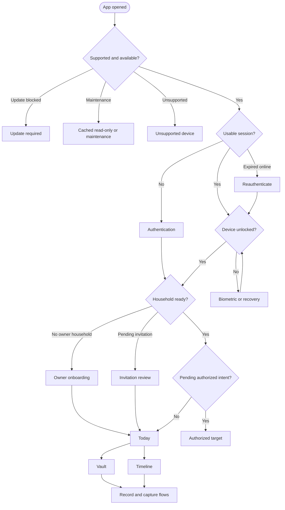

### 25.2 Authentication and onboarding

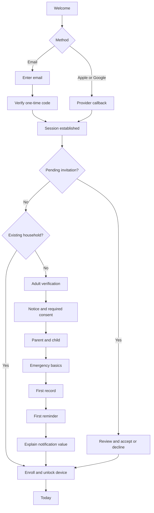

### 25.3 Main navigation

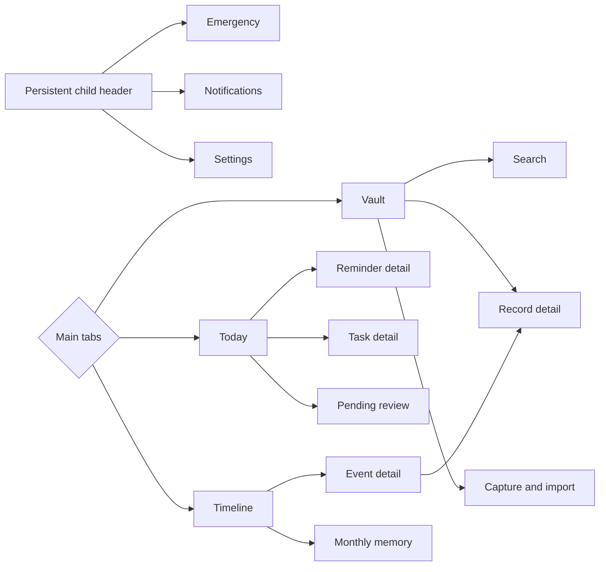

### 25.4 Role-based flow

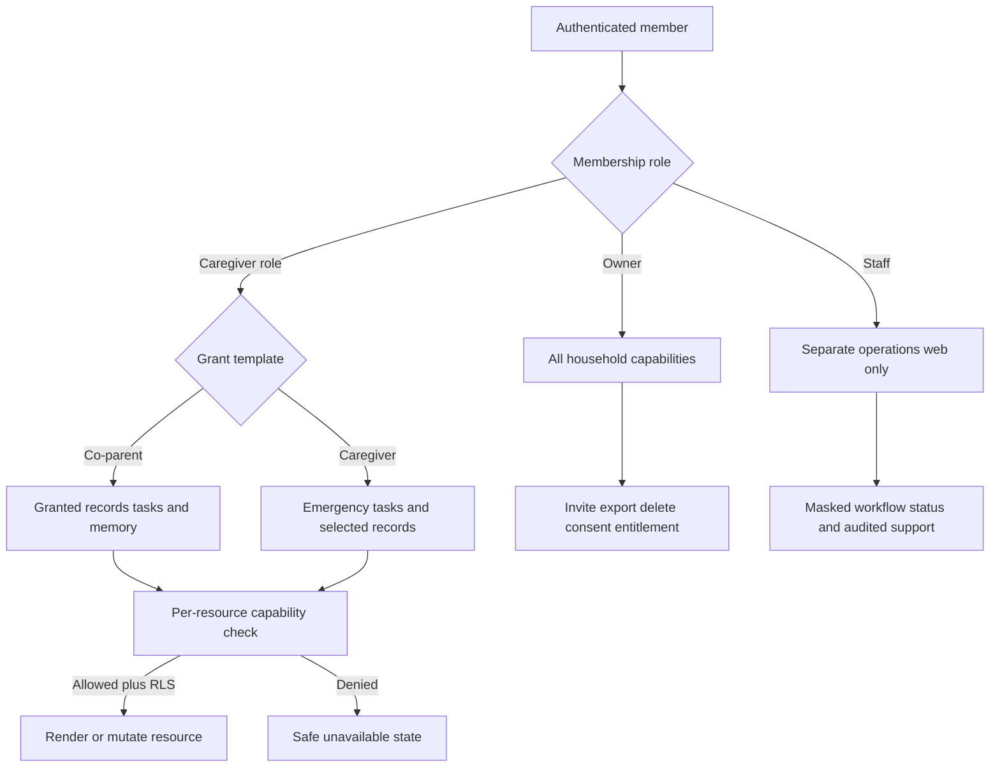

### 25.5 Emergency module

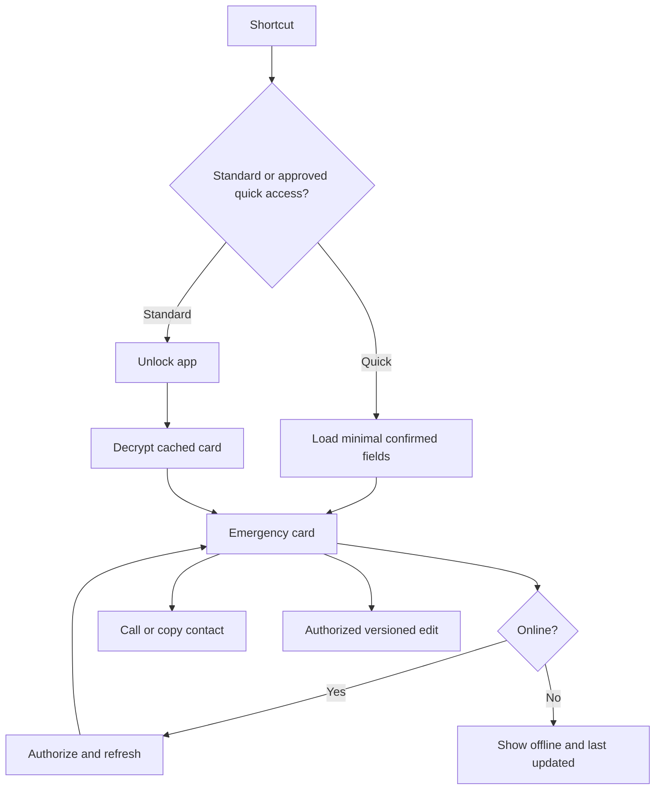

### 25.6 Vault capture module

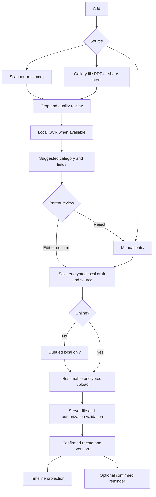

### 25.7 Today and reminders module

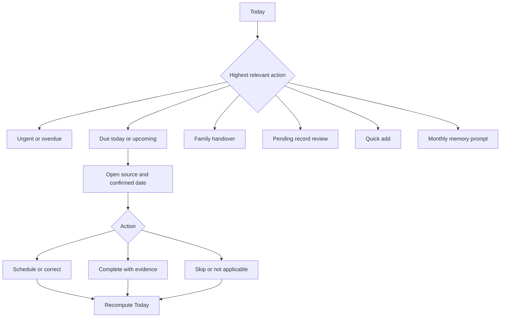

### 25.8 Timeline and memory module

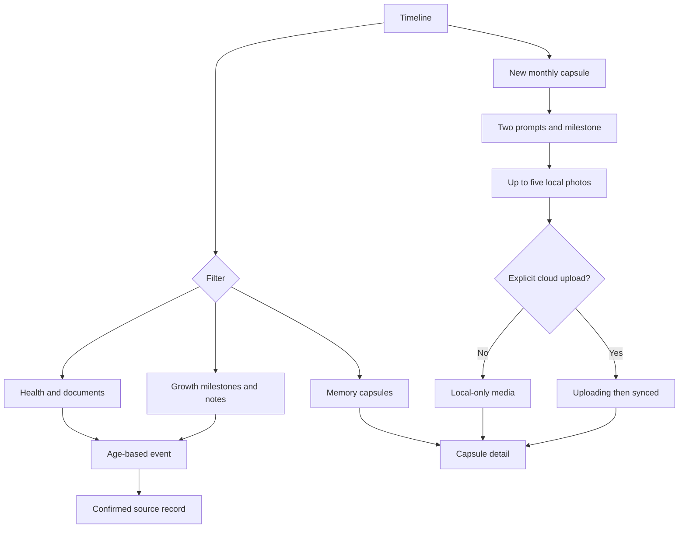

### 25.9 Family and tasks module

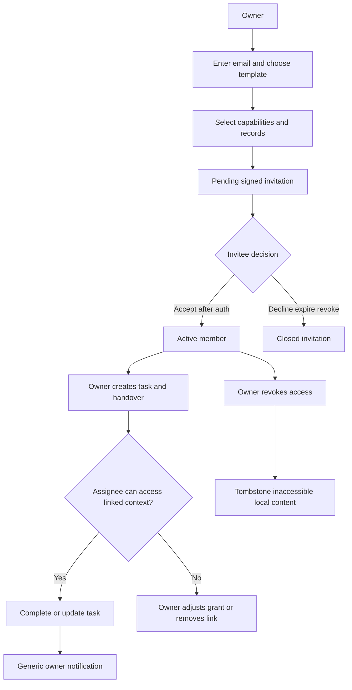

### 25.10 Trust operations module

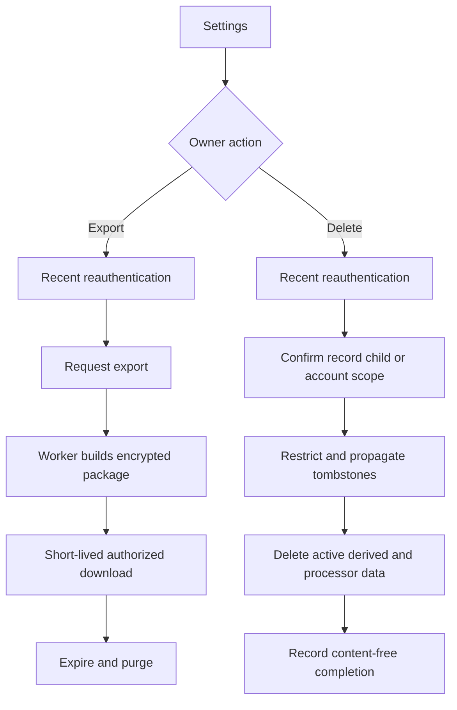

### 25.11 Notification deep-link flow

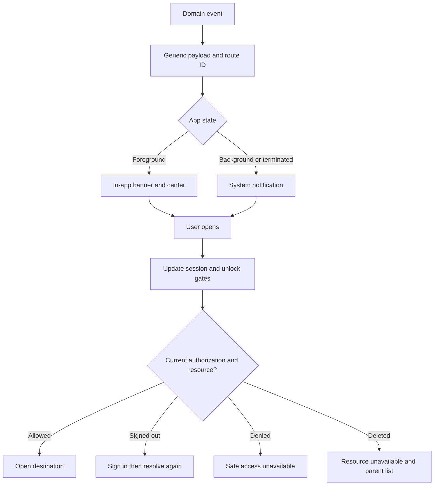

### 25.12 Offline synchronization flow

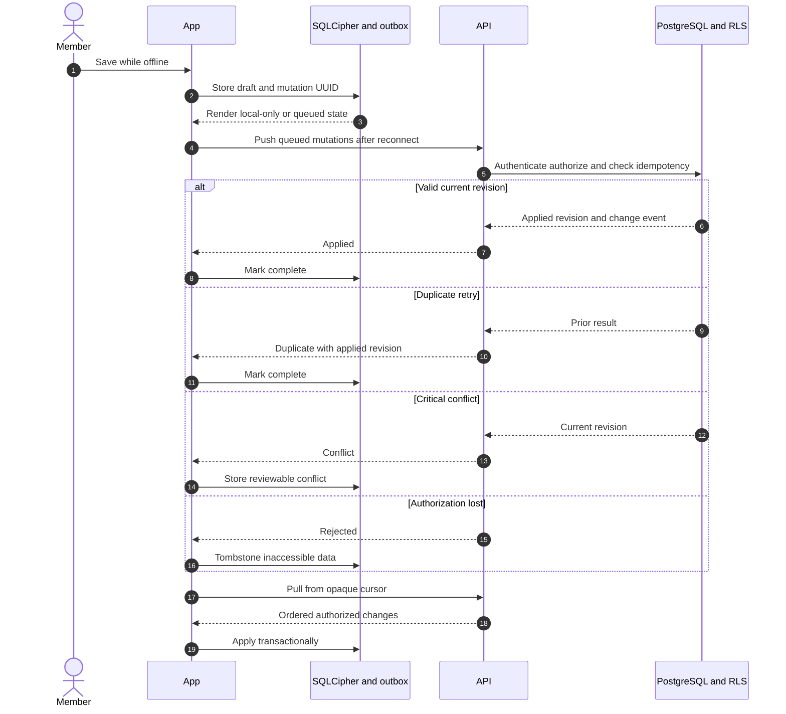

### 25.13 Account and session lifecycle

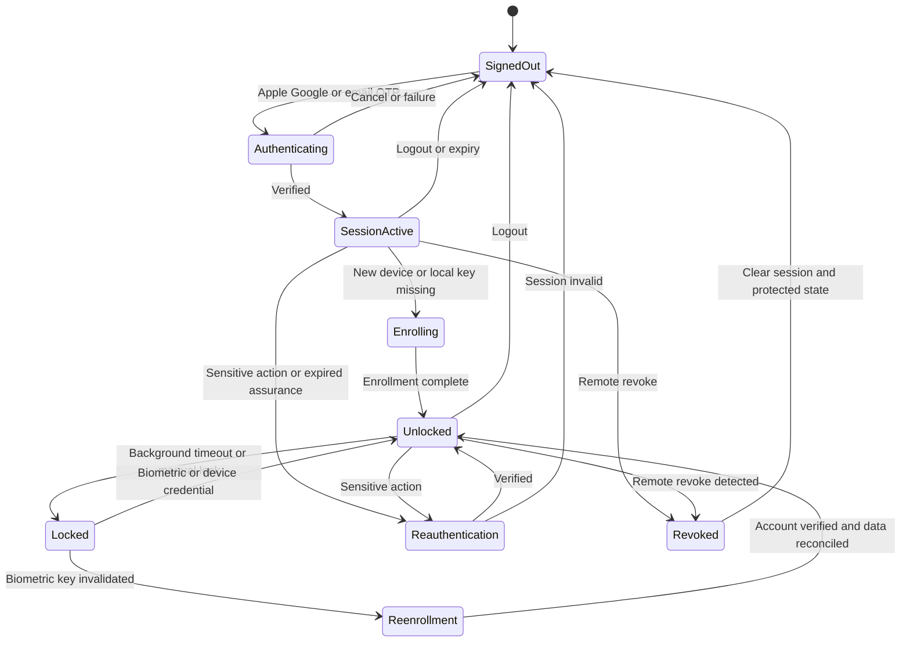

## 26. MVP Flow Coverage

| Approved MVP capability | Primary flow(s) | Screens | Roadmap owner |
| --- | --- | --- | --- |
| Authentication/session | `FLOW-AUTH-001` | `AUTH-01..08` | `OFF-01` |
| Parent, household, child, consent | `FLOW-ONB-001` | `ONB-01..06` | `OFF-02`, `OFF-06` |
| Local security/enrollment | `FLOW-AUTH-001`, `FLOW-EMR-001` | Unlock, settings, emergency | `OFF-03` |
| Offline repository/sync | All data flows | `SYN-01..02` and local states | `OFF-04` |
| Emergency card | `FLOW-EMR-001` | `EMR-01` | `OFF-05` |
| Manual record/capture/upload/OCR | `FLOW-VLT-001` | `CAP-01..03`, `REC-01..04` | `VLT-02..06` |
| Vaccination/visit/prescription | `FLOW-VAC-001`, `FLOW-VLT-001` | `VAC-01`, records, reminder | `VLT-07`, `UTL-01` |
| Vault/search/retrieval | `FLOW-VLT-001` | `VLT-01`, `SCH-01`, record | `VLT-08..09` |
| Today/reminders/notifications | `FLOW-TOD-001`, `FLOW-VAC-001` | Today, reminder, notifications | `UTL-01..03` |
| Tasks/handover/family invite | `FLOW-FAM-001` | Tasks, family, invitation | `UTL-04`, `UTL-06` |
| Timeline | Record, vaccination, memory flows | `TML-01` | `UTL-05` |
| Monthly memory | `FLOW-MEM-001` | `MEM-01..02` | `UTL-07` |
| Optional consented cloud extraction | `FLOW-VLT-001` alternate | OCR review/privacy | `UTL-08` |
| Export | `FLOW-TRUST-001` | `EXP-01` | `BTA-01` |
| Record/child/account deletion | `FLOW-TRUST-002` | `DEL-01` | `BTA-02` |
| Support/recovery/accessibility | Cross-module error flows | Support and all states | `BTA-03..11` |

Every required product capability maps to a flow and screen. Screens without a
valid content route are policy/entry/error states with an explicit safe exit.

## 27. Future-Phase Flows

### 27.1 M7 retention-gated flows

Only after M7 entry criteria pass:

- Packaging and entitlement comparison that never threatens stored data.
- Apple/Google purchase, restore, receipt/webhook reconciliation, grace,
  cancellation, and support states behind `EntitlementProvider`.
- Sponsor-code redemption and expiry with aggregate-only partner reporting.
- Entitlement lapse that preserves safe retrieval/export and never deletes data.

### 27.2 Later product flows

- Multiple children and an active child switcher.
- More granular family roles and more invited members.
- Expiring selected-record links.
- Provider-issued/verified record contribution.
- ABHA/U-WIN/DigiLocker, hospital, or insurer imports when approved and useful.
- Audio notes, richer capsules/yearbooks, and expanded age ranges.
- Local-language support and broader accessibility/localization verification.

These flows require their own product, privacy, authorization, offline, API,
and QA specifications before implementation.

## 28. Gaps, Risks, and Recommendations

| Priority | Gap or risk | Impact | Required resolution |
| --- | --- | --- | --- |
| Critical | Adult verification method is not selected | Cannot lawfully approve real child-data onboarding | Close `OD-01` with privacy/legal and test recovery/accessibility |
| High | Broader physical-device/accessibility matrix remains deferred | Pilot/device-capability claims remain unauthorized | Complete physical iOS and the named pre-pilot capability and assistive-technology checks |
| Critical | Real data remains blocked | No real participant/child data may enter any test flow | Keep synthetic fixtures until every pre-real-data gate passes |
| High | Co-parent is a product template but not a persisted domain role | UI/API terminology may drift | Confirm template-to-capability mapping in `UTL-06` |
| High | Update/maintenance policy contract is not specified | Unsafe or inconsistent launch gates | Define signed policy, rollback, cached emergency behavior, and QA matrix |
| High | Quick-access exposure posture remains open | Privacy and urgent-access trade-off | Close `OD-03` with physical-device adversarial tests |
| High | API groups are reserved, not feature contracts | Route/action tables cannot be treated as generated API | Each work package must add and diff OpenAPI before mobile adoption |
| High | Deletion grace/retention/processors are not approved | Trust flow cannot make completion promises | Close `OD-04` before pilot |
| Medium | Search scope for approved OCR text needs precise local/server policy | Leakage or inconsistent results | Define indexing, consent withdrawal, tombstone, and reindex behavior |
| Medium | Offline queue UX could overwhelm caregivers | Conflicts and rejected work may be misunderstood | Prototype status language and one-action recovery before Gate 2/3 |
| Medium | Support intake contract is unspecified | Sensitive data may leak in tickets | Define allowed fields, attachment prohibition, SLAs, and diagnostic consent |

Recommendation: treat this document as the cross-functional flow baseline, but
split implementation into the existing vertical work packages. Do not create a
large route scaffold ahead of its first product slice.

## 29. Implementation Readiness Checklist

### 29.1 Cross-functional definition

- [x] Product purpose, users, roles, scope, and exclusions are identified.
- [x] Required MVP capabilities map to at least one flow and screen.
- [x] Entry, authentication, onboarding, navigation, deep-link, and notification
      behavior include success and failure branches.
- [x] Screen inventory distinguishes MVP, future, and engineering-only routes.
- [x] Data-changing actions identify logical backend groups, authorization,
      idempotency/revision behavior, and audit needs.
- [x] Offline, syncing, conflict, rejection, stale, deletion, and permission-loss
      states are distinct.
- [x] Analytics and logging exclude sensitive content.
- [x] QA scenarios cover happy, validation, authorization, error, offline,
      recovery, and edge behavior for critical flows.
- [x] Mermaid diagrams cover application, auth/onboarding, navigation, roles,
      modules, lifecycle, notification, sync, and session behavior.

### 29.2 Required before implementation of each slice

- [ ] Gate and owning roadmap work package authorize the slice.
- [ ] Open decisions affecting the slice are closed or explicitly constrained.
- [ ] Route names and screen IDs are accepted by product/design/mobile.
- [ ] Generated OpenAPI operations and Problem Details codes are accepted.
- [ ] Domain entities, capabilities, RLS policy, consent, audit, and retention
      behavior are implemented and tested.
- [ ] Offline read/write boundary, conflict strategy, and local purge behavior
      are acceptance-tested.
- [ ] Design reference covers required network, trust, sync, access, destructive,
      theme, text-size, and motion states.
- [ ] Synthetic unit, component, API, database, contract, and E2E fixtures exist.
- [ ] VoiceOver, TalkBack, 200% text, reduced motion, and physical-device checks
      pass at the named gate.
- [ ] Privacy-safe analytics/error/logging canaries pass.
- [ ] Documentation and implementation status are updated only after validated
      evidence exists.

### 29.3 Consistency review result

The specification has no intentional dead-end MVP route. Every protected action
has an authorization recheck; every data-changing action maps to a logical
backend operation; every notification resolves through authentication,
authorization, and resource-existence checks; and no optional/future capability
is presented as an implemented or unconditional MVP dependency. Current M1
foundation behavior remains explicitly separate from the M2-M5 target flow.
